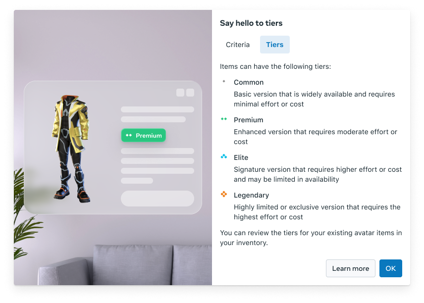
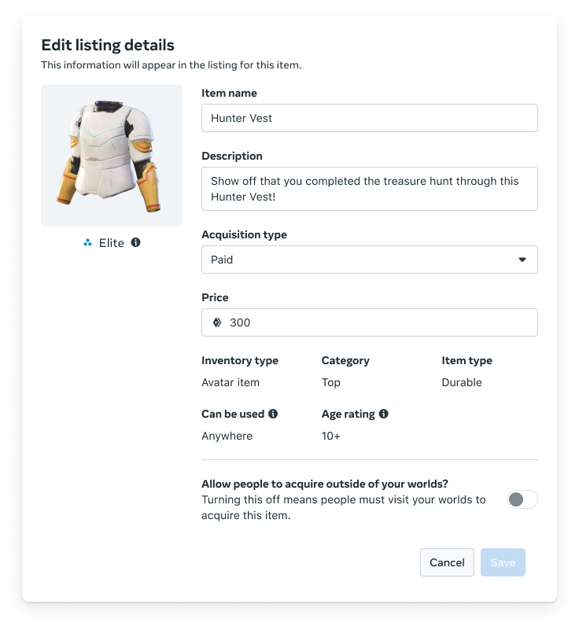
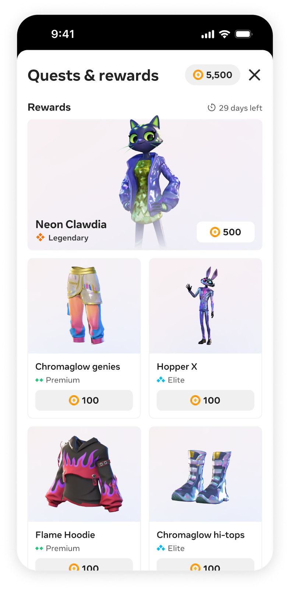

# [Digital Item Tiering](#digital-item-tiering)

The “tiering of digital items” is a crucial economy concept designed to aid creators and end-users with an objective framework to govern, communicate, and interpret the value of digital items in Meta Horizon. By organizing digital goods in four main tiers (**Common**, **Premium**, **Elite**, **Legendary**) - creators can showcase the uniqueness and value of their offerings, while enabling players to make more informed choices about their purchases and achievements.

## [Item tiering: A framework for consistent digital item value](#item-tiering-a-framework-for-consistent-digital-item-value)

There are four main tiers to categorize assets based on their overall value score which takes the cost or effort to acquire, utility and scarcity of an item into consideration:

## [What determines an item’s tier?](#what-determines-an-items-tier)

All free and premium items made by Meta, Meta Partners, and Meta Horizon creators will be tiered. Your item’s tier is determined by an automated score based on key item qualities. This ensures that higher quality items are generally harder to access. The factors that influence an item’s tier score are:

1. **Cost (Price or Effort)**: Cost reflects the required investment from the user to acquire the item.
   - **For Paid Items**: This is based on the item price in Meta Credits.
   - **For Earned Items**: This is based on the estimated effort required (manual drop-down) to acquire as part of a quest.
2. **Utility:** Whether the [item traits](https://developers.meta.com/horizon-worlds/learn/documentation/full-bodied-avatars/item-traits) provide a functional purpose beyond aesthetics, such as granting access or abilities. Virtual assets that offer utilitarian value provide a tangible benefit to gameplay or a unique ability, such as progression boosts, powerful weapons, or increased abilities.

## [Best practices for leveraging tiering to highlight value](#best-practices-for-leveraging-tiering-to-highlight-value)

An inconsistent and unclear tier system can cause items to lose perceived value and lose user trust in the system. With the introduction of tiers, we’d like to introduce a few best practices that can preserve user trust and maximize the effectiveness of the system:

1. **The Golden Rule of Tiering: Consistency Builds Trust**: Altering the listing details of an item, as shown in the image below, may impact its tier classification since the system automatically determines tiers based on these attributes. Maintaining consistency in listing details can help foster user trust in the tiering system.
   - Tier Reclassification Considerations: Frequent changes to an item’s listing can lead to the system recalculating its tier. For example, if the listing details are modified such that an item is downgraded from ‘Legendary’ to ‘Premium’ without corresponding changes in features or benefits, users may perceive this as devaluing the item, which could impact trust in the tiering system.
   - Tier Upgrade Justifications: When listing details are updated in a way that elevates an item to a higher tier (e.g., from ‘Premium’ to ‘Legendary’), users typically expect to see enhancements—such as improved visual appeal or added utility value—that justify the change. Adding visual/textual cues such as “limited-time promotion” or “seasonal event” may help justify the rationale behind tier changes. *Note: Users who acquired the item before the upgrade will not see the tier change.*

1. **Listing Details: Key to Item Value Perception**: The system determines item tiers based on various listing details, such as cost, rarity, and the effort required to obtain the item. Highlighting the unique attributes of each item—whether it’s earned through skill and dedication or available for direct purchase—can help users better understand its value and tier. Clearly communicating these attributes in your listing details may foster greater trust and satisfaction, as users are able to make more informed choices and appreciate the distinctions between different types of items.
2. **Balanced Content Variety across Tiers:**: Ensure your content selection includes a healthy mix of items from all available tiers to avoid any single tier dominating the experience. When users encounter a thoughtfully curated selection, each item’s unique qualities and tier status are more likely to stand out, potentially increasing both appeal and perceived value.

Using tiering, creators may be able to enhance the value and appeal of their digital goods. This approach can also contribute to a more transparent and engaging experience for players, potentially fostering greater trust and satisfaction within the ecosystem. Ultimately, thoughtful tiering and pricing strategies may benefit both creators—by supporting the long-term value of their offerings—and players, by providing clarity and confidence in their purchases.

