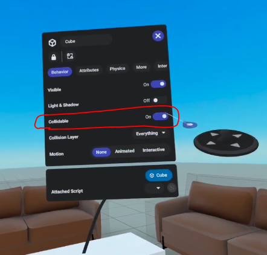
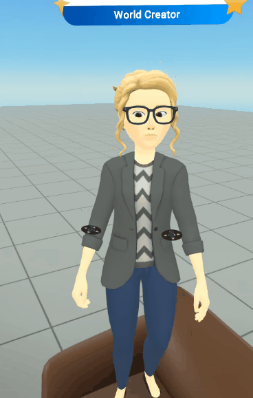
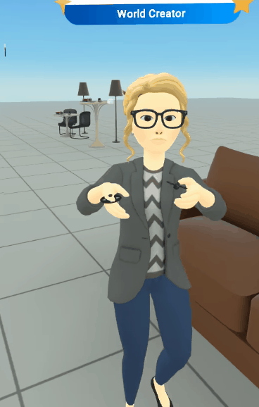
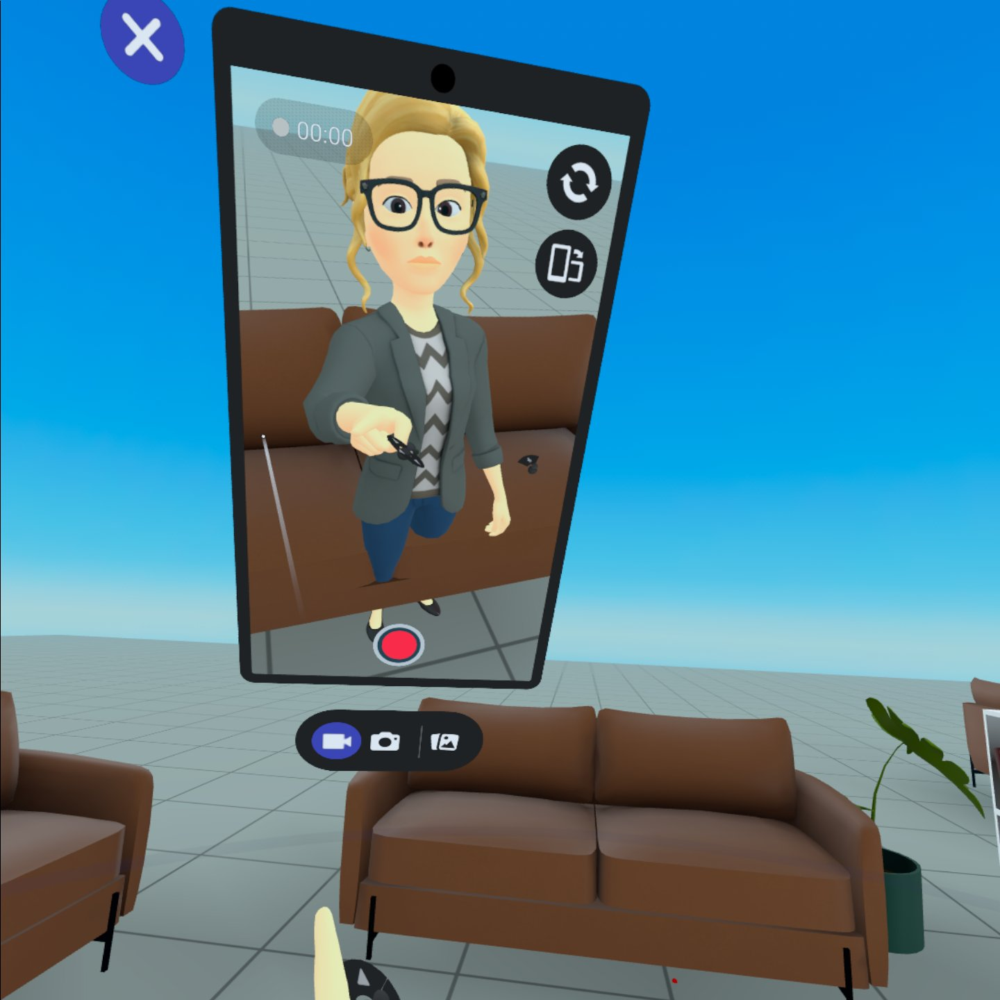
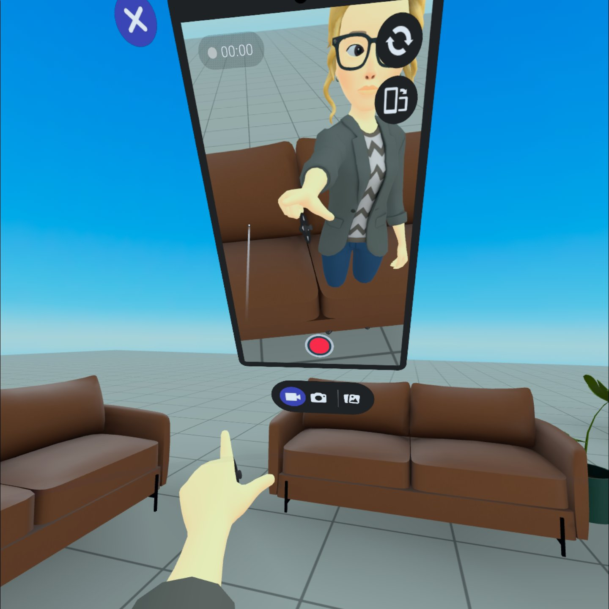
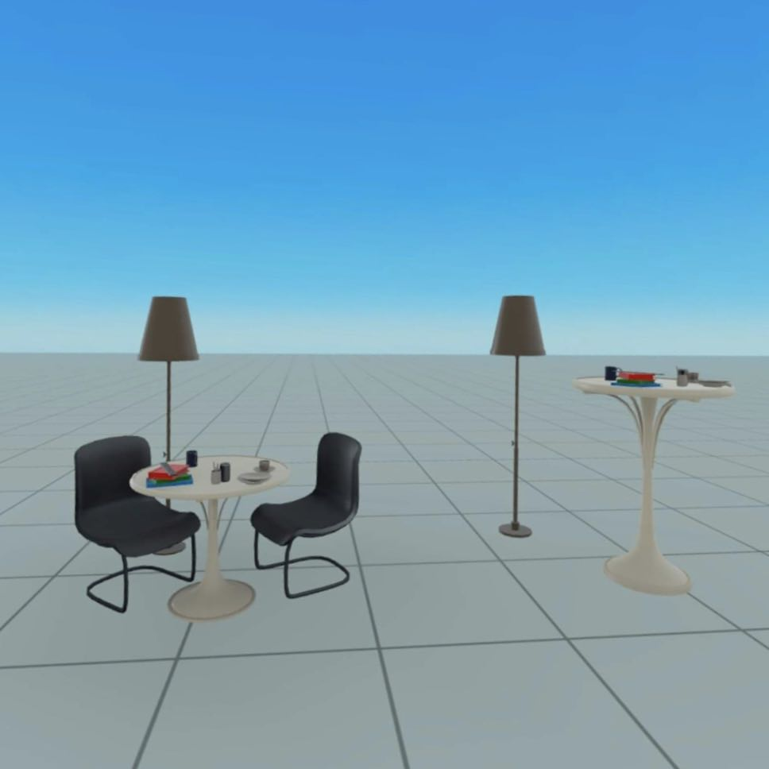
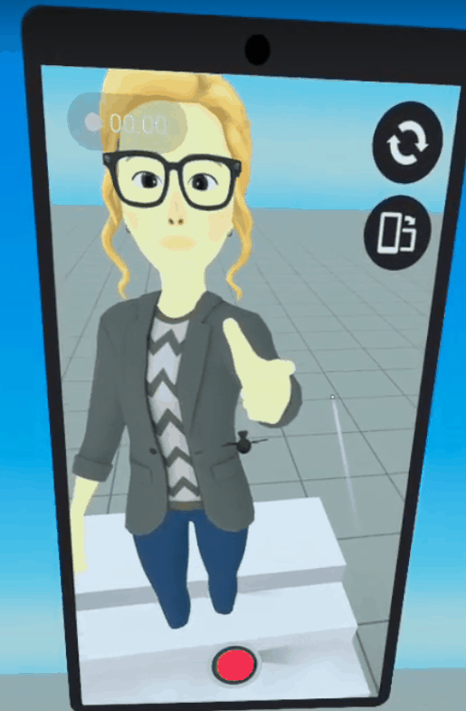
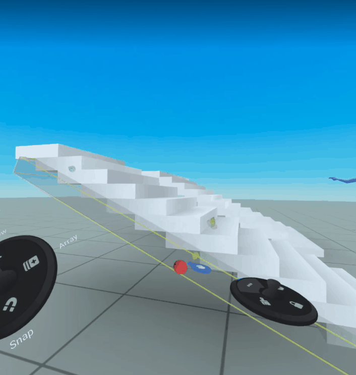

# [Optimizing for Full-Bodied Avatars in Meta Horizon Worlds](#optimizing-for-full-bodied-avatars-in-meta-horizon-worlds)

Legs are a highly requested feature in Meta Horizon Worlds, and we need your help to make sure everyone has the best experience possible!

We are continuing to iterate on and improve this new feature and will be rolling out more updates in the coming months, including future gizmos and attributes.

In the meantime, we have compiled some common interactions we recommend testing in your worlds, along with suggestions for how you can optimize the user experience.

## [Sitting](#sitting)

We are planning to create a feature that allows users to sit down on designated objects, however, this functionality will not be available for the initial release. If your world includes objects like chairs, couches, benches, etc. that act as a place for users to sit down, you will have the option to toggle the collider button on or off for an object. If the collider button is on, instead of sitting down, users will stand on top of the object.

**Option 1:** We recommend keeping the collider toggle off for objects that moonlight as a place to sit down. This will result in the users’ legs going through the object keeping the same height and line of sight that users previously had when they hover over objects.

Along with the recommendation of keeping colliders off for objects meant for seating, you can modify objects to cover the entire lower parts of the avatar’s bodies. This hides the avatar legs going through the object which can help with the overall aesthetic experience of your world.

**Option 2:** Alternatively, you can remove seating objects entirely, and convert tables into high top tables or high top bars and remove seats.

**

### [Clipping of Feet on Ramps and Stairs](#clipping-of-feet-on-ramps-and-stairs)

Feet may clip when walking on ramps and stairs that use an (invisible) ramp as a collider. Adjust colliders to prevent clipping of feet into stairs, ramps or the ground. This may also help ensure drop shadows show up consistently across worlds.

**Option 1:** Move the (invisible) collider ramp up so that feet don’t clip, but this might create some floating feet.

**Option 2:** Remove the invisible ramp collider and turn on collisions for individual stairs. Make sure the height between stairs is low enough that users don’t need to jump to go up them.

### [Frequently Asked Questions](#frequently-asked-questions)

- Can I share that I have early access to legs with users outside of the early access program?

  - No, please keep this information confidential.

- I can see everyone’s legs. Can people outside of early access see my legs too?

  - No, only people within the early access program can view legs. Think about it like having ‘legs glasses.’ You can see other users’ legs but they can not see your legs.

- Why can’t I see my own legs?

  - You may not be able to see your own legs when you look down but you are able to view them using the mirror or selfie camera.

- Will the addition of legs impact my world capacity?

  - Legs should have a minimal impact on world complexity / capacity.

- Can I assign a different damage value for legs?

  - This functionality is not supported at this time. Damage to legs will register the same as damage to torso.

- Am I able to create attachables for legs?

  - You are not able to create attachables for legs at this time but this functionality may be available with future updates.

