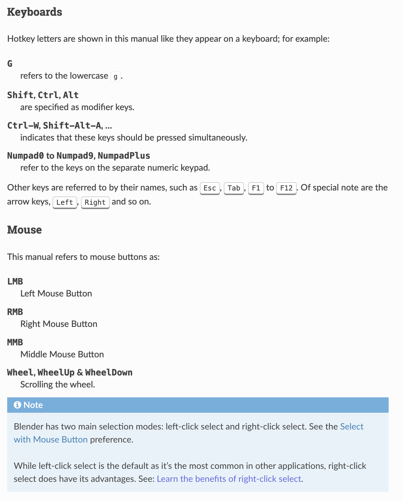
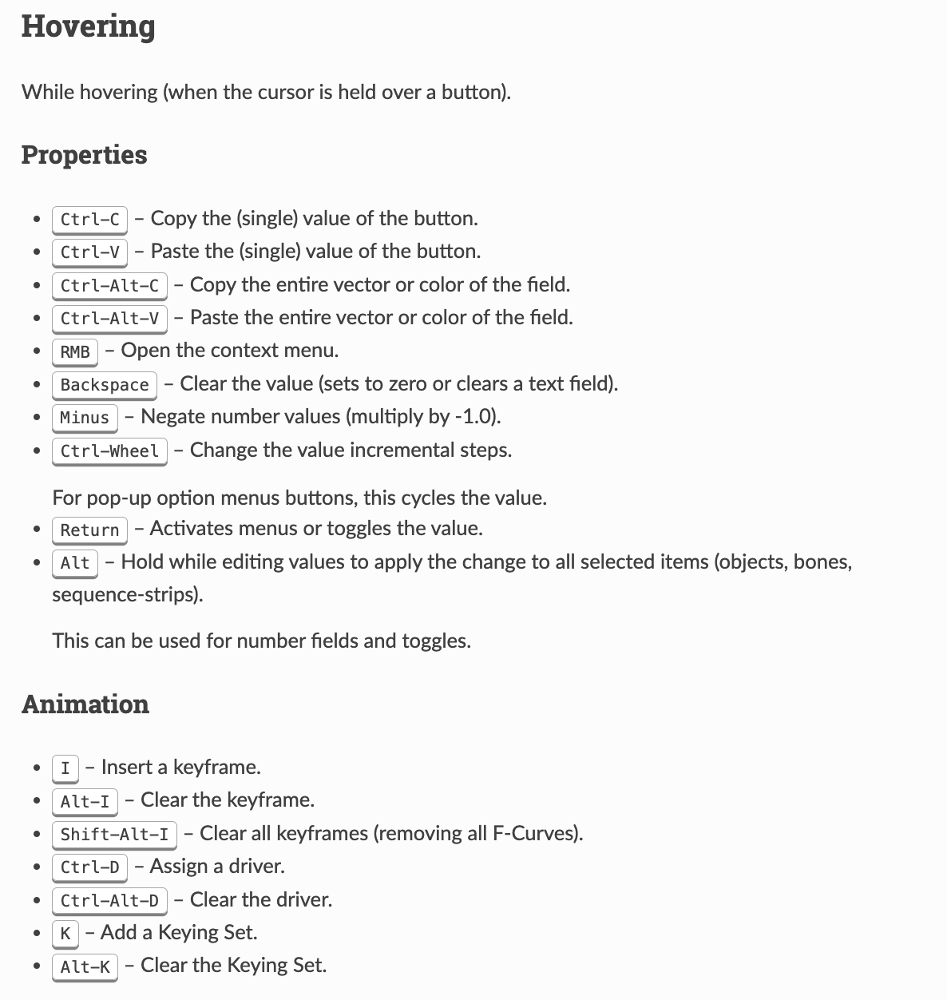
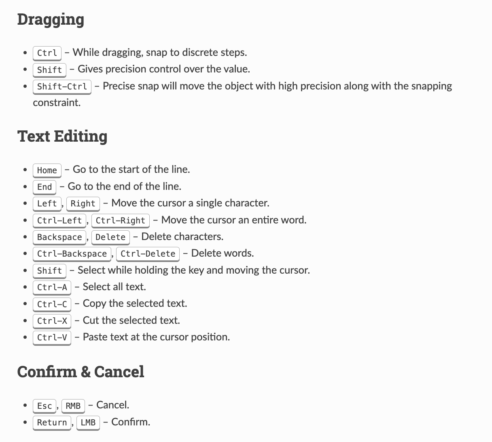

# 3D Modeling Tool Resources

This article provides links to introductory resources that will help you learn more about Blender and other 3D modeling tools.

## Blender

Blender is a popular free open source software program for building 3D models. It is a public project hosted on blender.org, licensed as GNU GPL and owned by its contributors. It can be downloaded directly from the [Blender Website.](https://www.blender.org/)

Below we provide beginner-friendly resources for learning 3D modeling with Blender:

* [Blender Guru’s Beginner Tutorial Series](https://www.blenderguru.com/tutorials/blender-beginner-tutorial-series): Andrew Price, known as Blender Guru, offers a comprehensive beginner tutorial series that covers the basics of Blender, including: navigation, modeling, texturing, lighting, and rendering.
* [Blender Fundamentals on YouTube](https://www.youtube.com/playlist?list=PLa1F2ddGya_-UvuAqHAksYnB0qL9yWDO6): This official Blender YouTube playlist provides a series of short and easy-to-follow video tutorials designed for new users.
* [CG Cookie’s Beginner Courses on YouTube](https://www.youtube.com/@cg_cookie): These courses introduce you to Blender’s fundamental tools and workflows. They provide a great starting point for newcomers.
* [Grant Abbitt’s Blender Tutorials on YouTube](https://www.youtube.com/c/GrantAbbitt): There are lots of user-friendly Blender tutorials on this channel, including modeling, texturing, and rendering basics.
* [CG Cookie’s Learn How to Create Textures and Materials](https://www.youtube.com/watch?v=dn4UFetEDWM): Cookie’s hands-on guide explains how to create textures and materials.
* [Blender Stack Exchange](https://blender.stackexchange.com/): The Blender Stack Exchange community can provide valuable assistance when you have questions or need help with Blender-related issues.
* [BlenderArtists Community](https://blenderartists.org/): Join the BlenderArtists forum to connect with other Blender enthusiasts. You can share your work and seek advice from experienced users.
* [Blender Keyboard Shortcuts](https://docs.blender.org/manual/en/latest/interface/keymap/introduction.html): Familiarize yourself with Blender’s keyboard shortcuts to improve your efficiency.

## Additional Tools for 3D Modeling

There are two categories of tools that you can use when modeling, professional paid-for tools and budget friendly. We’ve provided direct links to these tools and sorted then into their respective category.

### Professional 3D Modeling Tools

* **Pro 3D Modeling**: [Maya](https://www.autodesk.com/products/maya/overview), [Blender](https://www.blender.org/), [3DS Max](https://www.autodesk.com/products/3ds-max/overview), and [Cinema 4D](https://www.maxon.net/en/)
* **Modeling for Detail/Normal Generation**: [ZBrush](https://pixologic.com/)
* **Texturing**: [Photoshop](https://www.adobe.com/products/photoshop.html) and [Substance Painter](https://www.substance3d.com/products/substance-painter).
* **Animation**: [Blender](https://www.blender.org/) and [Maya](https://www.autodesk.com/products/maya/overview).

### Budget-Friendly 3D Modeling Tools

* **Modeling**: [Blender](https://www.blender.org/) and [SketchUp](https://www.sketchup.com/)
* **Texturing**: [GIMP](https://www.gimp.org/)
* **Animation**: [Blender](https://www.blender.org/)