# Best practices for custom models

## Performance information

Currently, custom model vertices increase the geometry complexity, but the limit might be tuned differently based on performance feedback. The amount of textures being used is currently not shown anywhere or capped. Visibility into this will come soon.

## Topology

Open edges are supported. Horizon doesn’t use double-sided shaders, so if you are creating objects with two sides, such as leaves, you will need to create polygons that face both directions.

### Modeling for vertex baked lighting

Horizon’s lighting solution (RTK) uses vertex colors to add lighting information to the scene. When modeling with this in mind, it becomes easy to visualize and control where light and shadow appear on the finished model once baked. The fidelity of the applied lighting is directly related to the density and placement of vertices.

It is important to plan your topology to support different lighting scenarios. Identify which parts are in shadow, and how that shadow transitions into light.

### Topology for GI artifact handling

| Topology creating GI artifacts | GI artifacts fixed with topology adjustment |
| --- | --- |
|  |  |
| Topology on custom models will sometimes produce artifacts when GI is calculated. This will cause extremely dark vertices when imported into Horizon. They will occur when a vertex is close to or snapped to another vertex or edge on a different contiguous mesh. | To remedy this when working with multiple contiguous meshes, place vertices toward the middle of intersecting faces. The image below shows an adjusted model, and no GI lighting artifacts. |

**Problem** The top example shows how vertices can define light and shadow:

* The Mesh on the top does not have enough vertices to define which areas are in light and which are affected by ambient occlusion.
* The cubes on the end lack the vertices in the middle of the faces to assign a shadow color to it.
* The center bar’s end vertices are inside the cubes, placing those in complete shadow. With no verts to interpolate into the light portion, the bar appears as if it is completely in shadow.

**Solution:** The meshes in the bottom example solves this problem by adding in a vertex in the center of the cube sides where it intersects the bar to define the shadow. It places support loops on the center bar to define which area is in the light.

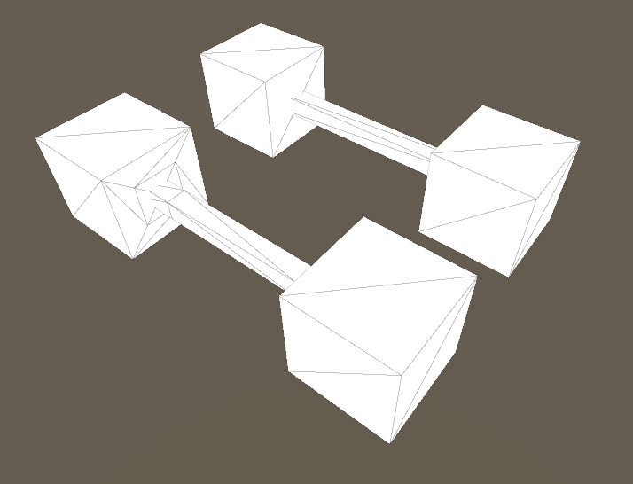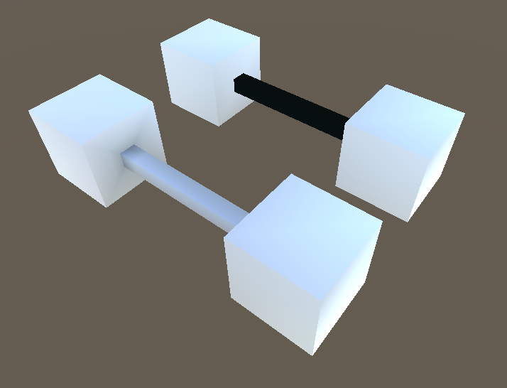

## Scale

Build objects on real-world scales. Make sure that when you export your FBX, the units are set appropriately.

**Houdini** - Check “Convert Units” on the FBX export ROP.

**Maya** - There is a known scale issue where models will come in at the correct size but will have their transforms set to 0.01 scale.

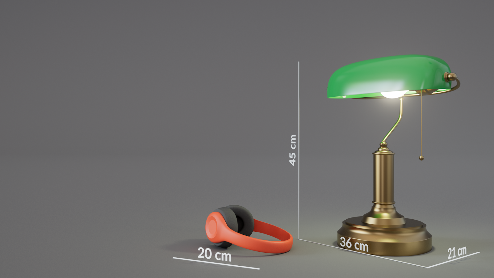

## Pivots

When exporting a set of objects, we recommend setting their pivot correctly, centered at the bottom of each piece, or aligned in the same way that you would for a well-prepared game asset.

**Tip**: currently, pivots will all become centered in Horizon, but this is something we plan to change in the future, so setting up your pivots correctly now could make these assets more useful in the future.

See the [Fallout 4 Modular Level Design](https://youtu.be/QBAM27YbKZg?t=422) talk for pivots, standardizing, and more tips around this.

## Remixability

Consider breaking your asset into pieces if those pieces would be useful for remixing.  However, if you aren’t planning on remixing an asset, it’s better optimized as a single piece.

**Maya** - Prior to exporting from Maya, you should group your kit, then arrange it in a way that is convenient to see and access all of the items in your kit. We recommend that the history is deleted and the transform is frozen.

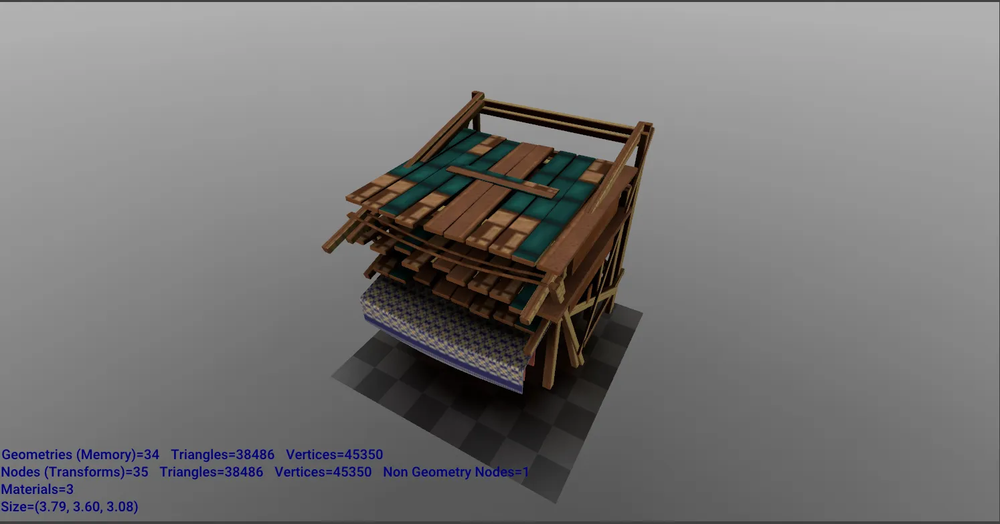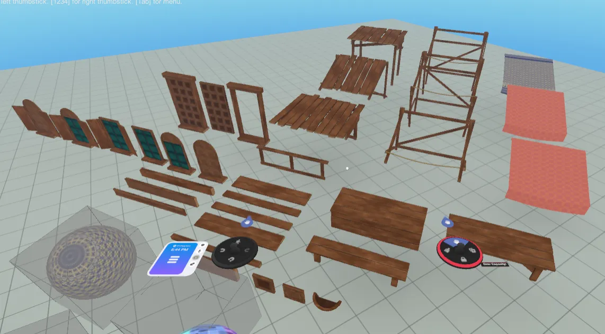

## UV padding

Because we use the lowest mip size for coloring the bounce lighting information, there is a possibility that closely-packed UVs with strong color differences could cause incorrect color bouncing. If you have UV islands with strong color differences, you should use extra UV padding between those islands.

Minimum padding you should use for **large color differences**:

* 512 textures use 8 pixels.
* 1024 textures use 16 pixels.
* 2048 textures use 32 pixels.

## Texture style

Because the Quest 2 screens are high resolution, you can get extremely close to object surfaces. This makes it challenging for textures with fine details to remain good-looking when you are very close to them or they are very large. We recommend creating textures with less high-frequency detail, a style which holds up well in VR.

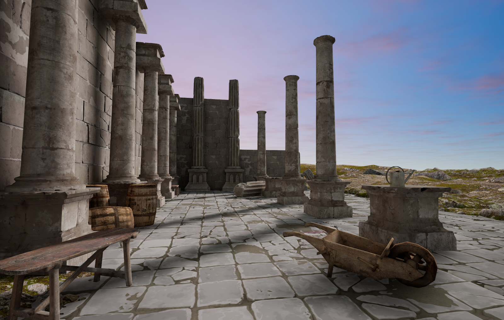*High frequency detail.*

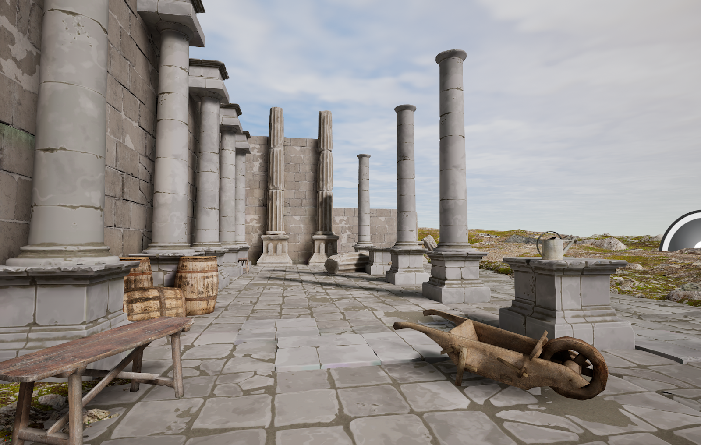*Lower frequency details look better close up in VR.*

## Model baking

Model baking is a common technique. Keep in mind that we currently do not support normal maps, so use geometry to convey information you typically might put into a normal map.  Using geometry instead of normals works very well in VR and gives you nicer kitbash piece intersections when laying out worlds.

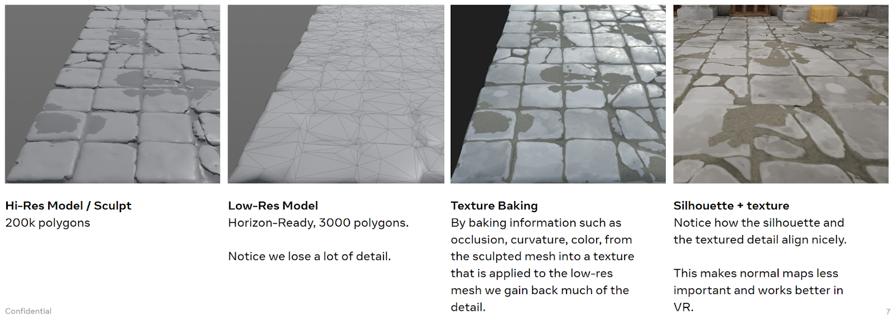

## Trim sheets

One of the best ways to optimize your textures is to use what are called trim-sheets, also known as artist-authored texture atlases. These are tiled strips of re-usable texture information that is assigned with UV coordinates onto different parts of the model.

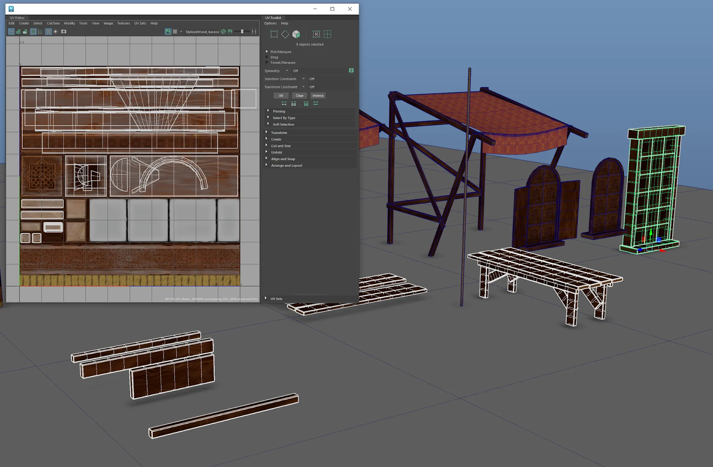

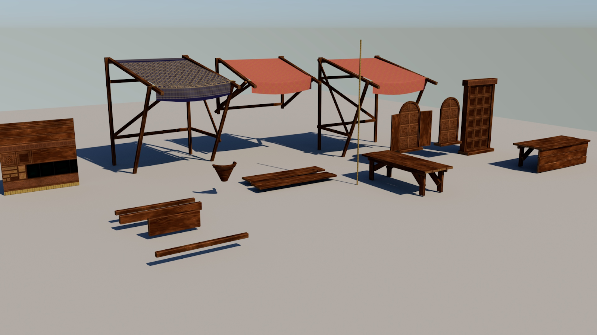

## When to use the Metalness Channel

Examples showing basecolor + roughness compared to basecolor + roughness + metalness.
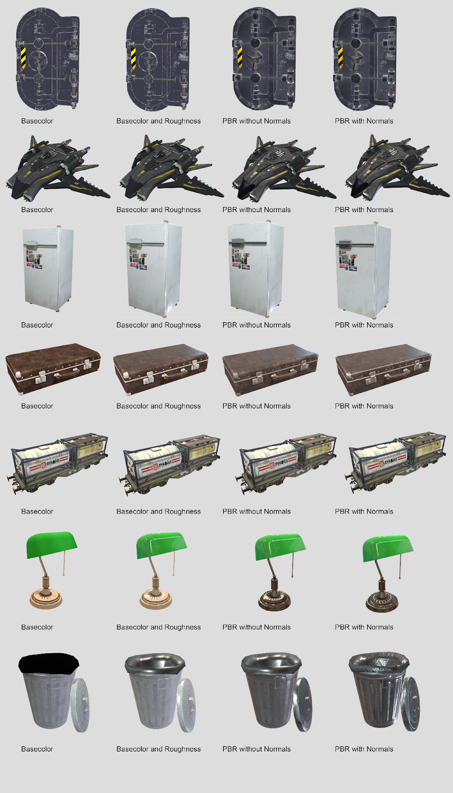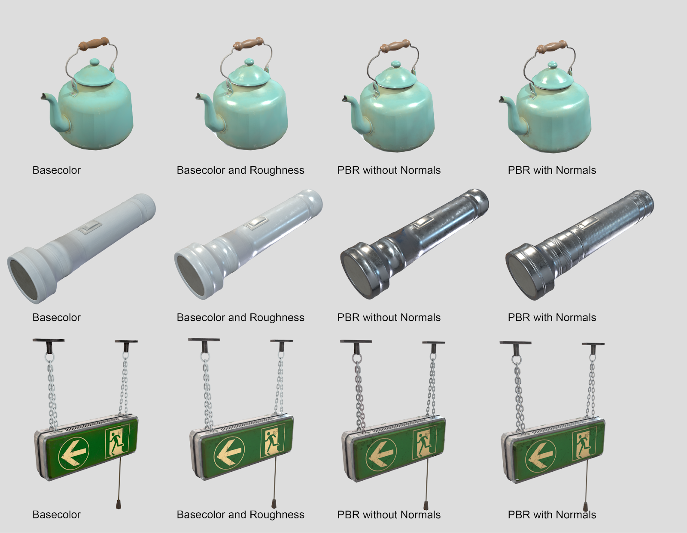

## World budgets

### Runtime world budgets

It’s important to consider the world limits when designing assets. This will enable you to effectively allocate the total number of assets required for creating your world, and develop a comprehensive asset plan.  These limits are view dependent however there is no occlusion culling meaning the world limit can often approach view limit.

|  | **Approximate limits for a gameplay heavy world** | **Maximums, when you have a more static world** |
| --- | --- | --- |
| **Total Vertices** | 600,000 | 1 Million |
| **Draw Calls** | 150 | 250 |

### Travel time world budgets

These limits are designed to keep world travel times in check, especially for visitors with lower internet speeds.

|  | **Download time** | **Download time** |
| --- | --- | --- |
| **Unique Vertices** | 200k | 400k |
| **Texture Megapixels** | 40 megapixels | 80 megapixels |

1 megapixel = 1024 x 1024. (example 4 Megapixels = 2048 x 2048)

More megapixels means more time to load the textures, which may impact world travel times or take the world longer to look fully loaded. 40 Megapixels = 25 MB (ASTC 6x6).

### Generic asset recommendation

|  | **Polygons** | **Vertices** | **Texture Size** |
| --- | --- | --- | --- |
| **5 m****3****Object** | 2000 | 1000 | 2048 x 2048 |
| **1 m****3****Object** | 1000 | 500 | 512 x 512 |

This is a very general recommendation, and artists should adjust as needed.

## Model specification

A 3D model is made up of Mesh + Textures + Materials.

**Note:** See [**Materials Specifications**](Materials%20Guidance%20and%20Reference%20for%20Custom%20Models.md) section for channel packing.

### Mesh recommendations

|  | **Recommended** |
| --- | --- |
| **Formats** | FBX |
| **Naming** | **Avoid** using these characters in your node & file names - .,, /, \*, $, & |
| **Objects** | Multiple meshes per FBX file supported |
| **Polygon Count** | 12K recommended maximum, 400K maximum vertices. |
| **Hierarchy** | Flattened in Horizon\* |
| **Pivot Points** | Centered on import\* |
| **Animation** | Importing animation is not currently supported |
| **UV Channel** | Only UV channel 0 is used to map textures onto the mesh |
| **Normals** | Vertex normals are imported |

\*subject to change in the future.

### Texture recommendations

PNG - 8 -bit per channel

See Material spec below for channel packing.

Horizon will support any power of 2 textures up to 4096 x 4096