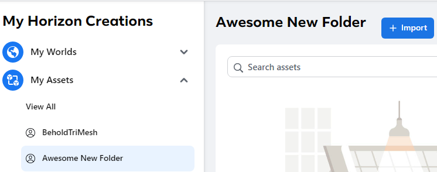
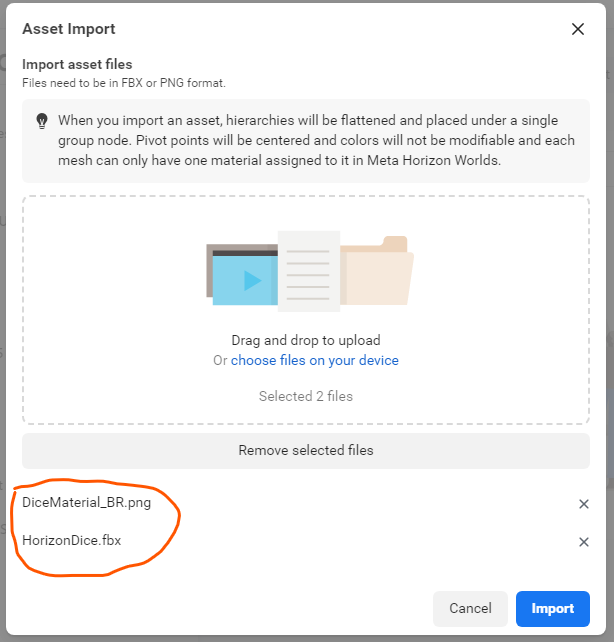
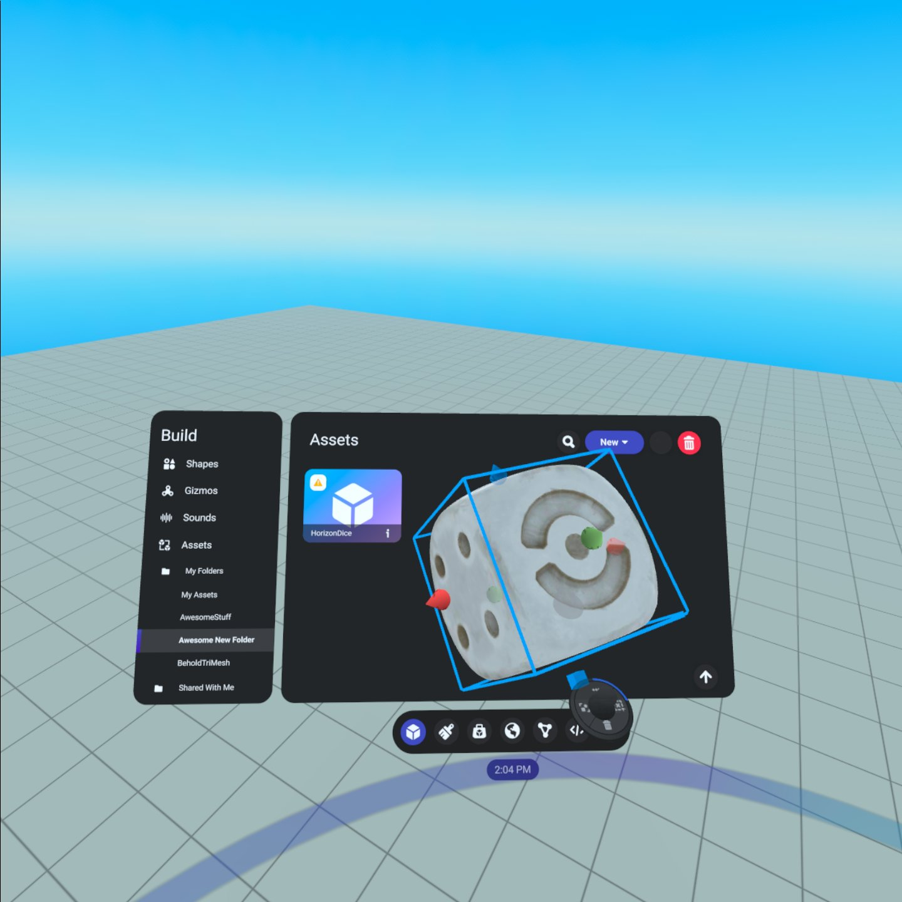

# [Creating a Custom Model](#creating-a-custom-model)

This document explains how to create custom models that will provide highly detailed 3D objects you can use to build rich visual assets and experiences in Horizon. These assets consist of shapes, textures, and materials that simulate real world objects or scenes.

The Quickstart video tutorial below will show you how to make a simple dice asset using Blender to define its mesh shapes, and Adobe Substance Painter to add textures and materials. The following section describes how to upload your finished model.

## [Setup Requirements](#setup-requirements)

Before you can begin using Custom Models in Horizon, you will need specific assets and software.

- DCC tools such as Maya, Blender, or Adobe

## [Quickstart Video Tutorial](#quickstart-video-tutorial)

This video demonstrates how easy it is to bring in an object from Blender and add textures and materials with Adobe Substance Painter to create a custom model for uploading into your Horizon World.

## [3D Modeling 101](#3d-modeling-101)

This series of videos, provided by the Meta Horizon Creator Program (MHCP), is a comprehensive introduction to 3D modeling using Blender.

- [3D Modeling 101: Week 1](../../MHCP%20program/Community%20guides/3D%20Modeling%20101%20-%20Week%201.md)
- [3D Modeling 101: Week 2](../../MHCP%20program/Community%20guides/3D%20Modeling%20101%20-%20Week%202.md)
- [3D Modeling 101: Week 3](../../MHCP%20program/Community%20guides/3D%20Modeling%20101%20-%20Week%203.md)
- [3D Modeling 101: Week 4](../../MHCP%20program/Community%20guides/3D%20Modeling%20101%20-%20Week%204.md)
- [3D Modeling 101: Week 5](../../MHCP%20program/Community%20guides/3D%20Modeling%20101%20-%20Week%205.md)

## [Uploading Finished Models](#uploading-finished-models)

> [!Note]
>
> This only works for unanimated rigid models; skeletal deformations are not supported with this upload flow.

When you have completed your custom 3D model, it is ready to be uploaded.

### [Uploading Procedure](#uploading-procedure)

Follow these steps to upload your custom model into your Horizon World.

1. Make sure you are signed into your Meta account, then navigate to [https://horizon.meta.com/](https://horizon.meta.com/creator/assets/).
2. Select the folder you wish to upload into and select **import**. 
3. Drag and drop a **single** FBX file and its associated texture(s). 
4. Click **Import** and wait for it to process.
5. Now in Horizon’s build mode, if you navigate to the folder you uploaded to, you will find your asset and be able to pull it into your world. 

## [How to Create Custom Models for Meta Horizon Worlds](#how-to-create-custom-models-for-meta-horizon-worlds)

The Quickstart video tutorial provided an introductory overview of the tools and procedures for creating a simple custom model asset. Other docs in this section expand on this, so you can build your own models. They provide specifications and additional details on how to:

- Budget your assets.
- Create meshes, textures, and materials.
- Define color details.
- Learn Performance and Best Practices.
- Upload your finished custom model.
- Get more information.

