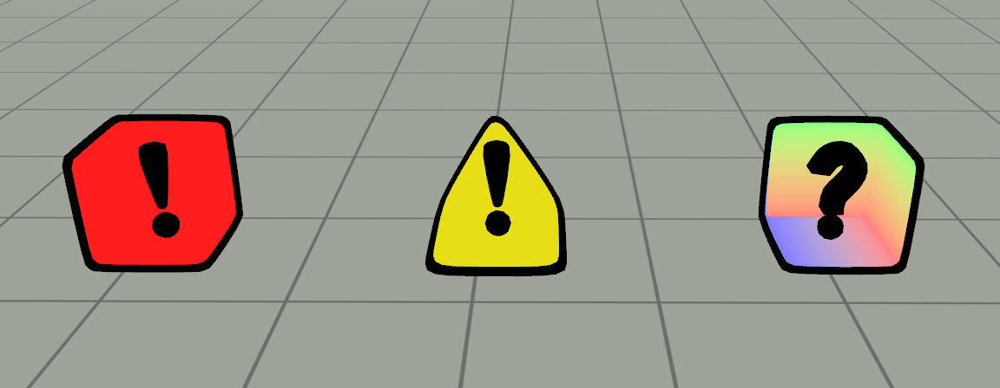
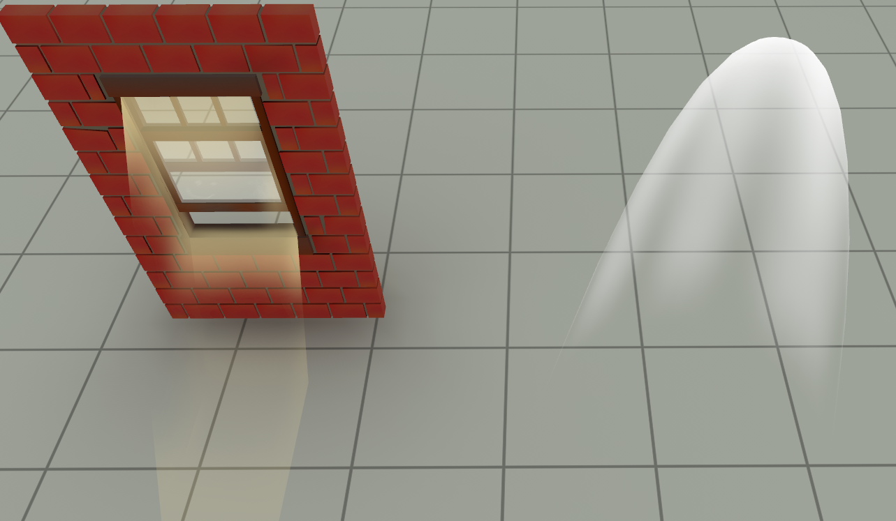
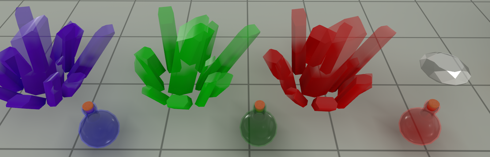
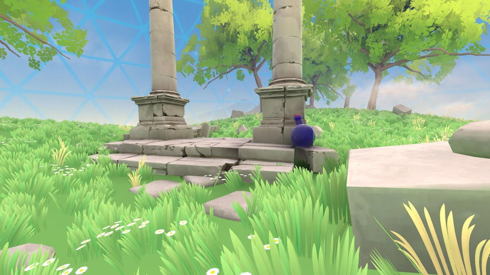
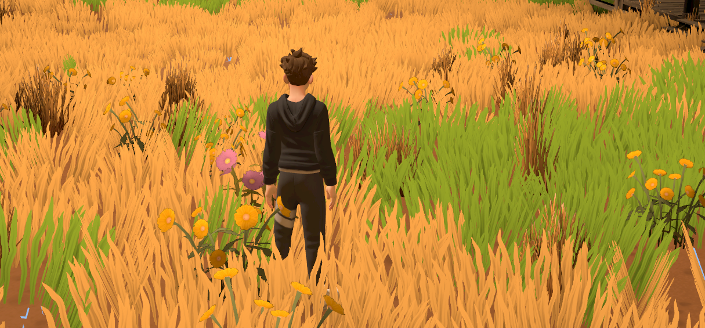
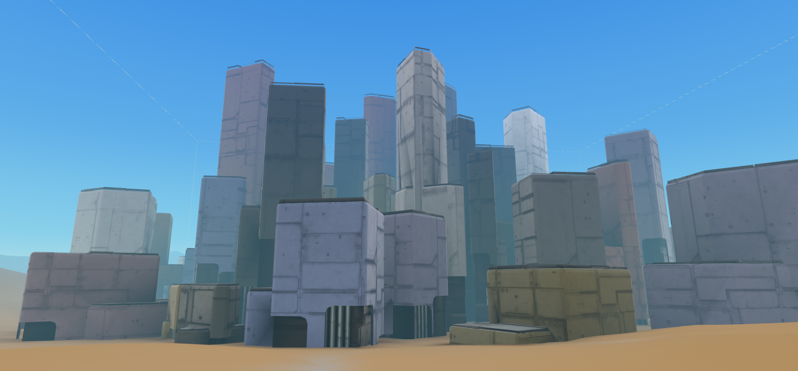
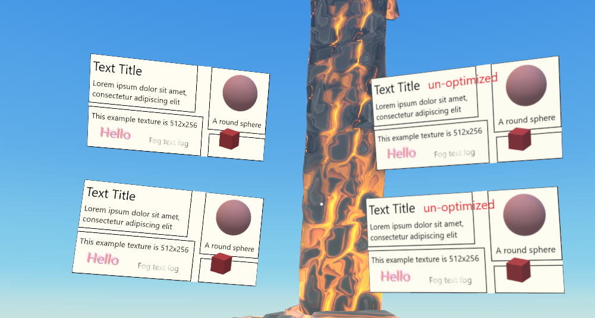

# Materials Guidance and Reference for Custom Models

A [mesh](https://en.wikipedia.org/wiki/Polygon_mesh) is a collection of vertices, edges, and faces that define the shape of a 3D object. In Meta Horizon Worlds, meshes are used to create objects such as buildings, terrain features, or decorative elements. Materials define the visual appearance of these 3D objects by specifying colors, textures, and other properties that are mapped onto them.

## Defining materials in the FBX file

A material is a set of properties that define how an object responds to light. A material specifies the way that the object reflects, absorbs, and transmits light. You can think of materials as the “paint” that you apply to the surface of an object. Materials can have various properties such as color, reflectivity, transparency, and roughness.

You can assign multiple materials per mesh in the FBX file, and multiple FBX meshes can share the same material. For more information, see [Multiple Materials per Mesh](Multiple%20Materials%20per%20Mesh.md).

## Filename Criteria

* Avoid using these characters in your file names -, ., , /, \*, $, &
* Avoid using underscores “\_” in your material and texture names, except to designate special tags like \_Metal.
  + 👎 Dont\_Name\_Like\_This\_BR.png.
  + ✅ NameLikeThisInstead\_BR.png.

## Texture and materials reference

### Single-Texture PBR

The PBR (Physical Based Rendering) material for a single texture combines the base color and roughness. Metalness will be set to 0.

|  | **Naming** | **Channels** |
| --- | --- | --- |
| **Texture A** | MyMaterialName\_BR.png | BaseColor (sRGB) + Roughness (linear) |

**Note:***MyMaterialName* is a placeholder for the name of the material the texture applies to.

### Single-Texture Metal PBR

Single-texture metal PBR material combines the base color and roughness. Material names must end in “\_Metal”. This part of the material name is not reflected in the texture matching. Metalness will be set to 1.

|  | **Naming** | **Channels** |
| --- | --- | --- |
| **Texture A** | MyMaterialName\_BR.png | BaseColor (sRGB) + Roughness (linear) + Metalness |

**Note:***MyMaterialName* is a placeholder for the name of the material the texture applies to.

### Double-Texture PBR

Using two textures gives control over more of the PBR properties.

|  | **Naming** | **Channels** |
| --- | --- | --- |
| **Texture A** | MyMaterialName\_BR.png | BaseColor (sRGB) + Roughness (linear) |
| **Texture B** | MyMaterialName\_MEO.png | Metalness + Emissive + AmbOcclusion (all linear) |

**Note:***MyMaterialName* is a placeholder for the name of the material the texture applies to.

### Unlit Materials

Materials that do not receive or cast lighting or shading are considered unlit. The material name in the FBX must end in “\_Unlit”. Any extra channels, such as the fourth channel, are discarded.

|  | **Naming** | **Channels** |
| --- | --- | --- |
| **Texture A** | MyMaterialName\_B.png | BaseColor (sRGB) |

**Note:***MyMaterialName* is a placeholder for the name of the material the texture applies to.

### Unlit Blend Materials

Blended materials that do not receive or cast lighting or shading are considered blended and unlit. The material name in the FBX must end in “\_Blend”. Unlit blended materials do not have any specular or reflection properties.

|  | **Naming** | **Channels** |
| --- | --- | --- |
| **Texture A** | MyMaterialName\_BA.png | BaseColor (sRGB) + Alpha (opacity) |

**Note:***MyMaterialName* is a placeholder for the name of the material the texture applies to.

### Transparent Materials

Transparent materials allow light to pass through. A specular channel is used, which modulates specular and reflection amounts. Using two textures gives control over more of the PBR properties. Material name in FBX must end in “\_Transparent”

|  | **Naming** | **Channels** |
| --- | --- | --- |
| **Texture A** | MyMaterialName\_BR.png | BaseColor (sRGB) + Roughness (linear) |
| **Texture B** | MyMaterialName\_MESA.png | Metal, Emissive, Specular, Alpha (aka inverse of Transparency) (linear) |

**Note:***MyMaterialName* is a placeholder for the name of the material the texture applies to.

### Masked Materials

Masked materials are used for controlling the mixing of two textures. The material does respond to specular and roughness properties, but is considered fully rough; i.e., roughness = 1. The A channel of the texture drives the alpha, where white is opaque and black is clear. Alpha cutout happens at 0.5 (matching the default for GLTF 2.0 and Unity). Material names in FBX must end in “\_Masked”.

|  | **Naming** | **Channels** |
| --- | --- | --- |
| **Texture A** | MyMaterialName\_BA.png | BaseColor (sRGB) + Alpha (aka inverse of Transparency) (linear) |

**Note:***MyMaterialName* is a placeholder for the name of the material the texture applies to.

Also supported is a “masked vertex color” material. In this case, the **BaseColor** texture is multiplied with the mesh’s vertex color. Material names in FBX must end in “\_MaskedVXM”.

### Vertex Color PBR

Vertex colors are RGBA values that are applied directly to mesh vertices. They do not contain any textures. You can use vertex color for:

* Simple clean objects.
* Objects that just need simple gradients or colors.
* Simple landscapes

A material name in the FBX must end in “\_VXC”.

### Vertex Color Single-Texture PBR

Vertex colors are RGBA values that are applied directly to mesh vertices and then multiplied with a texture **BaseColor** as input to both GI and shading. You can use vertex color for:

* Allowing more texture reuse across similar surfaces with different colors.
* Layering broad color and value changes.

Metalness will be set to 0.

A material name in the FBX must end in “\_VXM”.

|  | **Naming** | **Channels** |
| --- | --- | --- |
| **Texture A** | MyMaterialName\_BR.png | BaseColor (sRGB) + Roughness (linear) |

**Note:***MyMaterialName* is a placeholder for the name of the material the texture applies to.

### Vertex Color Double-Texture PBR

The Vertex Color Double-Texture PBR material is the same as the single-texture version but uses two textures to give more control over the PBR properties, in the same way as the regular texture PBR, but applied to vertices. Vertex color is **multiplied** with texture BaseColor as input to both GI and shading. Using two textures gives control over more of the PBR properties

Material names in FBX must end in “\_VXM”.

|  | **Naming** | **Channels** |
| --- | --- | --- |
| **Texture A** | MyMaterialName\_BR.png | BaseColor (sRGB) + Roughness (linear) |
| **Texture B** | MyMaterialName\_MEO.png | Metalness + Emissive + AmbOcclusion (all linear) |

**Note:***MyMaterialName* is a placeholder for the name of the material the texture applies to.

### UI Optimized Materials

UI Optimized Materials are optimized to provide better quality UI elements (e.g. text, icon) when displayed. These textures are unlit and do not receive or cast lighting or shading.

Material names in FBX must end in “\_UIO”.

|  | **Naming** | **Channels** |
| --- | --- | --- |
| **Texture A** | MyMaterialName\_BA.png | BaseColor (sRGB) + Alpha (opacity) |

**Note:***MyMaterialName* is a placeholder for the name of the material the texture applies to.