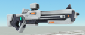
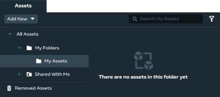
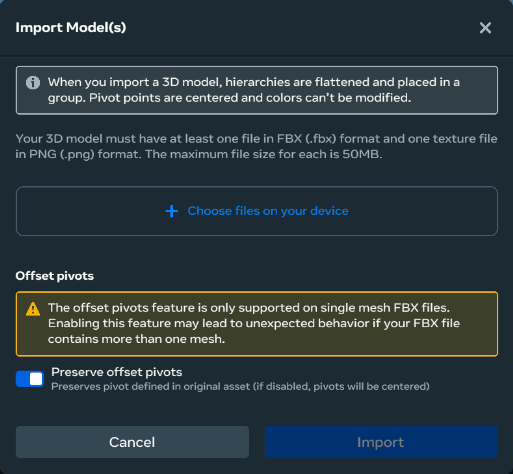

# [Getting started with 3D model import](#getting-started-with-3d-model-import)

## [Custom model files](#custom-model-files)

A custom 3D model is composed of multiple files, all of them must be specified when importing a 3D model into the desktop editor. The files include:

- An [FBX](https://en.wikipedia.org/wiki/FBX) file. This is the 3D model file format. It contains the 3D mesh along with scene data such as cameras, lighting, geometry, materials, and animations.
- One or more [PNG](https://en.wikipedia.org/wiki/PNG) files. These are image files, containing textures that map onto the model to make the spawned object look more realistic.

For example, you need to import five files in order to import this rifle asset:

## [Import a custom model asset](#import-a-custom-model-asset)

Follow this procedure to import a custom model asset, spawn an object from it, and add it to your scene.

**Note**: To complete this procedure, you need a custom 3D model (an FBX file and one or more PNG texture files) to import. If you don’t have a 3D model, you can get demo assets [here](../_assets/misc/57c2704c3a8466018227d9aa647b44f7f8c205c5e4eadbd16c3112a0374cbfbf.zip) .

1. From the Desktop Editor, click the **Asset Library** tab at the bottom of the screen and select **My Assets**.

   

2. Add a new asset by clicking **Add New**, and select **3D Model** from the menu.

   

3. Select the asset files to import by clicking **+ Choose files on your device** on the dialog window that appears.

4. In the file picker window, select the 3D model file and associated texture files; click **Open**.

   

5. In the dialog box, click **Import**. The following asset icon appears in your **My Assets** folder when the process is complete.

   

Spawn an instance of the asset by clicking on the icon for the asset, dragging it into the scene, and dropping it anywhere in the scene. A rifle object appears in the scene, and in the hierarchy.

## [Custom model workflows](#custom-model-workflows)

In this section, you’ll learn about three workflows associated with custom models.

### [Creating, saving, and importing custom 3D models](#creating-saving-and-importing-custom-3d-models)

There are several requirements for creating and importing (ingesting) custom 3D models. There are naming conventions for files, specific file types, and texture types. For more information, see [Creating a Custom Model](Creating%20custom%20models%20for%20Horizon%20Worlds/Creating%20a%20Custom%20Model.md).

### [Using static lighting to light a custom 3D model](#using-static-lighting-to-light-a-custom-3d-model)

Objects with built-in lighting can not be used in custom model worlds. This can be circumvented by setting up static lighting on a per-object basis using a static lighting gizmo. For more information, see [Static light gizmo](../Gizmos/Static%20light%20gizmo.md).

### [Add collision to a custom 3D model](#add-collision-to-a-custom-3d-model)

Your world’s performance degrades if you build your world with very detailed, complex 3D models. To improve your performance, Meta recommends that you add a simple collider to your 3D model’s FBX file, which turns it into a collider asset. You can define custom collision shapes in the FBX file. When these colliders are imported into Meta Horizon Worlds, they become collider entities. Collider entities are a new type of entity that are used only for collision. You can use the following types of colliders: **Box**, **Sphere**, **Capsule**, and **Mesh**.

A bonus mesh collider is available in the desktop editor. Although it doesn’t perform as well as the other colliders, it is more flexible and can conform to more complex shapes.

For more information, see the [Collider Ingestion User Guide](Creating%20custom%20models%20for%20Horizon%20Worlds/Collider%20Ingestion%20User%20Guide.md).

## [3D modelling resources](#3d-modelling-resources)

To learn more about 3D modelling, follow these links:

- [Glossary of 3D Terminology](https://www.inf.ed.ac.uk/teaching/courses/cg/Web/intro_graphics/glossary.html)
- [3D Modeling Tool Resources](3D%20Modeling%20Tool%20Resources.md)
- [Custom Model Import Best Practices](Creating%20custom%20models%20for%20Horizon%20Worlds/Best%20practices%20for%20custom%20models.md)

## [Known issues](#known-issues)

- Custom model worlds don’t support spawning objects at runtime from assets that contain primitive shapes or static entities (entities with motion set to *NONE*). If you attempt to use such objects in your custom model world, you’ll break lighting and visuals, and it will impact your world’s performance.
- You cannot convert a primitive asset world into a custom model world.
- The desktop editor does not support custom shaders.
- When you publish your custom model world, it takes anywhere from one to two minutes for it to be cached. Caching ensures that subsequent visits to your world happen quicker. While your custom model world is being cached, you can still access it and load into your world, but you’ll notice that the load time is noticably longer.
- If caching fails, you’ll receive an email to let you know that your custom model world load time will take longer than normal. To fix this, simply re-publish your custom model world.

To receive the notification email, you must enable [Meta Quest > Email Preferences > App emails > Meta Horizon Worlds > Recommendations](https://secure.oculus.com/my/emails/).

- You can spawn objects from 3D custom models into a primitive asset world, but you won’t be able to publish it. A selection of primitive assets is available to use and publish in your custom model worlds.
- You can add primitive shapes (by clicking **Build > Shapes**) to your custom model world, but only for greyboxing. That is, you can’t use primitive shapes to build your entire world. You can always use custom 3D models to build your world after you’ve laid-out your design.

## [What’s next?](#whats-next)

To learn more about Meta Horizon Worlds, try the following:

1. [Create your first world](../Tutorials/Getting%20started/Create%20your%20first%20world%20tutorial%2C%20part%201.md) using our step-by-step tutorial.
2. If you have issues when running the desktop editor, see [Desktop Editor Troubleshooting](../Desktop%20editor/Help%20and%20reference/Desktop%20editor%20troubleshooting.md)
3. Learn about the desktop editor with the [Introduction to the Desktop Editor](../Desktop%20editor/Get%20started%20with%20Desktop%20Editor/Introduction%20to%20the%20desktop%20editor.md).
4. Learn about the other tools available by reading our [Tools Overview](../Get%20started/Tools%20overview.md).
5. Join the [Meta Horizon Creator Program](https://developers.meta.com/horizon-worlds/programs/) to learn about our program benefits.

