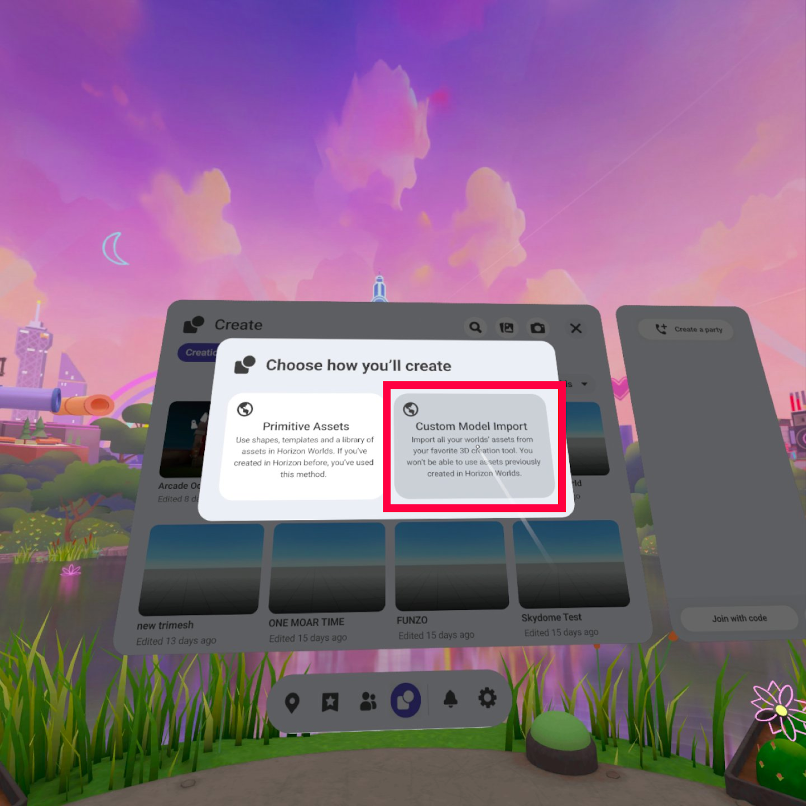
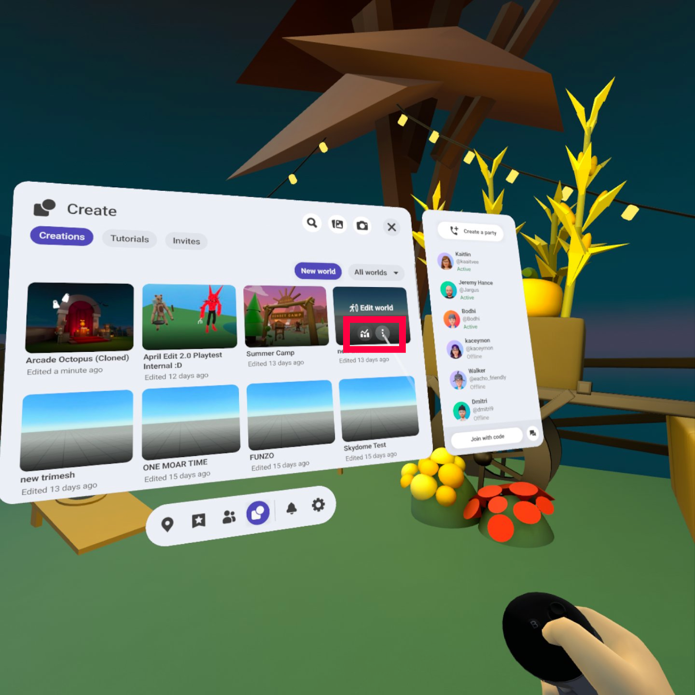
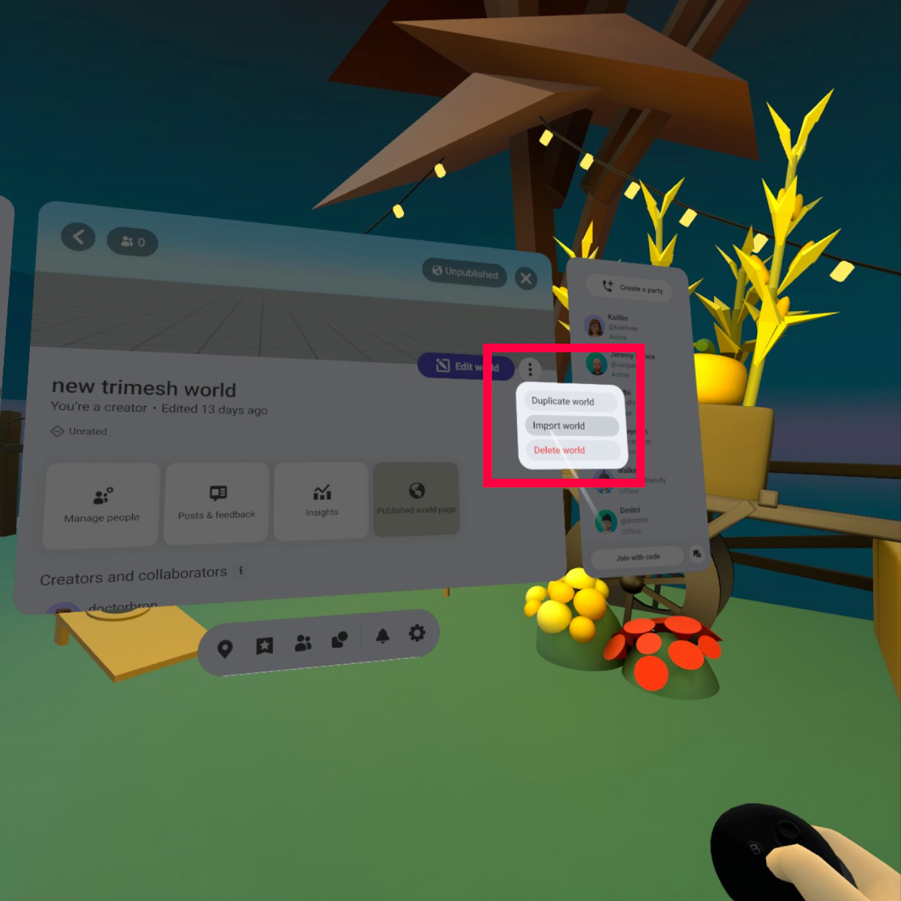
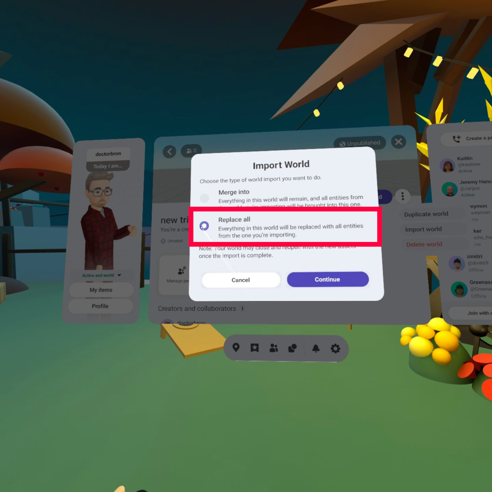
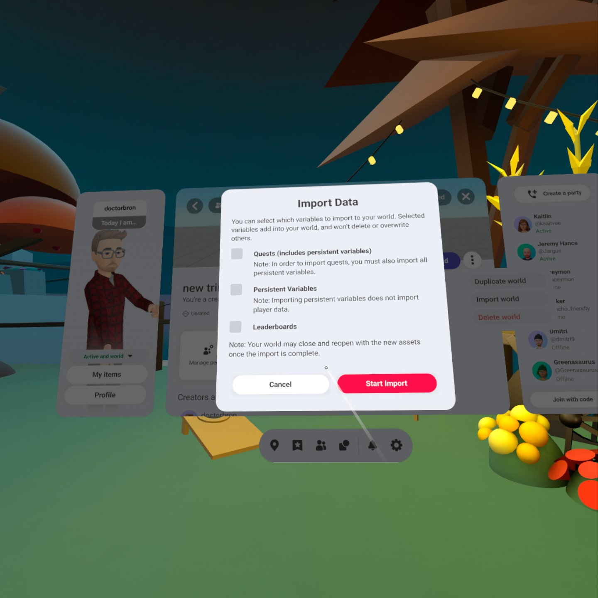

# [Replacing Primitive Worlds with Custom Model Worlds](#replacing-primitive-worlds-with-custom-model-worlds)

This article explains how to replace existing primitive worlds (the legacy way of building in Meta Horizon Worlds) with worlds built from imported custom models while maintaining the existing world likes, player data, and links to your world.

As a reminder, mixing geometry from primitive and custom model worlds will block publishing. While walking through these steps, it is highly recommended that you use “Replace all” instead of “Merge into” to avoid having primitive models remain in your world.

Before getting started, we recommended that you make a world backup and/or check for a recent world backup. If something isn’t quite right after import, this ensures you have a recent copy of your world to restore from.

## [How to replace your Primitive World with a Custom Model World](#how-to-replace-your-primitive-world-with-a-custom-model-world)

1. Create a new Custom Model world. If you haven’t done this before [see this Getting Started guide](Getting%20started%20with%203D%20model%20import.md) for Quick Start instructions. 
2. Navigate to your primitive world (the world to be replaced) via world builder.
3. Enter preview mode.
4. Open the menu.
5. Go to the world details page of your new Custom Model world. 
6. Open the 3-dot menu in the upper right corner.
7. Select “Import world”. 
8. Select “Replace all”. 
9. Choose the data you would like to import. 
10. Select “Start Import”.

Your world’s primitive geometry will be replaced with the new custom model geometry. You may now republish your world when ready!

## [Troubleshooting: “Pre-Release Asset” error when publishing](#troubleshooting-pre-release-asset-error-when-publishing)

Note that when attempting to republish your world, you may encounter an error referencing a **pre-release asset**. This error indicates that one or more **primitive assets** still remains in your world. You will need to locate and replace these with a tri-mesh/custom model geometry, or remove them altogether, before world publishing will succeed.

