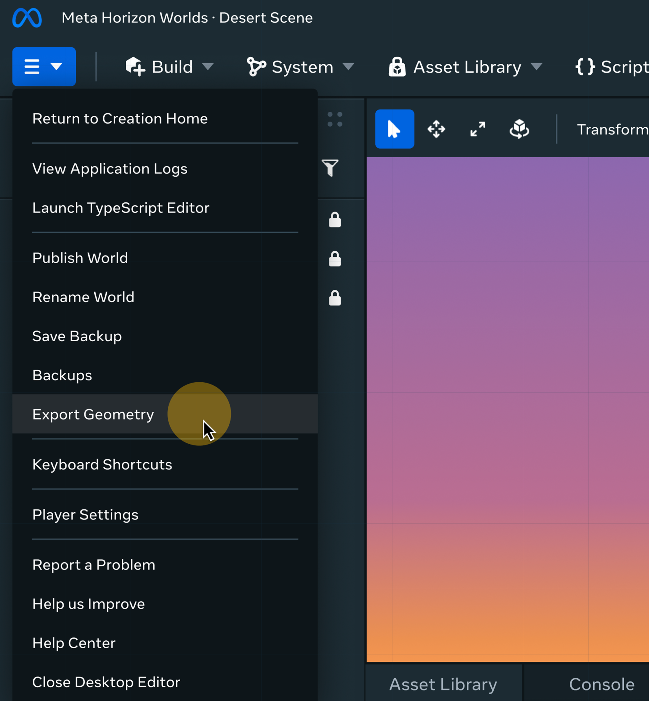
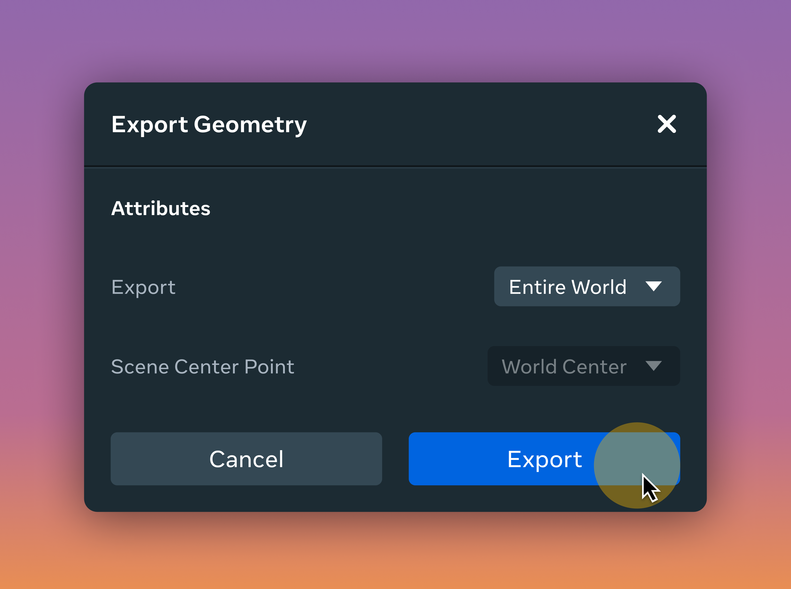

# [Asset Export to FBX File](#asset-export-to-fbx-file)

You can export the worlds you create in Horizon into an FBX file which can be loaded in desktop DCC tools like Maya and Blender. This can help when you want to convert you gray-box levels in Horizon into fully polished 3d models.

It’s possible to choose whether to export your whole world or just a small selection of assets, and decide whether to use the world-origin as the origin in your FBX file or use the center point of the models you have selected as the origin.

In Desktop Editor, you can find the export button in the top left menu button: 

This opens a menu where you can select:

- The export objects, whether to export the entire world or just the currently selected objects
- The scene center point, whether to use the world’s origin or use the center point of the selected objects.

Clicking export will create a file in a folder called FBXExport located wherever the Horizon app is installed.

