# Asset Templates

An asset template is an asset that has the type “Template”. You can create one from a complex object in your Hierarchy. Asset templates work just like legacy assets (like a 3D Model), except that they include powerful change propagation and versioning features.

Like legacy assets, asset templates can include:

* Multiple objects in a hierarchy, with a root object and child objects.
* Properties that define behaviors. For example, grabbables, and objects with physics.
* An attached script component.

But in addition to these features, asset templates also support the following:

| Feature | Description |
| --- | --- |
| Change Propagation | When you need to update all of the entities spawned from an asset template, you don’t have to update each instance by hand. Instead, you can update the asset template itself, then publish your changes, and they’ll propagate to all of the instances.   This synchronizes your changes across all of the worlds where you used that asset template. |
| Property Overrides | Allows you to customize asset template instances by overriding inherited property values.    If you want to apply those changes to all of the other instances of the asset template, you can push them back to the asset template, and then republish. |
| Versioning | Each time you publish a change to an asset template, it creates a new version of that asset template. This version information is added to the version history of changes.    Keeping track of the version history lets you revert to any previous version of the asset template. |

> **Note**: Meta Horizon Worlds Asset Templates are similar to [Prefabs in Unity](https://docs.unity3d.com/Manual/Prefabs.html).

## When to use an asset template

Asset templates are useful when you want to reuse an asset multiple times in your worlds, and you want the ability to update all of the instances in one-fell-swoop.

You can create entities from your asset template, and when you make changes to the asset template, you publish them, and the instance entities are updated. This makes it easy for you to update all of the instances in all of your worlds, using just one operation.

## Example

Consider a scenario where you want to create a forest in your world, and you want to create it using many instances of the same tree.

Now imagine that you need to update all of the tree objects. If you’d created the trees from a legacy asset, then you’d have to manually replace every tree in your forest with an updated one. This could be a lot of work!

But if you created the trees from an asset template, then you could update all of them at the same time just by updating the asset template, and then publishing the changes. The changes are then pushed to all of the instances of the asset template in your world.

## Compatibility & Recommendations

* Asset templates are compatible with anything that can be spawned into the world.
* VR support for asset templates is limited. Overrides to instances of assets done in VR can only be applied to the definition via the Desktop Editor.
* We recommend using only [File-Backed Scripts](../../Scripting/File-Backed%20Scripts.md) (FBS) worlds for the best experience and full functionality. **Non-FBS scripts are not fully supported.** Without file-backed scripts:

  + If you add non-FBS script to the template definition, when editing the template definition you can’t edit the script (it will not show in the script dropdown in properties).
  + If you edit a non-FBS script and/or attach it to an instance of the asset template changes to the script on an instance will not appear as overrides and thus cannot be applied to the template definition and propagated across worlds.
  + If you add a non-FBS to your definition it will duplicate anywhere it’s used in a world.

## Feature walkthrough

This section will go through the general workflow for templates once you are part of the GK. If you prefer this in video form, please see the tutorial video below.

## Creating a basic asset template

There are two ways to create a template:

* By converting a legacy asset to an asset template. See [Asset Migration](Asset%20Templates.md#asset-migration) section for more information.
  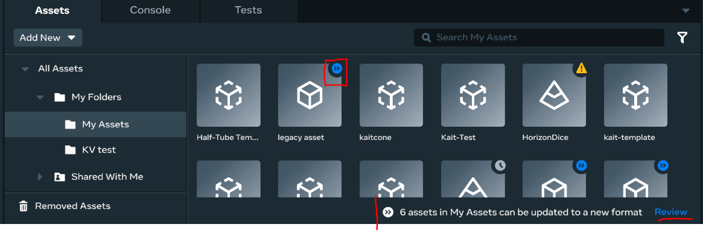
* By selecting objects in the scene and creating a new asset template from them.

To begin, first create a basic asset template.

- Add a basic cube to your scene. You can get it from the **Shapes** drop-down menu.
  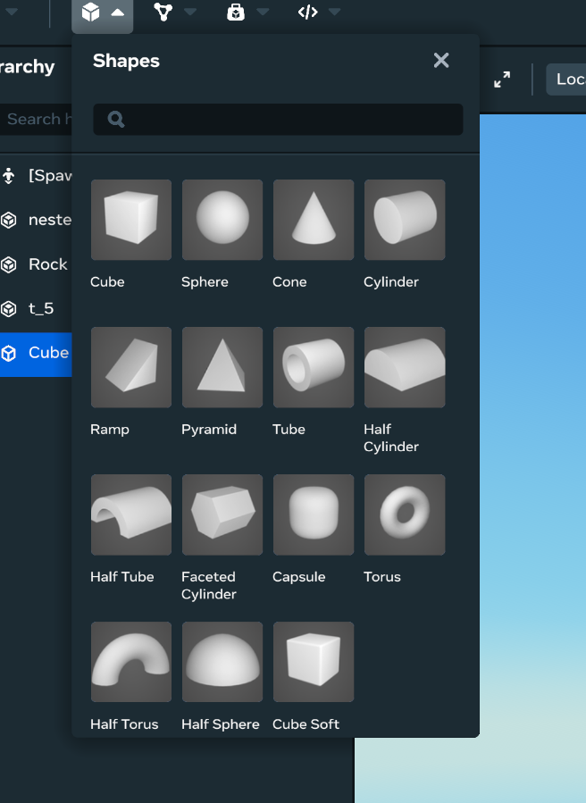
- Add a basic sphere to your scene. You can get it from the **Shapes** drop-down menu.
- In the Hierarchy, create an asset out of the two shapes by selecting both of them, and then right clicking on them. In the menu that appears, click **Create Asset**, and then enter the asset details.
  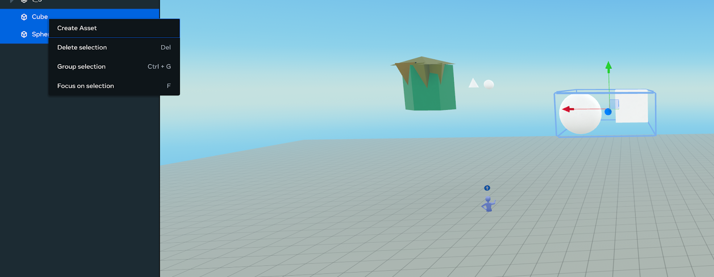

  You can create the asset as a template or as a legacy asset by selecting the asset type. If you choose **Legacy Asset Group**, your asset will not have instancing, property overrides, or change propagation.

You have now successfully created an asset template. The icon for the asset template changed in the Hierarchy. This is one way you can tell that an asset is a template asset.

## Editing Asset Definitions

Asset template definitions are edited in an isolated editing view, similar to how editing prefabs in Unity works. To enter asset definition editing mode, follow these steps:

- Enter asset definition editing mode. Right-click on your newly created asset, and then select **Edit Template Definition**. You can do this from either the Hierarchy, or by right-clicking the asset card in the Asset Library.
- Change the color of the entity via the property panel, or add new entities to the objects, then save the asset definition. This saves a draft of the definition. The he change appear locally in your world. To update the definition, you must publish the draft. After publishing, your changes appear as available updates in other worlds. To propagate changes in these other worlds, open the world and accept these updates. You can see more details under **Drafts**.
- Next, you’ll be prompted with the option to publish your template. Choose to **Save & publish** later.

> **Note**: Ingested assets must be spawned into a world before their definition can be edited. This is because ingested assets are created external to Meta Horizon Worlds and asset properties are applied to spawned instances of assets in a world before being saved to its definition.

## Draft Assets

A draft asset is an asset that has been updated in the current world, but whose changes haven’t yet been published to a new canonical asset version that can be used in other worlds.

- To view draft assets in the current world, click on the asset updates icon at the top left of the editor header.
- A modal will appear. Click on the **Unpublished changes** tab to see a list of all the draft assets in your world.

  **Note**: Anytime you edit an asset it’s stored as a draft.

  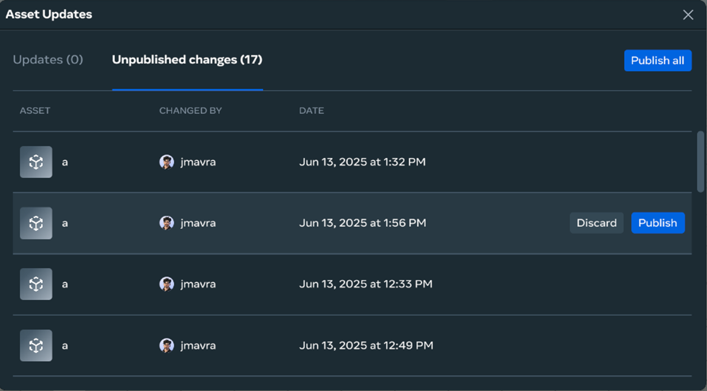
- From here you can either discard or publish your draft asset.
  * When you discard a draft of an asset, all asset instances in the current world will automatically switch to the latest major version, as dictated by the asset definition in the asset library.
  * When you publish a draft asset, it will create a new major version of the asset in the asset library.
- Click **Publish** publish the draft asset. You will be presented with a publish modal. You can optionally write a comment to be saved as version notes with the new version, and then when the publishing operation finishes, a new major version of the asset will be saved to asset definition in the asset library.

  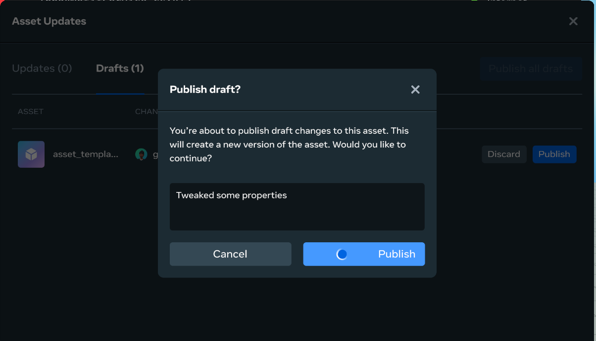
- Once the asset is published, click on the **Version History** button in the Asset Details panel to see its version history.

  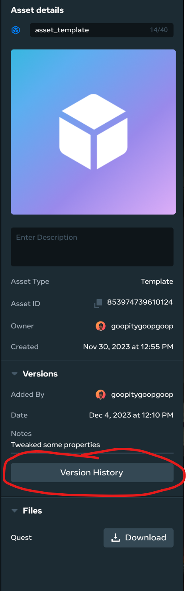
- The version history modal will display all of the major versions of an asset. These are all of the asset versions that have been previously published. If you go into other worlds or share an asset with other users, these are the versions that will be stored on the root asset definition. The asset can be restored to any of these versions at any time.

  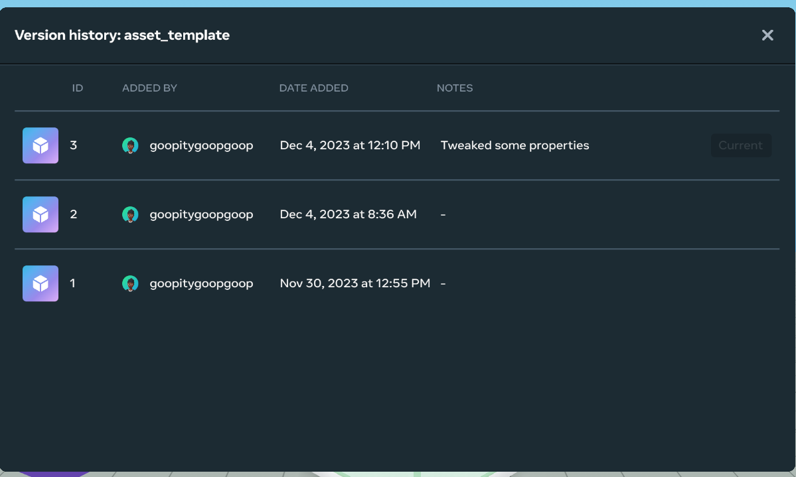

## Property Overrides

Property overrides enable you to override the property values on an instance of an asset template in a world. It effectively allows you to disconnect individual property values, while retaining a link to the root asset definition.

To override a property:

- Click on the root level asset template in your world. Review the properties. There shouldn’t be any overrides.
  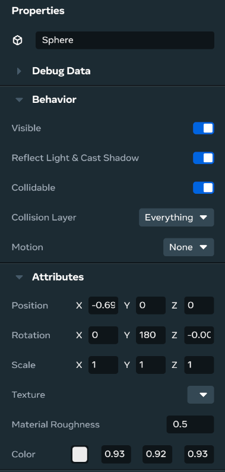
- Now, create an overridden property value. Edit the object to change its color. You’ll notice that the color label has a bold treatment, as well as a blue dot next to it to indicate that the value has been overridden. In the overrides panel, you will see a property override on the object showing different values for the previous and current color.
  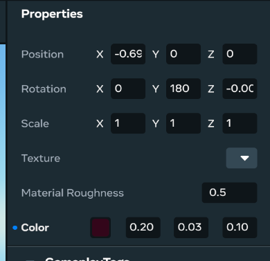
- From the property overrides panel, you can either select specific overrides to apply back to the definition, or apply all overrides. When you apply overrides back to the asset template definition, all instances whose matching properties haven’t been overridden will inherit the changes, and a new draft version of the asset will be created.
  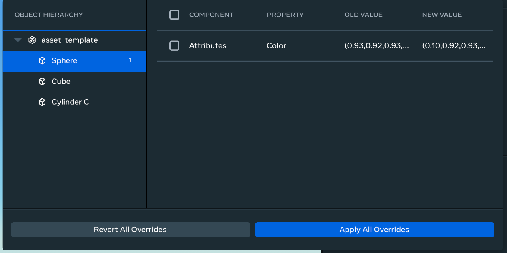
- It’s also possible to revert overrides. Reverting override values will revert the asset back to the same state as any draft version that exists, or in the absence of a draft version, the current major version of the asset.
  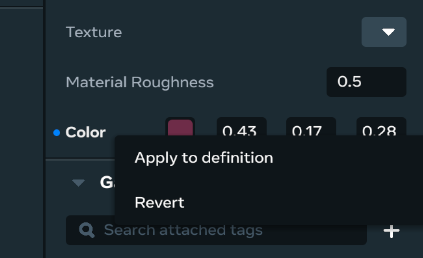

**Note:** Property overrides persist even when you update the asset. To test this, you can edit the asset definition, add a new shape to it and then exit. You will see that the color of the sphere will remain even after the update!

## Asset Migration

Assets that were in your asset library before asset templates need to be migrated in order to work with the new template format. This is a very easy process, but may take some time for a larger amount of assets.

The following steps will walk through asset migration:

- You will see a blue icon at the top right corner of an asset card if the asset needs to be migrated. Right click on the asset card, and select **Update Asset** from the menu that appears.

  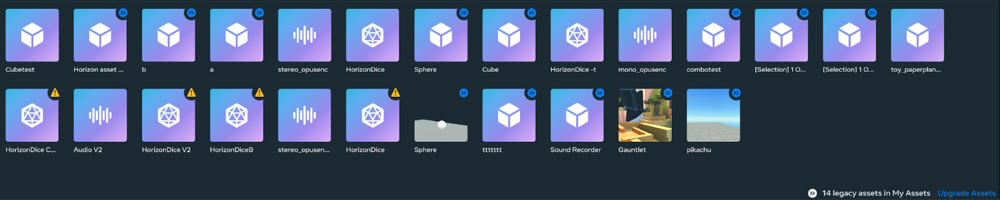
- Alternatively, you can also click on the folder and update all assets in a folder at once by clicking on the link at the bottom right of the asset browser.

**Note**: Ingested asset types don’t have to be migrated, only assets created within Horizon.

## Ingested Asset Types

An important note: ingested (imported) asset types automatically inherit asset versioning. While ingested assets (custom mesh, audio, etc.) are linked, you won’t see the overrides since ingested asset types don’t allow you to apply overrides back to the definition. If you’d like to apply an override to an ingested asset, you can create nested asset templates. These are simply asset templates that are parented to the same root object.

## Unlinking assets from an asset template

Unlinking instances from an asset template removes the connection to the template. The means it prevents the unliked asset from receiving updates from the asset template definition. It also removes the ability to push instance overrides back to the asset template definition.

To unlink an instance from a template:

- Select asset template instance in hierarchy.
- If the template has nested templates:
  - Choose **Unlink instance root** to only unlink the parent template.
  - Choose **Unlink instance root and children** to unlike the parent template and any nested child templates.

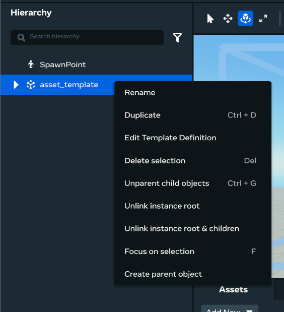

## Attaching scripts to asset templates and updating the definition

You can attach a script to the asset template by:

* Selecting an asset instance and under properties attaching the script as a reference.
* Or, right clicking on the asset to edit the definition and then going to the definition properties and adding the script as a reference.

### Attaching the script to the asset template instance

- Edit a script in the world from the property panel.

  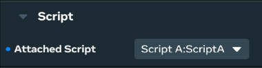
- When a script is attached to an asset template, you should see it appear as an override. You will see a blue dot next to **Attached Script** (above image) and two overrides applied: one for the script and one for motion (shown below).

  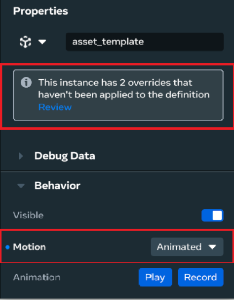
- Edit the script’s source code by selecting **Open in external editor.** When the script’s source code is updated, this will also appear as an override.
- Publish the script change through overrides. This will update the asset template definition with the script.
- Publish the script change through the overrides panel. This will update the asset template definition with the script changes included in the latest version of the template definition. See the note at the end of this section for more information.

  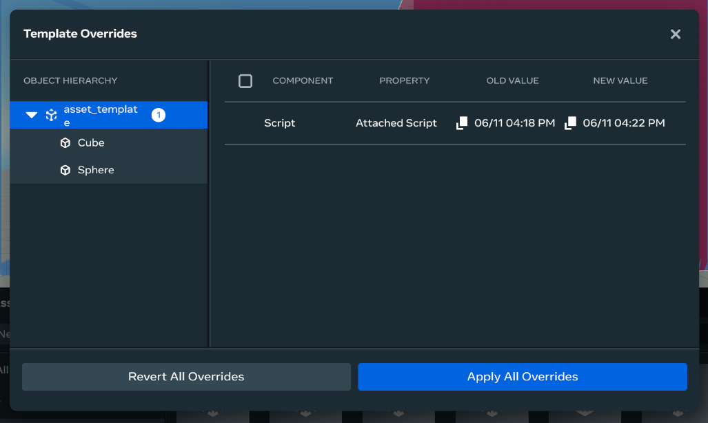

### Attaching the script to the asset template definition

- Right click on the asset instance (or asset in **Assets**) to edit the definition.

  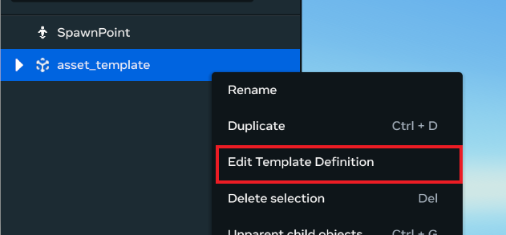
- Edit a script in the world from the property panel.

  
- Save and publish the template definition. This will create a new version of the asset that includes the script changes. See the note below for more information.

  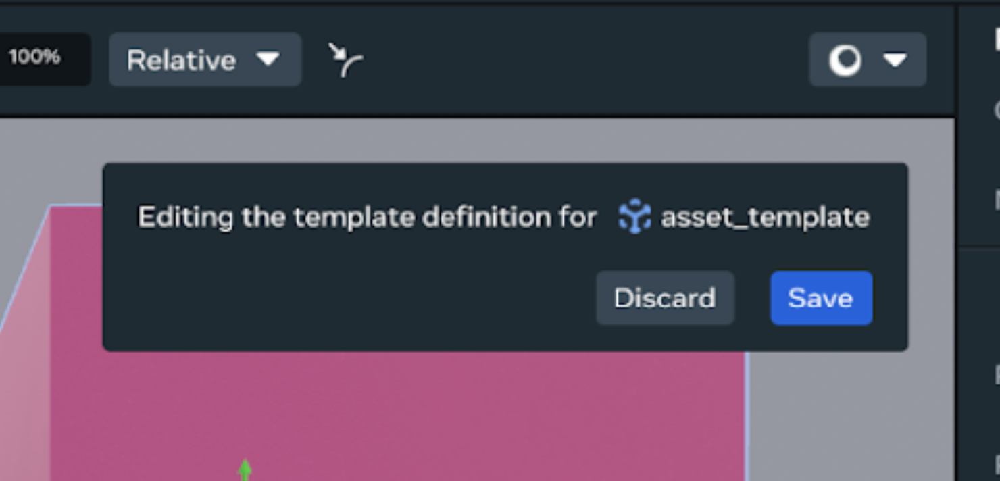

**❗️Important** : When you open a new world that uses this asset template, the script change will be included in the asset templates update. If the script in your world is on a different version than what is in the template update, accepting the template update will also update the script to be on the same version.