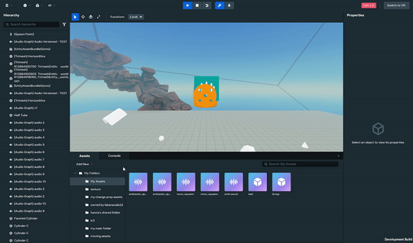
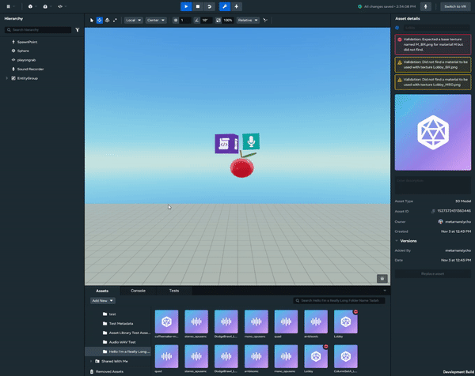
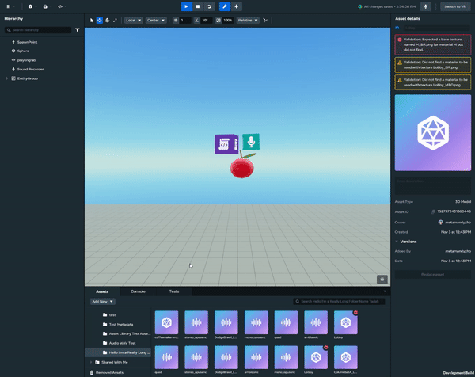
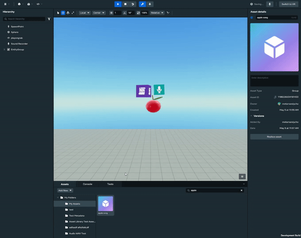

# [Creating, Editing, Removing, and Moving Assets to Folders](#creating-editing-removing-and-moving-assets-to-folders)

## [Creating folders](#creating-folders)

To create a new folder, click the “Add New” menu button above the left navigation column and select “Folder”. 

## [Editing folders](#editing-folders)

1. To rename a folder, right-click the folder in the left navigation column and select “Edit”. 
2. Fill out the Edit Folder fields and then click “Update” to finalize your changes.

## [Removing folders](#removing-folders)

To remove a folder from your library, right-click the folder in the left navigation column and select “Remove”. 

> [!Note]
>
> When deleting a folder, any assets inside will be moved into the “Removed Assets” folder.

## [Moving assets to different folders](#moving-assets-to-different-folders)

To move an asset into a different folder, right-click the asset card  and select “Move” and then fill out the modal dialog. 

