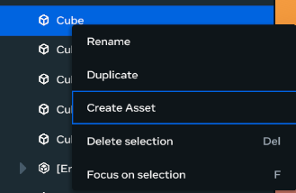
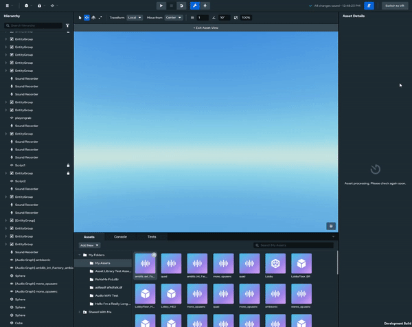
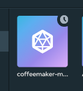
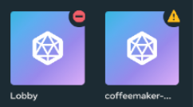
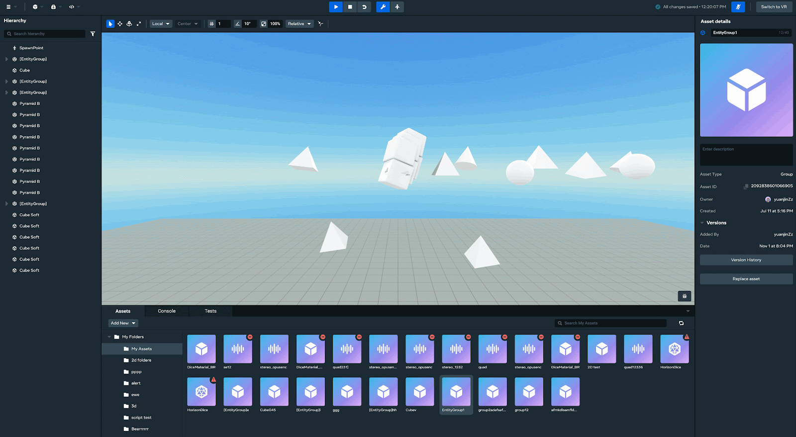
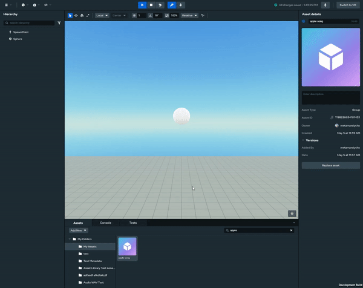

# [Creating, importing, viewing, and spawning assets](#creating-importing-viewing-and-spawning-assets)

A world is only as good as its assets, and in this article you will learn how to create, import, spawn, and view assets for your world.

## [Creating assets](#creating-assets)

To create an asset:

1. Right-click an object in the hierarchy list.
2. Fill in the **Create New Asset** fields and click **Create**.

When the asset is created, a notification and a new asset card will appear.

## [Importing assets](#importing-assets)

To import an asset:

1. Click the **Add New** button and select the desired asset type.
2. When the modal dialog appears, select the desired file(s), resolve any errors, and click **Import**.

> [!Note]
>
> When uploading multiple 3D models, ensure that every texture can be used by all the FBX files.

As your imports are being processed, asset cards with a clock icon will appear for each new item.

When all your assets have been processed, a notification will appear to confirm whether or not your imports were successful. If your asset had problems while processing, an error or warning icon will appear. To view the asset problems, click the asset card that has an error or warning icon.

## [Viewing asset details](#viewing-asset-details)

To view asset details:

1. Click an asset card.

Asset names and descriptions can be changed from the asset details screen. To edit the asset name or description, select the appropriate field, enter the new value, and click **Enter**.

## [Spawning assets](#spawning-assets)

To spawn an asset:

1. Right-click an asset card and select **Place**, or;
2. Drag-and-drop the asset card into the viewport.

