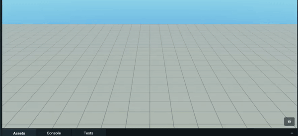
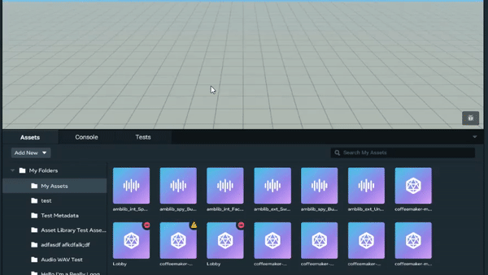
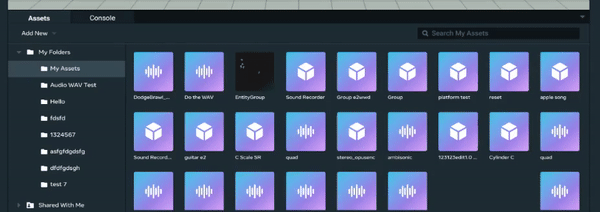
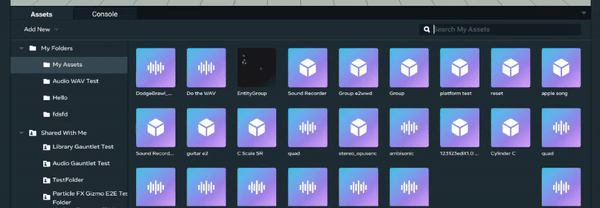
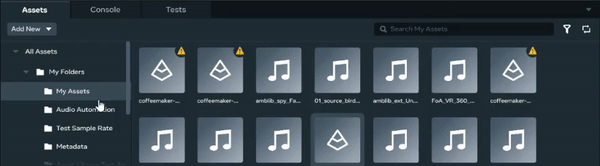
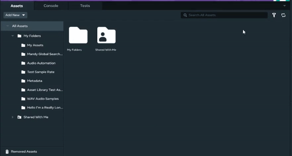
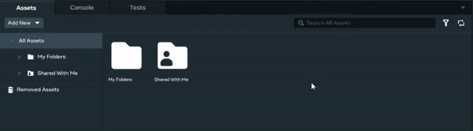

# Introduction to the Desktop Editor Asset Library

The Asset Browser in the Desktop Editor provides the ability to manage your asset library better than before. The Desktop Editor Asset Library allows you to:

* Create, edit, and remove assets.
* Spawn your saved creations into your world.

## Opening the Asset Library

- The Asset Library is available through the Asset Browser, located in the bottom panel of the Homepage. To access the Asset Browser, expand the Homepage panel and click one of the available tabs or “▼”.
  
- To resize the panel, click the navigation bar and drag the panel until you see all the tabs or “▼”.
  
- To view your personal and shared library, use the left navigation column.
  
- To find an asset within your folder, use the search bar to locate it.
  
- To global search for an asset, click “All Assets”, “My Folders”, or “Shared With Me” to find an asset that falls under the respective categories.
  
- To filter search results by asset types, click the filter icon next to the search bar.
  
- Double click folder cards located in “All Assets”, “My Folders”, or “Shared With Me” to navigate to the folder.
  