# [Making assets public](#making-assets-public)

This feature is only available to members of the [Meta Horizon Creator Program](https://developers.meta.com/horizon-worlds/programs). Learn more and join today.

## [Creating a public asset](#creating-a-public-asset)

You can publish 3D models and asset templates to Public assets. This allows other creators to import and use your assets in their own worlds. When other creators import and use your assets, they can make changes to the asset locally, but their changes will not affect the published version of the asset.

To make your asset public:

1. Select any asset in **My Assets** by clicking on its preview.

   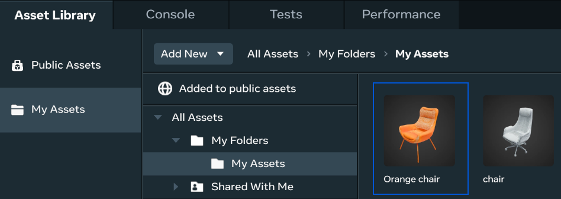

2. In the **Asset details** panel, click **Make asset public**.

   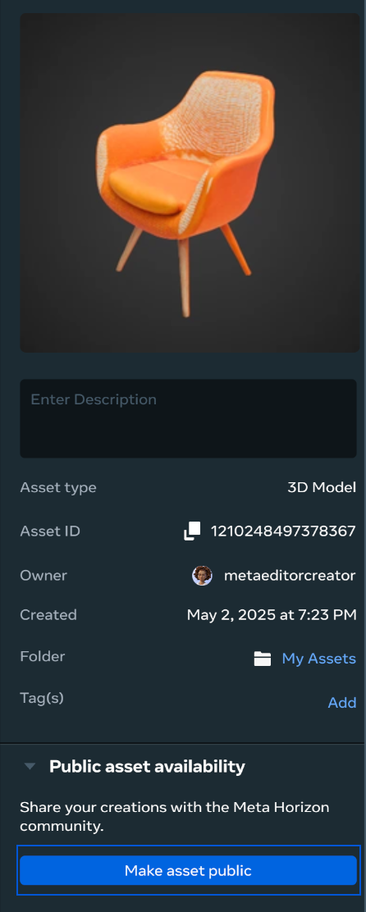

3. Check that the **name** and **description** will still be relevant once the asset is shared with other creators, and update it if needed.

   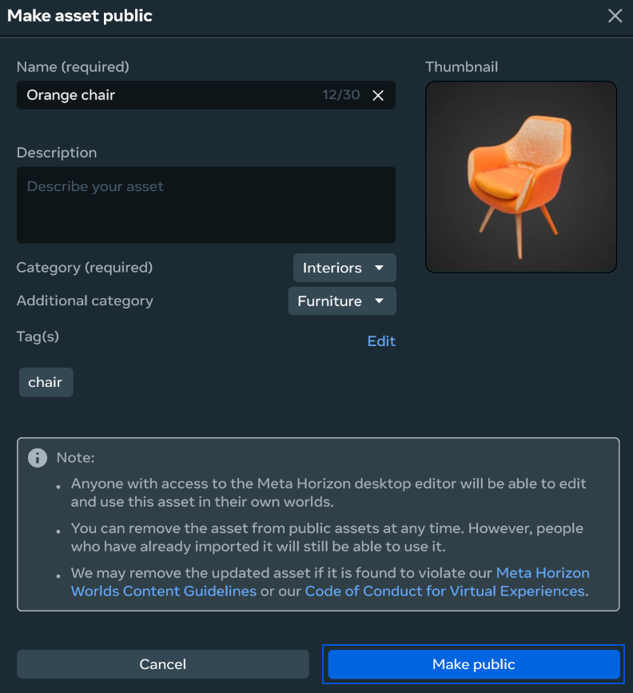

4. Add the relevant categories and tags to make it easier for creators to discover your asset.

5. Upload a thumbnail to give creators an idea of what your asset looks like.

6. Click **Make public**.

Once your asset is published, go to **Public assets** to view your published asset. You can use the search box to find it quickly by the name.

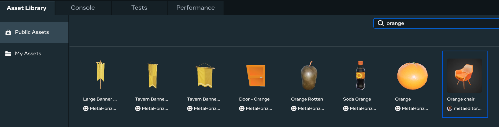

To view all the assets you have published, navigate to **My Assets** and click on **Added to public assets**.

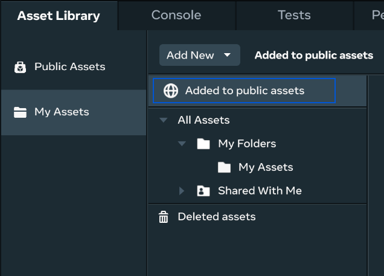

**Note:** We may remove an asset if it is found to violate our [Meta Horizon Worlds Content Guidelines](https://www.meta.com/en-gb/help/quest/481214418021533/) or our [Code of Conduct for Virtual Experiences](https://www.meta.com/gb/legal/quest/code-of-conduct-for-virtual-experiences/).

## [Updating a public asset](#updating-a-public-asset)

You can create a new version of your asset, and choose whether to make the changes available only to yourself or to other creators.

To make changes to your public asset:

1. Find your asset in **My Assets**.

2. Click on the asset preview to open the **Asset details** panel.

3. Modify asset information as needed, including the name, description, category, tags, thumbnail, files and more.

4. Click **Publish update** to make your changes available to other creators. If you don’t select **Publish update**, the changes will only be applied to your own version of the asset.

   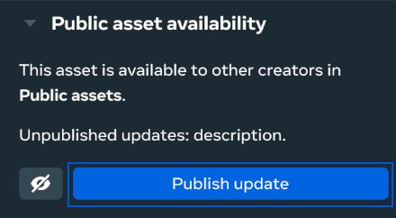

5. Click **Publish update** to add the updated version of your asset to **Public assets**.

   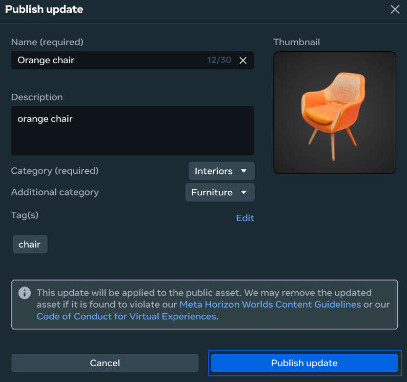

When changes become public, you will see a notification. Following the update, creators will be able to view only the latest version of the asset in **Public assets**. To get a new asset version, creators will need to visit **Public assets** and manually import the latest changes. Previously imported asset versions will not be updated.

## [Managing different versions of your public asset](#managing-different-versions-of-your-public-asset)

When you update your public asset files, a new version of the asset is created. To manage different versions of your asset open **Version history**. You can do it by clicking on **Version history** in the **Asset details** panel.

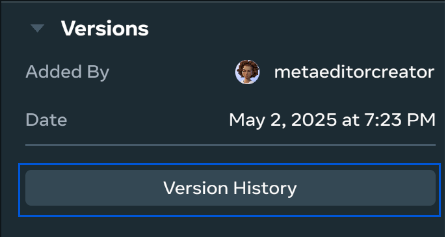

In **Version history** you will see all versions of your asset:

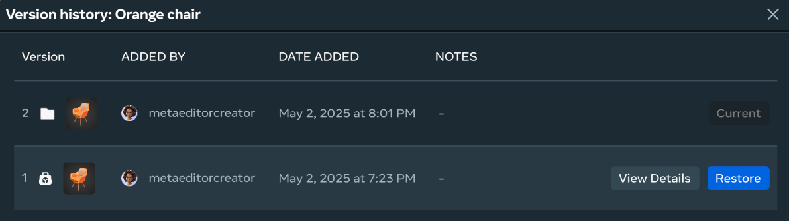

On the screenshot above you can see that the asset has 2 versions:

- **Version 1** - this version has been added to public assets and is accessible by other creators.
- **Version 2** - this version hasn’t been added to public assets and is the version that is currently being edited.

On this screen you can also:

- View details of the asset version by clicking on **View details**.
- Revert to a previous asset version by clicking on **Restore**.
- See the current version which you are currently editing. This version is marked as **Current**.

Example of how versioning works in flow with several versions:

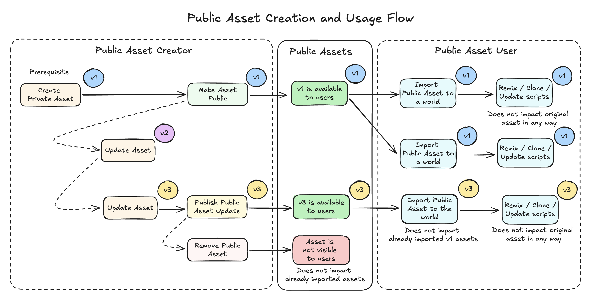

## [Removing an asset from Public assets](#removing-an-asset-from-public-assets)

To remove your asset from Public assets:

1. Find your asset in **My Assets**.

2. Click the asset preview to open the **Asset details** panel.

3. Click on the icon next to **Publish update**.

   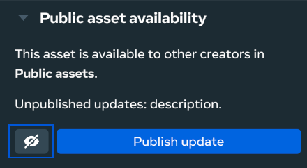

**Note:** After removing the asset from public assets, it will no longer be discoverable by other creators. However, creators who have already imported this asset to their world will still be able to use it.

## [Video example](#video-example)

Take a look at the following video, which demonstrates some ways to work with public assets.

<video controls></video><source src="../../.assets/video/55b38f2bcf8cb31d0bc3e9eae1dffad5f9775897adf6b61984295d12fab41b88.mp4" type="video/mp4">

