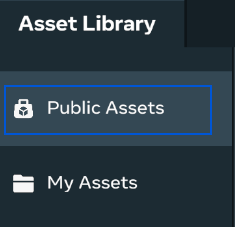
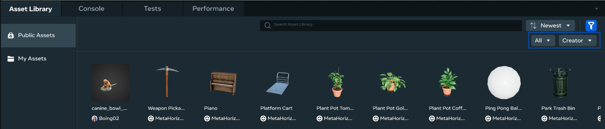
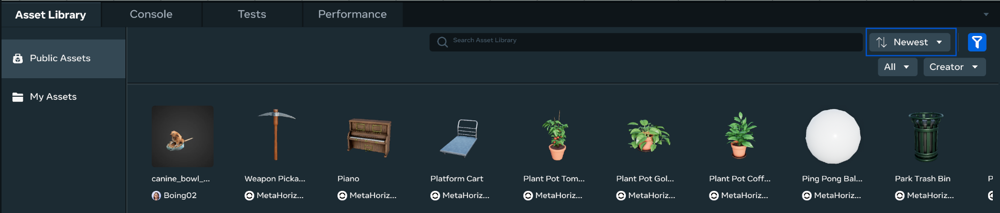
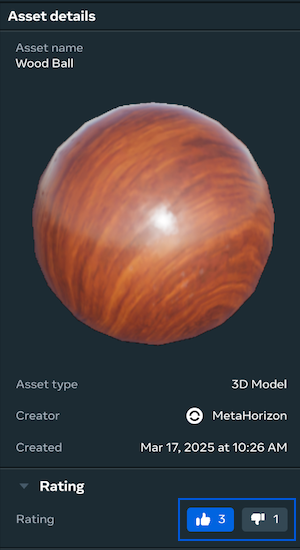
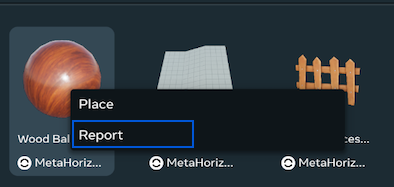
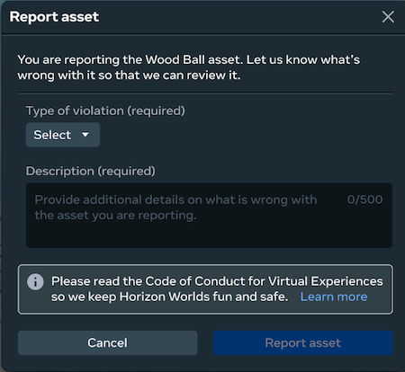

# Public Assets

## Overview

Public assets is a library of free, publicly available assets that you can import and try out in your own worlds.

**Note:** Public assets compliment your personal and shared assets in My assets, enabling you to store all your assets in one place.

To import assets from public assets:

- Select the **Asset Library** tab below the scene panel, and then click **Public Assets**.

  
- Use the category and creator filters to find assets that you might be interested in, or use search to find a specific asset.

  
- You can sort assets by name and date to narrow down your search.

  
- Select the asset that you want to import and drag it to your scene. This will cause an object to spawn from the asset into your scene and appear in the Hierarchy panel.
- In the Hierarchy panel, modify the new object to suit your needs.

## Rating

Use ratings to share your feedback on assets and help us prioritize high quality assets in search results, making it easier for others to discover and use them.

To vote, click on any asset and vote in **Asset details** panel in section **Rating**:

**Note:** You can vote only for other creator’s assets.

## Report inappropriate assets

If you see an inappropriate asset within the public assets that violate [Meta Horizon Worlds Content Guidelines](https://www.meta.com/en-gb/help/quest/481214418021533/) or our [Code of Conduct for Virtual Experiences](https://www.meta.com/gb/legal/quest/code-of-conduct-for-virtual-experiences/), please report it to us. It will help us to keep a high-quality collection. To report an asset, click on asset’s preview and then click **Report**.

Provide **Type of violation** and **description** to help us to understand a problem and then click **Report asset**.

## Asset types

The library contains the following types of assets:

| Feature | Category | Description |
| --- | --- | --- |
| Animals | Aliens, Aquatic, and Land. | Fun and unusual creatures. An example is the Happy Cyclops. |
| Environment | Abstract, Backyard, City, Forest, Landscape, Park, Plants, Sky, Space, and Water. | Objects you’d expect to find in an environment. |
| Food | Entrees, Drinks, Snacks, and Staples. | Various types of foods and dishes. |
| Home | No categories. | Objects you’d expect to find in a home, like tables and chairs. |
| Interactive | Complete Mechanics, Game Systems, Interfaces, Player Scripts, Social Tools, and VFX (video effects). | Objects that players can interact with. |
| Interiors | Bathroom, Bedroom, Decorations, Furniture, Industrial, Kitchen, and School. | Different styles of decor. Includes such objects as a dining room table, a kitchen counter, and a bed. |
| Lights | Abstract, Decorative Lights, Lamps, and Mounted Lights. | Objects that emit light. For example, a night light, a ceiling light, and a candle. |
| Shapes | No categories. | Objects of various geometric shapes. For example, a torus, a wedge, and a cone. |
| Structures | Abstract, Buildings, Ceiling, Doors, Fencing, Floor, Stairs, Walls, and Windows. | Objects that represent parts of buildings. For example, modular walls, a conference room, and a large office. |
| Toys | Combat, Fantasy, Minigames, and Sports. | Objects that represent toys. For example, a baseball glove, a pool table, or a pool cue. |
| Vehicles | Aircraft, Boats, Cars, and Fantasy. | Objects that represent vehicles. For example, a police car, a pirate ship, or a motorcycle. |
| Wearables | Backpacks, Costumes, Hands, and Hats. | Objects that represent things you can wear. For example, a backpack, a helmet, or diapers. |