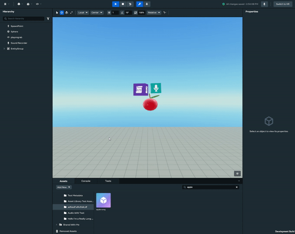
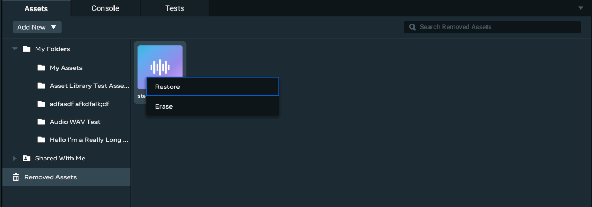
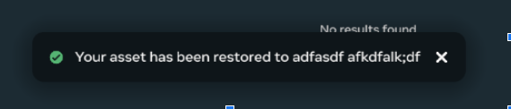
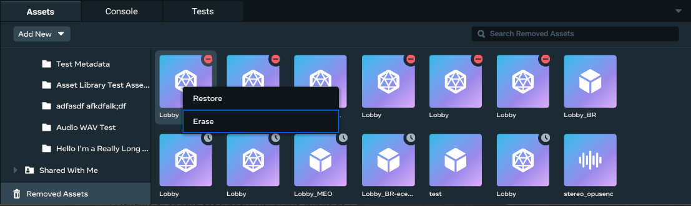
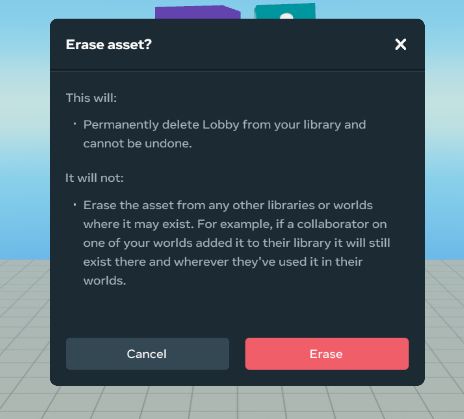

# [Removing, Restoring, and Permanently Erasing Assets](#removing-restoring-and-permanently-erasing-assets)

## [Removing assets](#removing-assets)

To remove an asset, right-click the asset card and select **Remove** to place the asset into the Removed Assets folder.

## [Restoring assets](#restoring-assets)

1. To restore an asset, click **Removed Assets** from the left navigation column and right-click the desired asset card and select **Restore**. 
2. When the asset has been restored, a success notification with the asset location will appear on the Homepage. 

**Note**: The asset will be placed into the “My Assets” folder if the original folder was removed.

## [Permanently erasing assets](#permanently-erasing-assets)

1. To permanently erase an asset from your library, click “Removed Assets” from the left navigation column and right-click an asset card and select “Erase”. 
2. A modal dialog will appear to finalize your decision. 
3. A notification will appear to confirm whether or not your asset was successfully erased.

