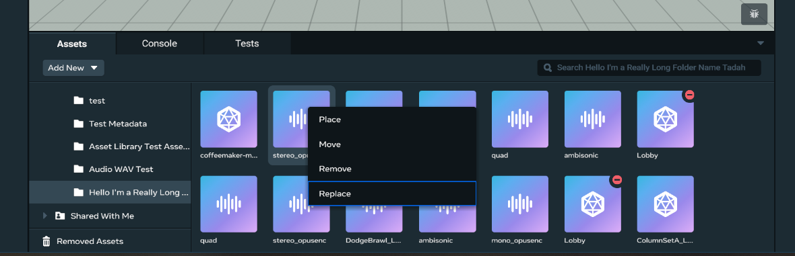
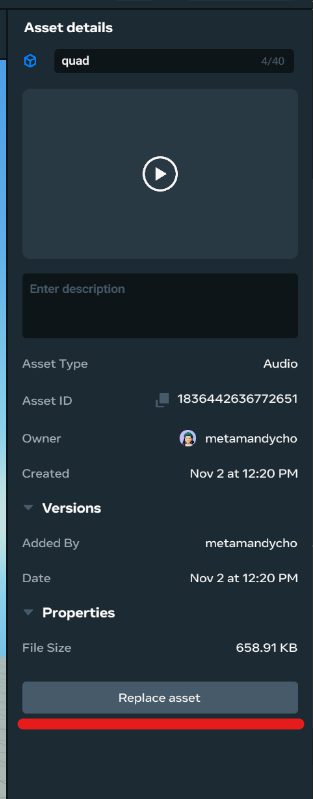
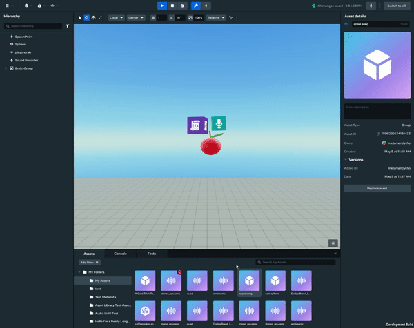
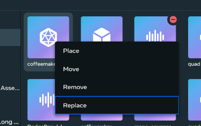

# [Replacing Legacy and Imported Assets](#replacing-legacy-and-imported-assets)

## [Replacing legacy assets](#replacing-legacy-assets)

1. To replace the underlying entities for a legacy asset, right-click the asset card and select “Replace”, or go to the asset details and click the “Replace Asset” button. 
2. Shift-select the entities from the viewport or entity hierarchy and then click “Replace”. 

## [Replacing imported assets](#replacing-imported-assets)

1. To replace the underlying file contents for an imported asset, right-click the asset card and click “Replace” or click the “Replace Asset” button in the asset details. 
2. Select your new files when the import asset modal dialog appears. 
3. A notification will appear to confirm whether or not your asset was successfully replaced.

