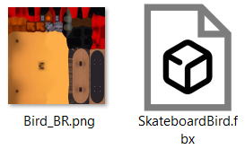
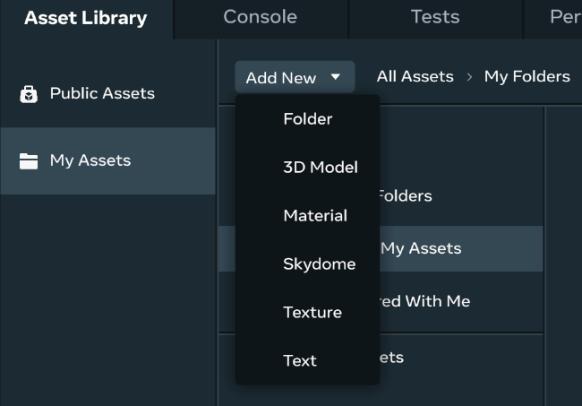
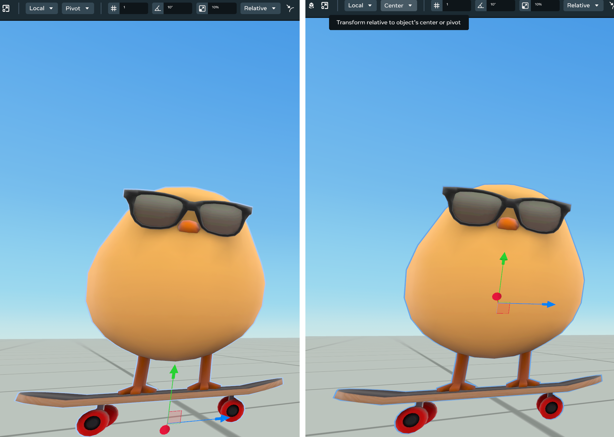
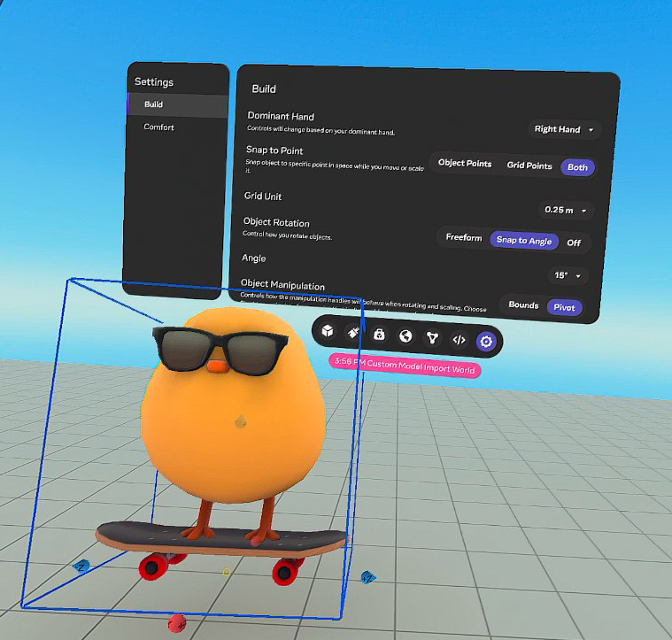

# [Use offset pivots](#use-offset-pivots)

This topic describes when and how offset pivot is used, outlines the expected behavior of offset pivot in the desktop editor, and ends with a discussion on managing offset pivots and best practices.

By default, an entity’s pivot point is its center. This behavior works well for entities like planets, ice skaters, and spinning tops, but not for entities such as doors, drawbridges, and treasure chest lids. For the animation of these entities to look natural, [pivot](../Get%20started%20with%20Desktop%20Editor/User%20interface/Object%20tools.md#pivot) points need to be offset or moved.

When you create an asset using a [digital content creation tool](../../Custom%20models%20\(FBX\)/Creating%20custom%20models%20for%20Horizon%20Worlds/Creating%20a%20Custom%20Model.md#setup-requirements), you can configure the [3D model](../../Custom%20models%20\(FBX\)/Creating%20custom%20models%20for%20Horizon%20Worlds/Creating%20a%20Custom%20Model.md) to use an offset pivot instead of a center pivot. As you import [this type of asset](../../Reference/core/Classes/MeshEntity.md) to your personal asset library in Meta Horizon Worlds, you have the option to [**Preserve offset pivots**](../../Tutorials/Getting%20started/Create%20your%20first%20world%20tutorial%2C%20part%202.md#part-2-import-custom-models-and-write-your-first-script). When you enable **Preserve offset pivot**, entities spawned from the asset will rotate and scale around the pivot defined in the FBX file, instead of the default center pivot.

Although you can use offset pivots in both the [desktop editor](../Desktop%20Editor.md) and the [VR editor](../../VR%20tools/Getting%20started/Create%20a%20new%20world%20in%20Meta%20Horizon%20Worlds.md), this topic focuses on the desktop experience. Additionally, you can also write [TypeScript code](../../Reference/core/Classes/Entity.md) that uses the offset pivot for rotating and scaling.

**Note**: You can import [single-mesh FBX files](../../Custom%20models%20\(FBX\)/Creating%20custom%20models%20for%20Horizon%20Worlds/Creating%20a%20Custom%20Model.md) that contain only one pivot offset. Offset pivots don’t support custom [colliders](../../VR%20tools/Getting%20started/Collider%20Visualization%20User%20Guide.md).

## [Prerequisites](#prerequisites)

Before you begin, make sure you have the following:

- [Install and run the desktop editor](../../Get%20started/Install%20the%20desktop%20editor.md).

## [How to use offset pivots](#how-to-use-offset-pivots)

In this section, you import a 3D model that already contains an offset pivot to your [personal asset library](Introduction%20to%20the%20Desktop%20Editor%20Asset%20Library.md). You then manipulate the entity based on its offset pivot.

### [Step 1: Import the 3D model](#step-1-import-the-3d-model)

Follow these steps to use the asset file provided by Meta that contains an offset pivot.

1. Download the [Demo asset](../../.assets/misc/83c647b29f28782fe13ed455d6537aa090832a3fbc65066825a0e7e37af2f852.zip) . This file is a zip archive that contains a single mesh 3D model that contains an offset pivot, and a texture file.

   

2. Unzip the archive to a local folder. Next, import the 3D model to **My Assets** either through the desktop editor or your [Meta Horizon portal account](https://horizon.meta.com/creator/assets/folder/). The following steps highlight the experience from the desktop editor.

3. In the desktop editor, navigate to [Asset Library](../Get%20started%20with%20Desktop%20Editor/User%20interface/Panels%20and%20Tabs%20in%20the%20desktop%20editor.md#assets-library) under the [Scene pane](../Get%20started%20with%20Desktop%20Editor/User%20interface/Panels%20and%20Tabs%20in%20the%20desktop%20editor.md#scene-pane).

4. Click on **My Assets** > **Add New** > **3D Model**.

   

5. The **Import Model(s)** dialog appears. Click **choose files on your device**.

6. Navigate to the folder that contains the unzipped asset files.

7. Select the two asset files and then click **Open**.

8. Leave **Preserve offset pivots** enabled.

9. Click **Import**. The asset appears in the **My Assets** folder.

### [Step 2: Manipulate entities with offset pivots](#step-2-manipulate-entities-with-offset-pivots)

1. [Create a new world](../Get%20started%20with%20Desktop%20Editor/Create%20a%20New%20World.md) in the desktop editor.

2. Spawn an instance of the asset by dragging the SkateboardBird asset from **My Assets** to the Scene pane. Notice that the pivot is grounded.

   **Note**: Once the mesh of the custom model is imported, changes to the pivot must be done in a [digital content creation tool](../../Custom%20models%20\(FBX\)/Creating%20custom%20models%20for%20Horizon%20Worlds/Creating%20a%20Custom%20Model.md#setup-requirements). While you cannot change the pivot’s position in the Meta Horizon Worlds desktop or VR editor, you can toggle between the entity’s offset pivot and the center pivot as shown in the image below. The setting persists across Meta Horizon Worlds sessions.

   

   You can also enable the offset pivot in [VR](../../VR%20tools/Getting%20started/Use%20the%20Creator%20Menu%20in%20Meta%20Horizon%20Worlds.md) as shown below.

   

3. Manipulate the entity based on its offset pivot, including position, rotation, and scale. You can do this in the [desktop editor](../Get%20started%20with%20Desktop%20Editor/User%20interface/Object%20tools.md) and in the [VR editor](../../VR%20tools/Getting%20started/Create%20a%20new%20world%20in%20Meta%20Horizon%20Worlds.md).

   **Note**: If you need to define custom pivots for entities created in the Meta Horizon Worlds desktop editor, see [Pivot around parent object](../Hierarchy%20window/Hierarchy%20panel%20overview.md#pivot-around-parent-objects) for a different approach.

## [Manage offset pivots](#manage-offset-pivots)

When working with offset pivots, be aware of the following limitations and best practices.

### [Preserve single-mesh uploads](#preserve-single-mesh-uploads)

You can preserve offset pivots only for [single-mesh FBX files](../../Custom%20models%20\(FBX\)/Creating%20custom%20models%20for%20Horizon%20Worlds/Creating%20a%20Custom%20Model.md).

You can try to use a multi-mesh hierarchy, but your results will be undefined. If your entity has a hierarchy with offset pivots, then you must import the offset pivot meshes one at a time.

### [Use non-custom box colliders](#use-non-custom-box-colliders)

You should import meshes that have only non-custom box colliders, because using custom colliders produces undefined results.

## [What’s next?](#whats-next)

Try the following related topics:

- [Getting started with custom model import](../../Custom%20models%20\(FBX\)/Getting%20started%20with%203D%20model%20import.md)
- [Materials guidance and reference for custom models](../../Custom%20models%20\(FBX\)/Creating%20custom%20models%20for%20Horizon%20Worlds/Materials%20Guidance%20and%20Reference%20for%20Custom%20Models.md)
- [Collider ingestion user guide](../../Custom%20models%20\(FBX\)/Creating%20custom%20models%20for%20Horizon%20Worlds/Collider%20Ingestion%20User%20Guide.md)
- [Hierarchy panel overview](../Hierarchy%20window/Hierarchy%20panel%20overview.md)

