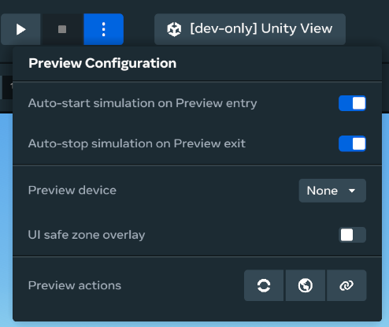
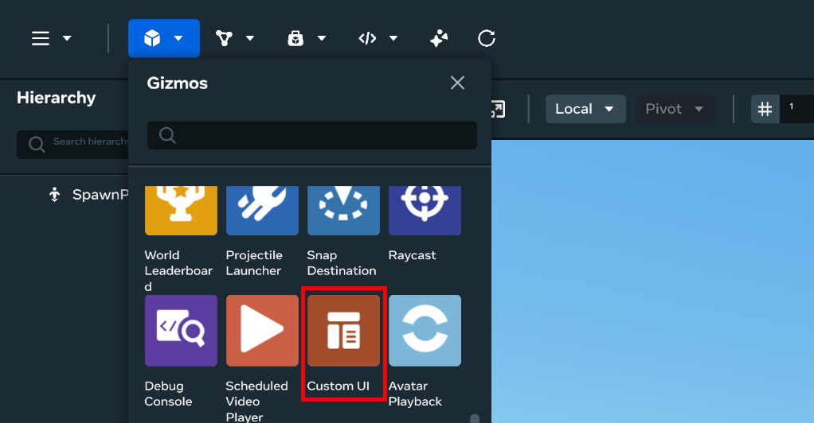
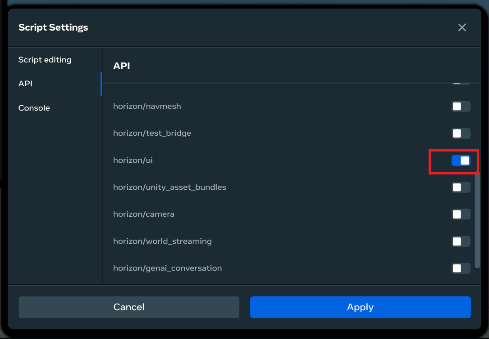
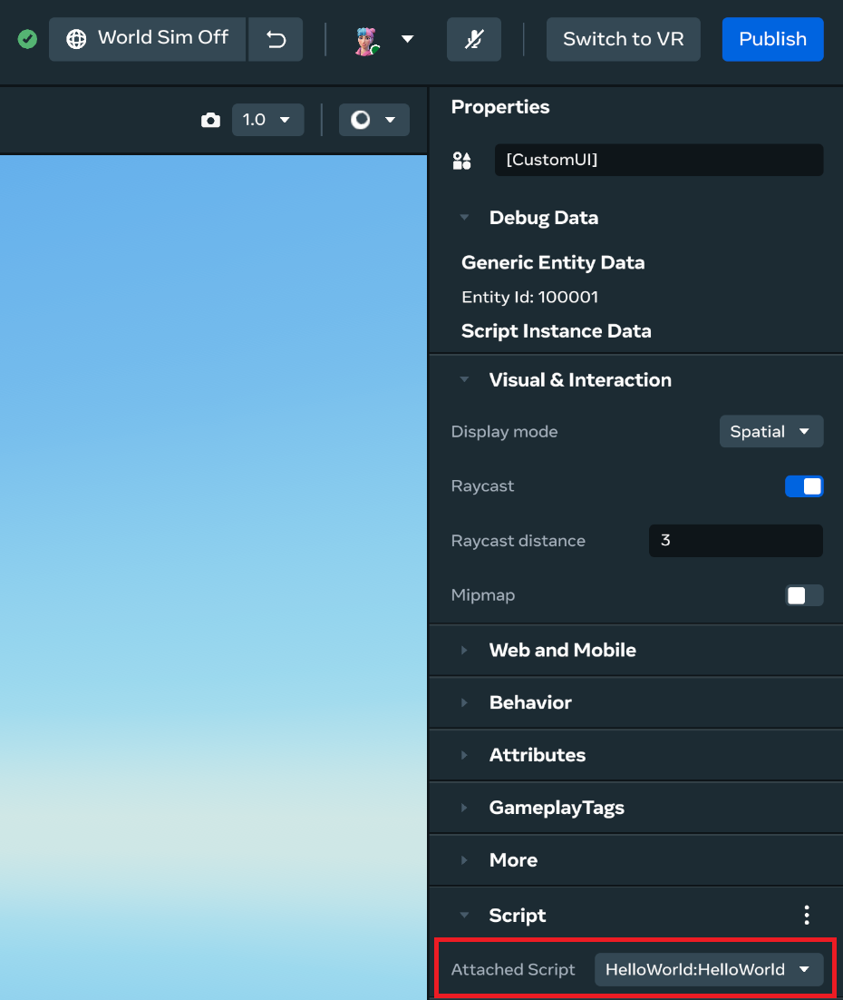
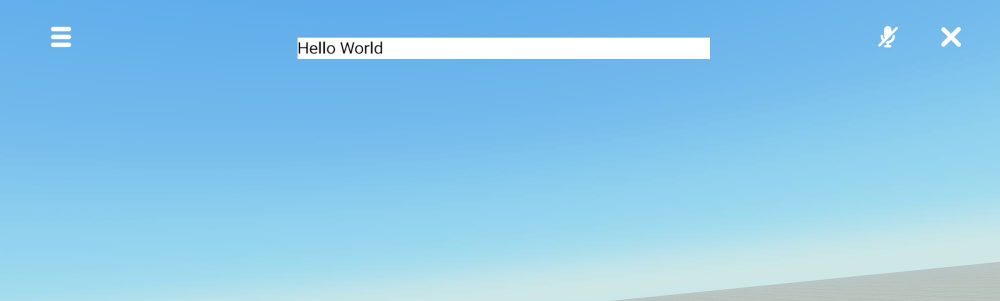

# [Create a custom UI panel](#create-a-custom-ui-panel)

This topic shows you how to create a custom UI panel. To create one, you need a Custom UI gizmo and a [`UIComponent` script](Custom%20UI%20Styles.md#uicomponent).

## [Before you begin](#before-you-begin)

Before you begin building custom UIs in the desktop editor, enable auto-start and auto-stop of the simulation when previewing.



Unlike other physical entities in the world, a custom UI is entirely generated from TypeScript code. If auto-start is disabled when you begin the preview, then no code is executed when you enter the preview. Your custom UIs are not initialized, and are therefore invisible.

## [Step 1: Create a Custom UI gizmo](#step-1-create-a-custom-ui-gizmo)

On the menu bar, find the **Custom UI** gizmo in the **Build** dropdown menu > **Gizmos** and drag it into the **Scene** pane. Like other entities, you can control the position, scale, rotation, and visibility of the Custom UI gizmos, both from the **Properties** panel and from scripts.

The **Gizmos** panel is where you’d find the **Custom UI** gizmo.



On the far right of the desktop editor, you’d find the Custom UI’s **Properties** panel.

A custom UI panel is represented by a Custom UI gizmo, which controls where and how the panel is placed in the world. You can place multiple Custom UI gizmos in the world.

In the past, creators often placed duplicate Custom UI gizmos in the world and controlled the visibility for each to create custom UI panels that displayed different content for each player. In most cases, you do not need to duplicate Custom UI gizmos. The Custom UI feature allows you to display different content to different players within the same Custom UI gizmo. See [Player-specific custom UI](Player-Specific%20Custom%20UI.md) for details.

## [Step 2: Create a UI script](#step-2-create-a-ui-script)

The Custom UI gizmo does nothing unless you attach a script to it. The script controls the content of the panel. Next, [create a TypeScript script using the desktop editor](../../Scripting/Get%20started%20with%20TypeScript/Adding%20an%20IDE%20to%20the%20desktop%20editor.md#create-a-new-meta-horizon-worlds-script-in-the-desktop-editor). To use the Custom UI functionalities, include `horizon/ui` module for TypeScript API v2.0.0 from the **Scripts** dropdown menu > **Settings** (the gear button on the top right of Scripts menu). The examples here are for TypeScript API v2.0.0.



In your Custom UI script, you can add `preStart()` and `start()` methods in addition to the `initializeUI()` method. These methods are called in the following order:

# [`initializeUI()`](#initializeui)

# [`preStart()`](#prestart)

# [`start()`](#start)

For more information, see [TypeScript Script Lifecycle](../../Scripting/TypeScript%20Script%20Lifecycle.md).

## [Step 3: Create a Hello World template](#step-3-create-a-hello-world-template)

Write the following code in your script. Notice that the component extends the `UIComponent` class, instead of a regular `Component`. [UIComponent Class](UIComponent%20class.md) describes what each line means in more detail, but this template is a good starting point for now.

```typescript
import 'horizon/core';
import {UIComponent, View, Text} from 'horizon/ui';

class HelloWorld extends UIComponent {
  initializeUI() {
    return View({
      children: Text({text: 'Hello World', style: {color: 'black'}}),
      style: {backgroundColor: 'white'},
    });
  }
}

UIComponent.register(HelloWorld);
```

## [Step 4: Attach the script to the gizmo](#step-4-attach-the-script-to-the-gizmo)

Like all script components, the same `UIComponent` can be attached to more than one Custom UI gizmo. Those Custom UI gizmos will then display the same content.

To achieve [player-specific custom UIs](Player-Specific%20Custom%20UI.md) and heads-up display (HUDs), you do not need to duplicate Custom UI gizmos or scripts in most cases. The framework provides tools for you to build custom UI panels that display different content for different players.

You can find the registered `HelloWorld` component in the **Script** section of the **Properties** panel.



After you attach the `HelloWorld` script to the **Custom UI** entity, click Play to enter the preview mode. If you haven’t already, ensure you have turned on **Auto-start simulation on Preview entry** and **Auto-stop simulation on Preview exit** in [**Preview Configuration**](../Get%20started%20with%20Desktop%20Editor/Preview%20mode.md#preview-configuration) to successfully complete this tutorial.

While in preview, you will be prompted to press the “E” key when your avatar is within a certain distance from the UI panel. Press “E” to see the “Hello World” panel.

**Note**: You can choose the display mode based on your preference in the **Properties** panel > **Visual & Interaction** > **Display mode**. The following image shows the “Hello World” panel in the **Spatial** display mode. Additionally, you can [resize the panel](UIComponent%20class.md#properties-panelheight-and-panelwidth) and place it wherever you like.



