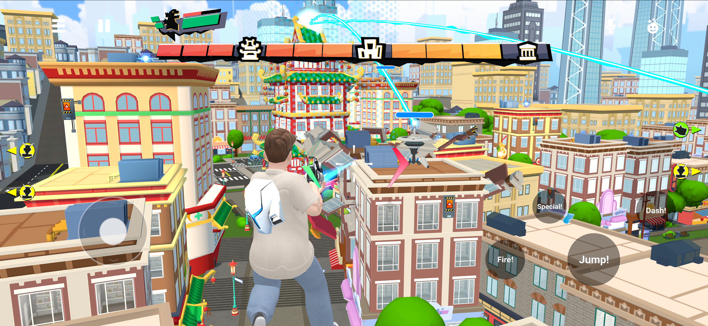

# [Custom UI Controls](#custom-ui-controls)

## [Overview](#overview)

Custom UI controls is an extension of custom UI with the **Input Mode** set to **Interactive, Non Blocking**. This input mode renders an interactive UI to the screen while still allowing players to move around, interact with the world and turn the camera.

This input mode is primarily designed for creating a set of custom on-screen controls to work alongside or replace the built-in system controls on mobile.



## [Getting started](#getting-started)

Before you begin, it is recommended you review the following how-to guides:

- [Creating a Custom UI Panel](Create%20a%20custom%20UI%20panel.md)
- [Local Mode Custom UI Scripts](Local%20Mode%20Custom%20UI%20Scripts.md)
- [Non-Interactive Custom UI Screen Overlay](Non-interactive%20custom%20UI%20screen%20overlay.md)

## [Step by step guide](#step-by-step-guide)

### [Create the Custom UI Controls entity and script](#create-the-custom-ui-controls-entity-and-script)

- Add a custom UI gizmo to your world.
- Change the **Display Mode** property from **Spatial** to **Screen Overlay**.
- Change the **Input Mode** property from **No Interaction** to **Interactive, Non Blocking**.
- Create a new script asset for the custom UI.
- Change the execution mode of the script from **Default** to **Local**. Custom controls should use local mode to ensure a rapid response to input events.

### [Set up the custom controls UI layout](#set-up-the-custom-controls-ui-layout)

- Open the TypeScript editor and open the new script asset.
- Write a UI layout with at least one Pressable component.

### [Set ownership of the custom controls entity](#set-ownership-of-the-custom-controls-entity)

Please refer to [Local Mode Custom UI Scripts](Local%20Mode%20Custom%20UI%20Scripts.md) for more detailed instructions on using local mode.

- Create a new script asset and leave it in **Default** execution mode.
- Create an empty gizmo and assign the script to it.
- Add a prop of type entity to the script and name it something like “myCustomControls”.
- In the `start()` method (or somewhere you consider suitable for setting ownership of entities, such as a trigger entity), add the following code: `this.props.myCustomControls.owner.set(this.player)`
- In the Desktop Editor, select the empty gizmo and assign the custom controls entity as the value for the “myCustomControls” prop.
- Set **Preview Device** to **Mobile**.
- Enter preview mode.
- Confirm the custom UI controls appear and the Pressable elements are interactable.

### [Hiding the system controls](#hiding-the-system-controls)

If you want to completely replace the system controls with your own custom controls, you’ll need to hide the system controls. To do this, call a TypeScript function at the point when you would like the system controls to be hidden. This example hides the system controls when the custom UI panel is initialized.

```typescript
import { PlayerControls } from '@horizon/core';


initializeUI() {

  // Disable the system controls when the custom controls UI is initialized

  PlayerControls.disableSystemControls()

}
```

### [Triggering Player Input Actions](#triggering-player-input-actions)

We have provided two TypeScript functions to trigger the down / up input actions on the player controls. These functions support the same PlayerInputAction enum as the [Custom Input API](../../Mobile%20and%20web/TypeScript%20APIs%20for%20mobile/Custom%20Input%20API.md).

```typescript
return Pressable({

  children: Text({

    text: "Jump!",

    style: {

      color: 'white',

    },

  }),

  onPress: (player: hz.Player) => PlayerControls.triggerInputActionDown(PlayerInputAction.Jump),

  onRelease: (player: hz.Player) => PlayerControls.triggerInputActionUp(PlayerInputAction.Jump),

  style: {

    position: 'absolute',

    alignItems: 'center',

    backgroundColor: backgroundColor,

    borderRadius: 100,

    height: 200,

    justifyContent: 'center',

    width: 200

  },

})
```

