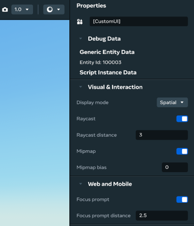
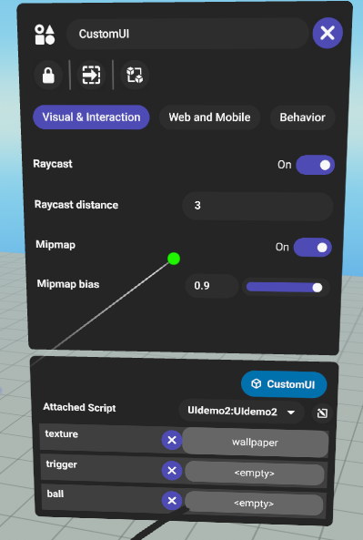
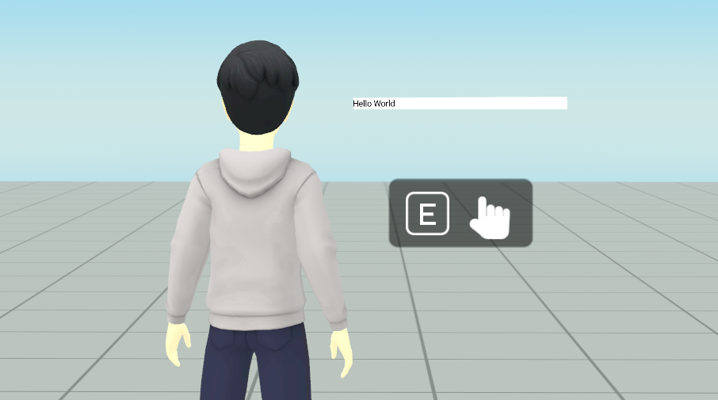

# [Custom UI panel configurations](#custom-ui-panel-configurations)

This topic describes how you can customize behaviors of the custom UI panel in **Properties** by configuring settings for **Raycast**, **Mipmap**, **Focus prompt** and related properties.

Find these settings by first selecting the **Custom UI** gizmo entity in **Hierarchy**. The corresponding configuration settings are then shown in **Properties** > **Visual & Interaction** and **Web and Mobile**. You can use both the desktop editor and the VR edit mode to configure the settings.

The following image shows the custom UI panel configuration settings in the desktop editor.

The following image shows the custom UI panel configuration settings in the VR edit mode.

There are no TypeScript APIs for these configurations. They can only be set statically in **Properties** and cannot be changed at runtime.

## [Visual & Interaction settings](#visual--interaction-settings)

### [Raycast](#raycast)

In VR, players interact with the UI panels through raycast from their controllers. By default, raycast is automatically enabled when a player is within a certain distance of the UI panel. You can disable raycast and customize the raycast distance.

When raycast is disabled, the UI panel no longer receives the raycast input events. As a result, the player can no longer interact with the panel. For example, no `Pressable` components will work properly.

### [Raycast distance](#raycast-distance)

Raycast distance controls the distance within which a player can interact with the UI panel. By default, the value is 3. We advise not to set the raycast distance greater than 10. While there’s no strict upper limit for this setting, having a larger raycast distance across multiple UI panels could negatively impact the performance.

These raycast settings only affect the player experience in VR and are unused for web and mobile experiences.

### [Mipmap](#mipmap)

By default, certain UI panels might have aliasing problems and appear pixelated when viewed from a far distance. This can be particularly undesirable when the UI content contains small text. Enabling mipmap can mitigate the issue by automatically caching some downsampled UI texture.

### [Mipmap bias](#mipmap-bias)

When mipmap is enabled, the mipmap value setting becomes visible. The range for the mipmap bias is set between -1 and 1, and the default is 0. Enabling mipmap will slightly affect the performance. If mipmap is enabled for a large number of visible UI panels, it could negatively impact the Graphics Processing Unit (GPU) performance and reduce frames per second (FPS). Use this feature sparingly only when needed.

## [Web and Mobile settings](#web-and-mobile-settings)

### [Focus prompt](#focus-prompt)

Unlike in VR, players do not interact with UI panels through raycast on web and mobile platforms. Instead, players see a prompt when they are within a certain distance from the UI panel, prompting them to press “E” key. If they do, the camera will zoom in and focus onto the UI panel, and players can interact with the UI through clicking or tapping.

When the focus prompt is disabled, players cannot zoom in and focus onto the UI panel and they cannot interact with the panel.

### [Focus prompt distance](#focus-prompt-distance)

Focus prompt distance controls the distance within which the focus prompt is shown to a player and the player can zoom in. By default the value is 2.5, but can be customized with a number that ranges between 0 and 10. The range restriction is due to performance considerations.

These focus prompt settings only affect the player experience on web and mobile platforms and are unused for VR experiences.

## [Web and mobile unsupported use cases](#web-and-mobile-unsupported-use-cases)

### [Moving UI panels that can receive focus from players](#moving-ui-panels-that-can-receive-focus-from-players)

In some cases, if a UI panel is in motion when a player interacts with it, the UI panel may appear cropped or clipped as the UI panel continues to move after receiving camera focus.

To avoid this, don’t move or rotate UI panels that can receive focus from players.

