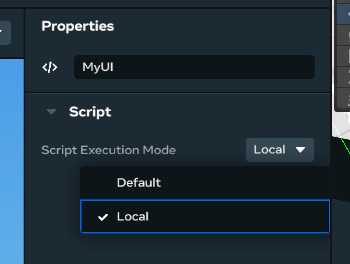

# [Local Mode Custom UI Scripts](#local-mode-custom-ui-scripts)

Custom UI supports local mode. It runs the attached script on the player client locally, removing the need for networking during binding update and callback response when players interact with the UI. This is the suggested solution when you want to display some player-specific UI that is only visible to a single player.

## [Create custom UI with local mode scripting](#create-custom-ui-with-local-mode-scripting)

1. Create a UI with Custom UI gizmo and attach a TS `UIComponent` script.
2. On the property config of the attached script, change the **Script Execution Mode** to **Local.**
3. Call `uiEntity.Owner.set(player)` when you want to transfer a UI to the player’s local client. This call can happen inside or outside of the `UIComponent` scripts.
4. Now the attached `UIComponent` script will be executed on the player’s local client, which will remove the networking during binding updates and callback response, reducing the binding and callback turnaround time to minimal.
5. See sections below on detailed behavior and other optional API can be used during transfer.

### [Binding and Callback Behavior](#binding-and-callback-behavior)

1. **Binding updates will only affect the owner.** When the UI gizmo is locally owned by a player, global value updates (calling `binding.set(newValue)` without a player list) will act like player value updates (calling `binding.set(newValue, [owner])`), and will only affect the local player.
2. **Binding updates for other players will be ignored.** When the UI gizmo is locally owned by a player, other players will not receive any binding value updates, neither global value updates (calling `binding.set(newValue)` without a player list) nor player value updates (calling `binding.set(newValue, [anotherPlayer])`).
3. **Callback logic will run on the owner client**. This does not affect the case if the callback action globally synced, for example changing a color of an entity. But it may result in different behavior if the callback is interacting with other local script variables. In this case, you may want to use a network event to communicate with the server.
4. **UI scripts will be restarted after the transfer.** After ownership of a UI gizmo is transferred (from server to player, player to player, or player to server), UI scripts will be restarted. This means all the bindings will have new instances, with their values reset to the default value provided in the script.

### [Visibility and Best Practices](#visibility-and-best-practices)

A Local Mode UI gizmo is **only visible to the owner** and invisible to other players. Once the creator marks the `UIComponent` script as **Local**, the UI becomes invisible, until its ownership is transferred to a player, and then be visible to that player only. This is the major difference from Default mode UI which is visible to all players by default.

There are now two types of UI visibility

- Local mode visibility: the visibility constraint when UI is in local mode
- Entity visibility: the visibility controlled by `uiEntity.visible.set` and `uiEntity.setVisibilityForPlayers`

Those two types act as “And” logic. A player can only see the panel when both visibility types are on. For example, when a UI is transferred to a player, you can still hide the UI with `uiEntity.visible.set(false)`. Similarly, a player cannot see a locally owned UI by other player, even if the UI has `uiEntity.visible.set(true)`.

Suppose there are two players (player1, player2), the visibility control looks like the following:

|                                                                        | Default (Non Local Mode)        | Local Mode, assigned to player1 |
| ---------------------------------------------------------------------- | ------------------------------- | ------------------------------- |
| Entity Visibility false (through `visible.set`)                        | To Player1: no To Player2: no   | To Player1: no To Player2: no   |
| Entity Visibility true (through `visible.set`)                         | To Player1: yes To Player2: yes | To Player1: yes To Player2: no  |
| Entity Visibility true For Player1 (through `setVisibilityForPlayers`) | To Player1: yes To Player2: no  | To Player1: yes To Player2: no  |
| Entity Visibility true For Player2 (through `setVisibilityForPlayers`) | To Player1: no To Player2: yes  | To Player1: no To Player2: no   |

Because of this restriction on the visibility, we recommend treating global UIs and local UIs as separate concepts and **not** interchangeable. In detail:

1. If you want a UI to be visible and interactable to all players, you should use Default Mode.
2. If you want a UI to be visible to all players but only interactable to some, you can filter the `player` in the callbacks.
3. If you want to hide a UI for some players but show it to them later, use `uiEntity.setVisibilityForPlayers`.
4. If you create a Local Mode UI, always consider it as only usable to one player.
5. If you want multiple players to have their own local UI at the same time, you can create multiple entity instances as a pool and assign them separately

We also recommend implementing and testing your `UIComponent` script in the **Default** Mode first, and only change the gizmo to the Local Mode once it is working in the Default Mode already.

### [Local Mode Example](#local-mode-example)

Here’s an example of implementing a local mode UI, and transfer the UI to the player who entered a trigger

- `MyUI`: example implementation of a normal UI
- `MyUIAdvanced`: example implementation of a UI that contains extra state for transfer purpose. This implementation is optional
- `MyTrigger`: example script that transfers the ownership

```typescript
// MyUI script, attached to Custom UI gizmo, set to *Local* mode


// component props

type TProps = { ... };


class MyUI extends UIComponent<TProps> {

  static propsDefinition: PropsDefinition<KeyDialogProps> = {

    ...

  };


  initializeUI() {

    return View({

      ...

    });

  }

}
```

```typescript
// Optional implementation

// MyUIAdvanced script, attached to Custom UI gizmo, set to *Local* mode


// component props

type TProps = { ... };

// optional extra information you want to carry when transfer UI

// from one to another can be any SerializableState

type TState = {

  msg: string;

  my_num: number;

};


class MyUIAdvanced extends UIComponent<TProps, TState> {

  static propsDefinition: PropsDefinition<KeyDialogProps> = {

    ...

  

  // optional to implement, runs on new owner client who receive the ownership

  receiveOwnership(

    state: TState \| null,

    fromPlayer: Player,

    toPlayer: Player,

  ) {

    console.log("this log happens on new owner client, after the transfer", state);

  }


  // optional to implement, runs on old owner client before transfer away ownership

  transferOwnership(fromPlayer: Player, toPlayer: Player): TState {

    console.log("this log happens on old owner client, like server, before the transfer");

    // returning the data in TState type that's transferred to new owner

    return {

      msg: "some msg",

      my_num: 123

    };

  }


  initializeUI() {

    return View({ ... });

  }

}


UIComponent.register(MyUIAdvanced);
```

```typescript
// MyTrigger script, have an UI object as prop, and set the owner once a

// player enter the trigger. This script stays on *Default* mode

type Props = {ui: Entity};

class MyTrigger extends Component<Props> {

  static propsDefinition: PropsDefinition<Props> = {

    ui: {type: PropTypes.Entity},

  };


  start() {

    this.connectCodeBlockEvent(

      this.entity,

      CodeBlockEvents.OnPlayerEnterTrigger,

      (player: Player) => {

        this.props.ui.owner.set(player);

      },

    );

  }

}


Component.register(MyTrigger);
```

