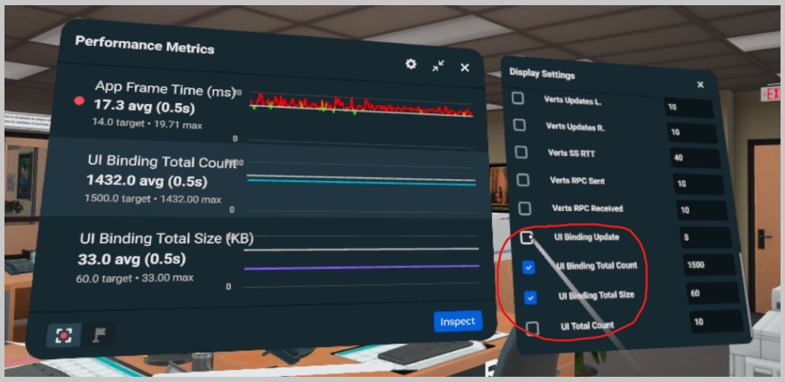
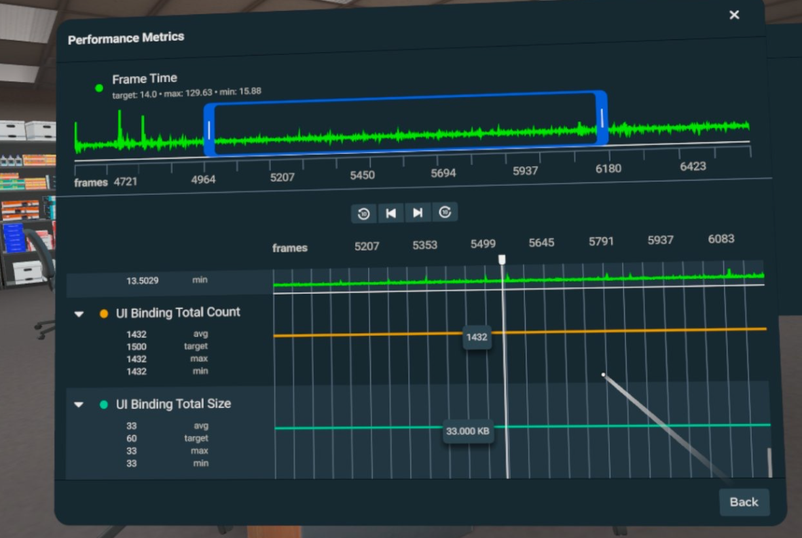

# [Performance Metrics for Custom UI](#performance-metrics-for-custom-ui)

There are 4 real-time metrics available to help with debugging Custom UI.

They are:

1. Total # of visible UI
2. Total # of value bindings
3. Total data size of bindings (in KB)
4. Binding update # in every frame

All the metrics can be seen under the [realtime metrics](../../Performance/Performance%20tools/Enabling%20and%20modifying%20the%20real-time%20metrics%20panel%20in%20VR.md) list.

As well as [Scrubbing](../../Performance/Performance%20tools/Performance%20Scrubbing.md) metrics.

