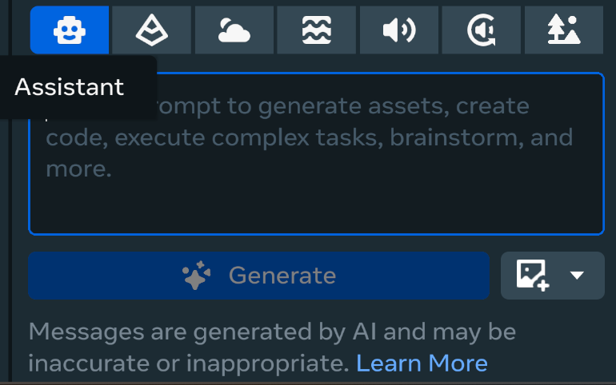
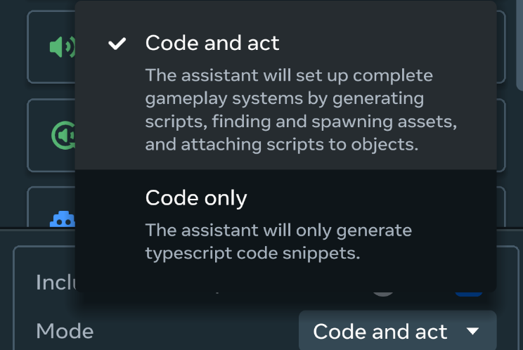
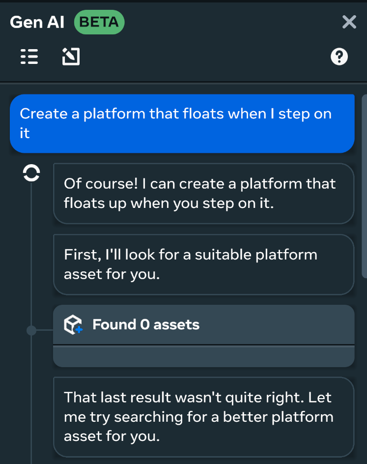
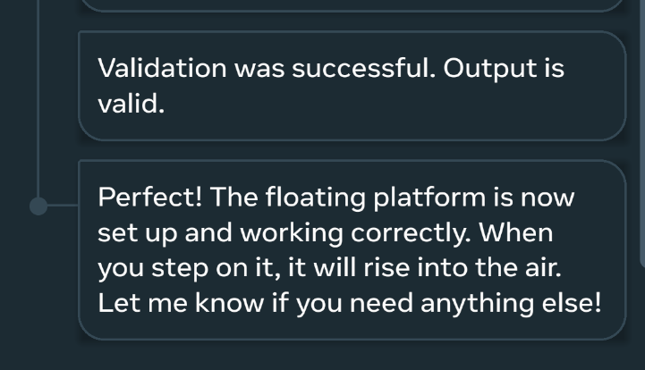
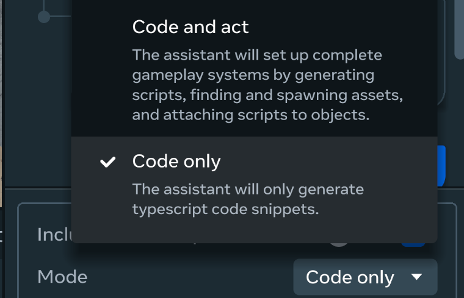
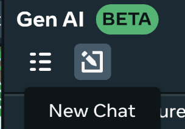
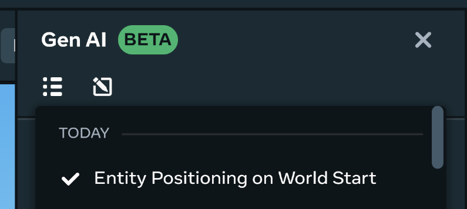

# [Generative AI Assistant Tool](#generative-ai-assistant-tool)

> [!Important]
>
> Join the [Meta Horizon Creator Program](https://developers.meta.com/horizon-worlds/programs)! As a member, you gain:* Access to monetization opportunities including monthly bonuses, in-world purchases and competition cash prizes.
> * Helpful resources including educational content, technical support and a collaborative creator community.

> [!Important]
>
> To report bugs, go to the main menu and select **Report a problem**. To give us feedback, select **Help us improve** from the main menu.

When creating a world in Horizon, using Typescript can be a challenge. The Generative AI Assistant Tool can help you learn Typescript by generating code snippets, and even take actions to help accelerate your world building process. The tool is available in the Horizon Desktop Editor and it is an authoritative, AI-powered chat assistant. The tool works like a chat app and is as simple as having a back-and-forth, real-time conversation with someone. In this case, that someone just happens to be an [LLM](https://en.wikipedia.org/wiki/Large_language_model).

Keep in mind there are daily rate limits for using the Generative AI Assistant Tool. You can check the rates limits in in the following section.

Gen AI Tool Availability & Rates

Access to GenAI features is automated and determined based on your location when using the Desktop Editor. If you move from an unsupported location to a supported location or vice versa, there will be a delay in updating your access for GenAI features. Horizon desktop editor’s GenAI tools are currently available to users aged 13+ and the Creator Assistant tool is available to users aged 18+. Access to GenAI features is automated and determined based on your location when using the desktop editor. If you move from an unsupported location to a supported location or vice versa, there will be a delay in updating your access for GenAI Features. The GenAI features are available in the following regions: United States, the United Kingdom (UK), Canada, India, Australia, France, Germany, Spain, Brazil, the Netherlands, Italy, Poland, Argentina, Vietnam, Mexico, New Zealand, Sweden, Belgium, Ireland, Switzerland, Denmark, Finland, Norway, Singapore, Iceland, and Austria. Additionally there are daily rate limits per user on content created using Meta AI. These limits are:

- Typescript - 1000 requests
- Audio SFX/Ambient - 200 requests
- Skybox Generation - 50 requests
- Mesh Generation - 100 requests

To access the Generative AI Assistant Tool, select **Gen AI** from the top menu bar. You can then select the **Assistant** tool to enable the Horizon Generative AI Assistant.

## [Use the Generative AI Assistant Tool](#use-the-generative-ai-assistant-tool)

The Generative AI Assistant Tool can take action in your world handle basic end-to-end processes during the world building process. You can enable this mode by selecting **Code and act** as the mode for the assistant.

As an example, by entering the prompt “Make a door that opens when a button is pressed”, the Generative AI Assistant Tool can take the following actions:

- Find assets in the **Asset Library** and place them in your world
- Modify entity properties
- Create scripts and connect them to your world
- Instruct you on additional steps needed to adjust editor settings

You can also regenerate the content by re-submitting your prompt until you get a satisfactory response.

To use the Generative AI Assistant tool, use the following process:

1. Select **Gen AI** from the top menu bar, then select the **Assistant** and set the mode to **Code and act**. 
2. Input a prompt into the prompt window. This can be a natural language prompt that’s more conversational like “Create a platform that floats when I step on it.”
3. Click **Generate** and the Gen AI Assistant will begin executing on your task. The Assistant will narrate its actions so you can follow along with its process and check its steps. 
4. Once the process completes, the Assistant will validate its output and then indicate that the process is complete. Any new assets created will appear in the **Hierarchy** pane on the left side.
5. Once the process is complete, you can converse with the Gen AI Assistant to make updates to the created content, or other parts of your world. 

Currently the Gen AI Assistant is only capable of tasks focused on **basic interactivity** and **basic system prompts**. It cannot autonomously complete complex workflows and is limited to mechanics that Typescript can interact with. Additionally it cannot interact with any of the additional generators in the **Gen AI** panel.

The following are examples of use cases that the Gen AI Assistant can do and can help as a framework for interacting with the Gen AI Assistant:

- As a builder, I can ask a “how do I” question and retrieve up to date results from Horizon documentation to answer my question:
  - How do I **interact with Unity Asset Bundles**?
  - How do I **create my own custom asset**?
  - How do I **work with animations in Horizon**?
  - How do I **learn Typescript**?
  - How do I **implement a Custom UI system in Horizon**?
- As a builder, I can ask the AI Assistant to implement basic interactivity / basic systems:
  - Build a **floor tile that activates when stepped on**.
  - Create a **lever that can be switched on and off**.
  - Generate **coins that players can collect for points**.
  - Design a **door that requires a key to open**.
  - Make **health packs that heal players when picked up**.
  - Construct a **pad that teleports players to another location**.
  - Develop a **platform that moves back and forth**.
  - Engineer an **elevator that goes up and down**.
  - Build a **device that launches players into the air**.
  - Design a **spinning obstacle that hurts players**.
  - Create **platforms that fall or disappear when stepped on**.
  - Establish an **area that makes players run faster**.
  - Construct a **floor that damages players like lava**.
  - Generate a **gun that shoots projectiles**.
  - Make **targets that can be shot at**.
  - Create **barrels that explode when hit**.
  - Implement a **countdown timer for my game**.
  - Design a **door that opens when players get close**.
  - Build a **puzzle with pressure plates that need specific weights**.
  - Create a **combination lock puzzle**.
  - Generate a **box that spawns random items**.
  - Implement a **randomizer like rolling dice**.
  - Design a **system that spawns objects repeatedly**.
  - Construct a **dance floor with music**.

## [Generating TypeScript code snippets](#generating-typescript-code-snippets)

**Note**: The Generative AI Creation Tool can only generate code using [version 2 of the Meta Horizon Worlds Typescript API](../../Scripting/API%20references%20and%20examples/Horizon%20TypeScript%20V2%20Changes.md).

The Generative AI Assistant tool can also generate Typescript snippets for you to attach to objects in your world. For best results when generating Typescript APIs, try to keep your scope limited to one API at a time.

Responses will occasionally contain [hallucinations](https://en.wikipedia.org/wiki/Hallucination_\(artificial_intelligence\)). This usually happens when there are no supported APIs available for the given prompt.

If a response doesn’t give the expected result, try reframing your prompt to be more clear and specific.

To generate code snippets using the Gen AI Assistant, use the following process:

1. Select the **Assistant** icon and set the **Mode** to **Code Only**.

   

2. Select either the LLama or Specialist model with the **Model** dropdown.

3. Enter a prompt into the prompt window and click **Generate**.

4. The Gen AI Assistant will create a sample snippet of Typescript code and provide details on how to use it. **Note**: Because this feature is code only, you will still have to follow the steps provided to use the generated typescript snippet

If you would like to change topics, you must start a new conversation by clicking the **New Chat** button. 

Specify whether the result was helpful by clicking either **Like** (thumbs-up), or **Dislike** (thumbs-down). Meta uses this information to fine-tune the LLM.

## [View Generative AI tool history](#view-generative-ai-tool-history)

After using the Generative AI Assistant tool, you can view previous chats by selecting the **History** icon.

After opening the history window you can select a previous conversation. This will restore the selected conversation including the context used to generate content.

## [What’s next?](#whats-next)

To learn more about Meta Horizon Worlds, try the following:

1. [Create your first world](../../Tutorials/Getting%20started/Create%20your%20first%20world%20tutorial%2C%20part%201.md) using our step-by-step tutorial.
2. If you have issues when running the desktop editor, see [Desktop Editor Troubleshooting](../Help%20and%20reference/Desktop%20editor%20troubleshooting.md)
3. Learn about the desktop editor with the [Introduction to the Desktop Editor](../Get%20started%20with%20Desktop%20Editor/Introduction%20to%20the%20desktop%20editor.md).
4. Learn about the other tools available by reading our [Tools Overview](../../Get%20started/Tools%20overview.md).
5. Join the [Meta Horizon Creator Program](https://developers.meta.com/horizon-worlds/programs/) to learn about our program benefits.

