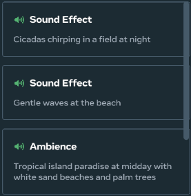
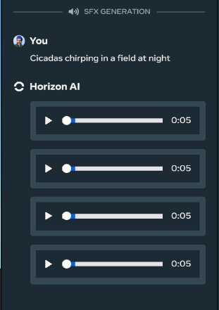
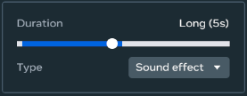
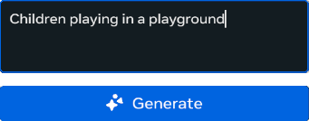
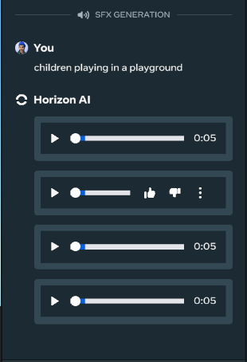
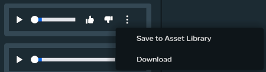
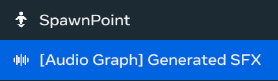
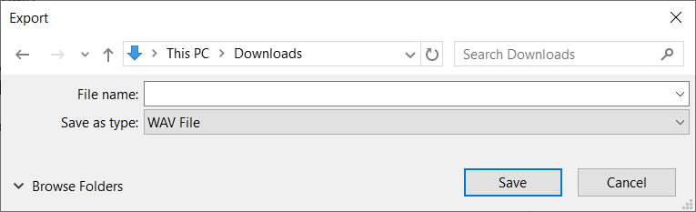
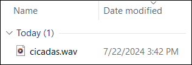

# [Generative AI Creation Audio Tool](#generative-ai-creation-audio-tool)

> [!Important]
>
> Join the [Meta Horizon Creator Program](https://developers.meta.com/horizon-worlds/programs)! As a member, you gain:* Access to monetization opportunities including monthly bonuses, in-world purchases and competition cash prizes.
> * Helpful resources including educational content, technical support and a collaborative creator community.

> [!Important]
>
> To report bugs, go to the main menu and select **Report a problem**. To give us feedback, select **Help us improve** from the main menu.

The Generative AI Creation Tool assists in the audio creation process, taking it from a potentially daunting process to a simple matter of clicking a few buttons and adding the resulting audio!

The Generative AI Creation Tool provides two audio generation modes: sound effect generation and ambient audio generation. Sound effect generation is useful when attempting to create short audio clips, while ambient audio generation is useful when generating longer background tracks.

You can either select sounds based on example prompts, or create your own custom prompts and see what sounds you can come up with.

Once you have that perfect sound, you can use it to create audio assets for your world, or download it to your local hard drive for future use.

Additionally, the tool is located in the Horizon Desktop Editor, making it not only easy to use, but easy to navigate to whenever you need it.

Gen AI Tool Availability & Rates

Access to GenAI features is automated and determined based on your location when using the Desktop Editor. If you move from an unsupported location to a supported location or vice versa, there will be a delay in updating your access for GenAI features. Horizon desktop editor’s GenAI tools are currently available to users aged 13+ and the Creator Assistant tool is available to users aged 18+. Access to GenAI features is automated and determined based on your location when using the desktop editor. If you move from an unsupported location to a supported location or vice versa, there will be a delay in updating your access for GenAI Features. The GenAI features are available in the following regions: United States, the United Kingdom (UK), Canada, India, Australia, France, Germany, Spain, Brazil, the Netherlands, Italy, Poland, Argentina, Vietnam, Mexico, New Zealand, Sweden, Belgium, Ireland, Switzerland, Denmark, Finland, Norway, Singapore, Iceland, and Austria. Additionally there are daily rate limits per user on content created using Meta AI. These limits are:

- Typescript - 1000 requests
- Audio SFX/Ambient - 200 requests
- Skybox Generation - 50 requests
- Mesh Generation - 100 requests

## [Generating audio from an example prompt](#generating-audio-from-an-example-prompt)

The chat panel contains several example prompts. For example, the image below shows two sound effect examples and one ambient audio example.

To try out a sound, simply select it. For example, when you select “Cicadas chirping in a field at night”, the user interface changes to display a chat between you and the Gen AI tool. Your prompt appears at the top of the panel, followed by the AI-generated results.

The Gen AI tool returns several sound clips. Listen to each, and then decide which is your favorite!

## [Generating audio from a custom prompt](#generating-audio-from-a-custom-prompt)

As well as containing several sample prompts, the chat panel also contains an input field for accepting your custom prompts.

Type your own prompt into the input field, set the **Duration**, select an audio **Type**, and click **Generate**. The Gen AI tool generates four audio clips for sound effect generation and one audio clip for ambient audio generation. Try them out and then pick the one that you like the best. Note that ambient audio can take over a minute to generate due to the length of the ambient audio tracks.

To specify whether the result was helpful, hover over the audio player and click either **Like** (thumbs-up) or **Dislike** (thumbs-down). Meta uses this information to fine-tune the LLM.

## [Listening to generated sound effects](#listening-to-generated-sound-effects)

1. Pick one of the sound clips to audition, and then click the **Play** button.

The clip plays through your computer’s speakers.

## [Adding generated sound effects to your asset library](#adding-generated-sound-effects-to-your-asset-library)

1. Hover over the applicable sound clip, click the three dots, and click **Save to asset library**.

The generated sound effect is converted into an asset and added to your Asset Library.

If you drag the generated SFX asset into your scene, it appears in your Hierarchy.

## [Downloading generated sound effects](#downloading-generated-sound-effects)

1. Hover over the applicable sound clip, click the three dots, and click **Download**.

   

   The Export dialog box appears, prompting you to enter a filename.

   

2. Enter a filename and click **Save**. The sound effect file is saved to your local hard drive.

## [What’s next?](#whats-next)

To learn more about Meta Horizon Worlds, try the following:

1. [Create your first world](../../Tutorials/Getting%20started/Create%20your%20first%20world%20tutorial%2C%20part%201.md) using our step-by-step tutorial.
2. If you have issues when running the desktop editor, see [Desktop Editor Troubleshooting](../Help%20and%20reference/Desktop%20editor%20troubleshooting.md)
3. Learn about the desktop editor with the [Introduction to the Desktop Editor](../Get%20started%20with%20Desktop%20Editor/Introduction%20to%20the%20desktop%20editor.md).
4. Learn about the other tools available by reading our [Tools Overview](../../Get%20started/Tools%20overview.md).
5. Join the [Meta Horizon Creator Program](https://developers.meta.com/horizon-worlds/programs/) to learn about our program benefits.

