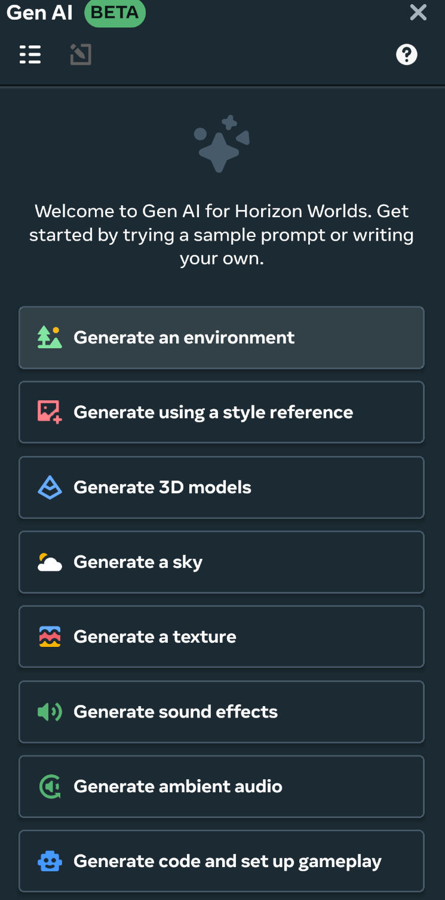
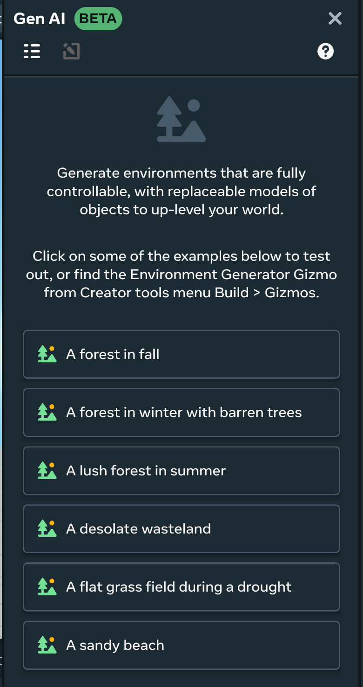
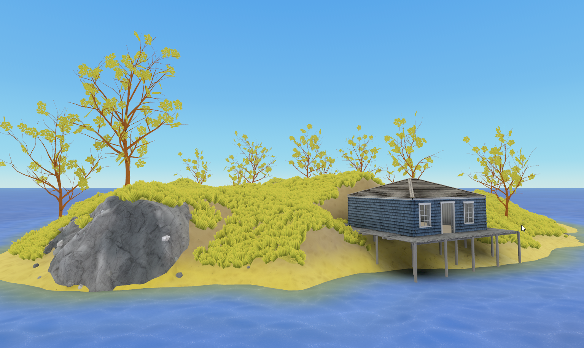
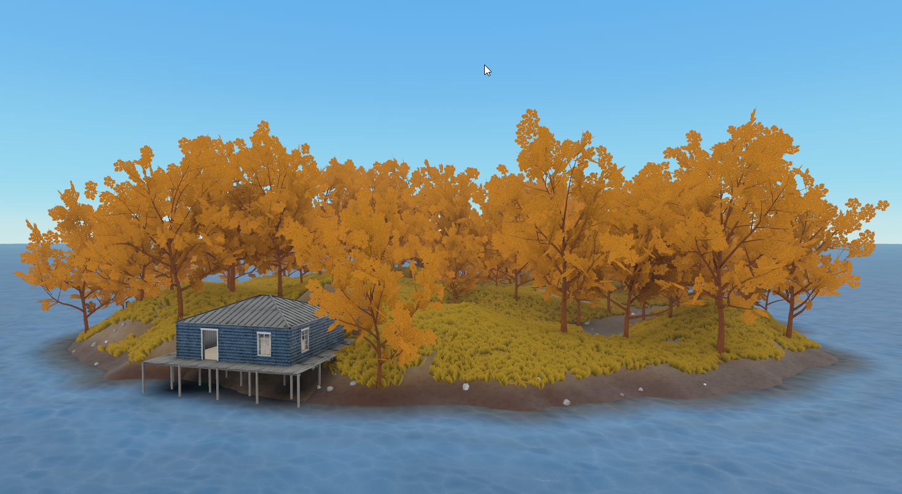
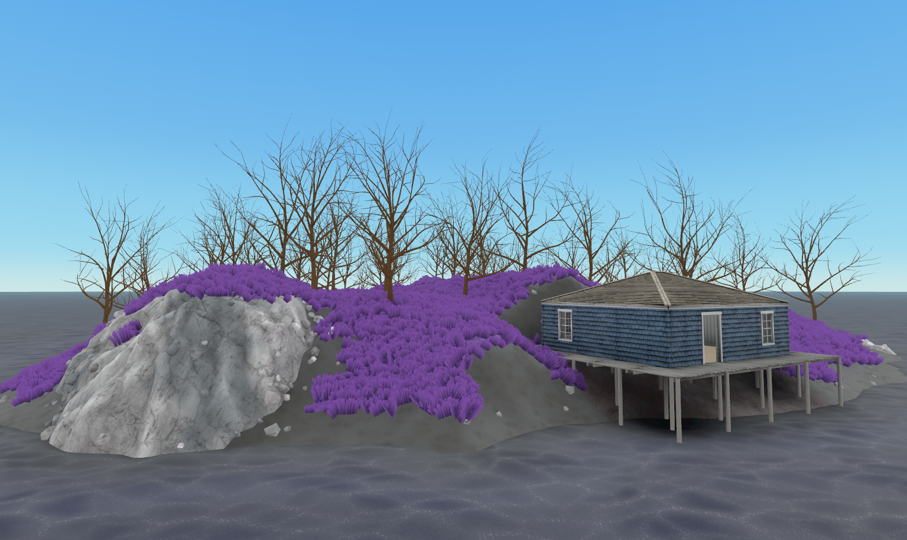
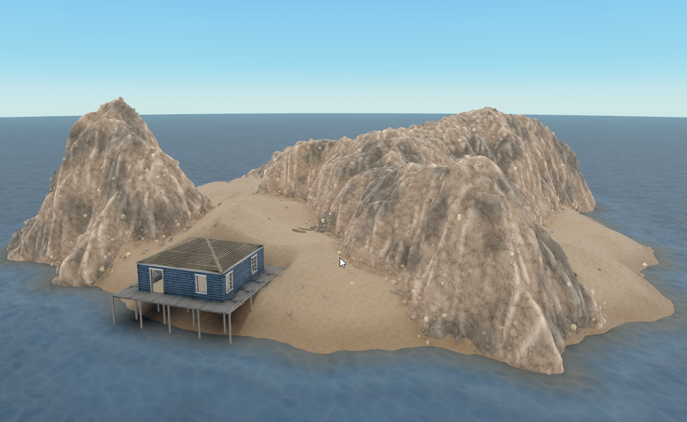

# [Generative AI Environment Generation Tool](#generative-ai-environment-generation-tool)

The GenAI Environment Generation tool offers a rapid solution for creating immersive environments in your world. Currently this tool supports generating island themed environments, with more themes planned to come in the future.

This document will cover how to:

- Generate an environment using the environment generation tool
- Influence the theme and mood of your generations using LLM prompt

## [Generate an environment using the environment generation tool](#generate-an-environment-using-the-environment-generation-tool)

You can enable the environment generation tool through the **GenAI** menu or with the Environment Generation gizmo.

To generate an environment using the environment generation tool, use the following process:

1. Open the desktop editor and select the **GenAI** menu from the top menu bar. Note that the **GenAI** panel may be open and visible by default in the right hand panel of the desktop editor. 
2. In the **GenAI** menu, select **Generate an Environment**.
3. Select one of the example prompts listed in the **GenAI** menu. The Environment Generation properties window will appear with the selected prompt input in the **Prompt Input** field. 
4. Click **Generate** to generate the environment. The time needed to generate the environment is based on the complexity of the generated environment, but usually takes between 1 and 2 minutes.

Once finished, your environment will be generated and you can click the **Play** button to walk around your generated environment and explore the environment with your avatar. Once you’re satisfied with your generated environment, click **Save to Asset Library**

## [Environment Generation Parameters](#environment-generation-parameters)

When generating an environment, there are a variety of parameters in the **Environment Generation** tool. The following parameters are available in the Environment Generation tool:

**Generator**: Selects which environment generator to use. Today, only **Island World Builder** is available, and it features the parameters that follow.

**Seed**: Controls the randomness of the generation for both terrain and buildings. Setting the value from 0 - 999 will fix the seed at the input value.

**Environment size**: The two dimensions for the size of the island terrain measured in meters.

**Terrain shape**: Controls the shape of the generated island. The available choices are **Round**, **Crescent**, and **Ring**.

**Quality:** Defines the mesh density for the generated terrain. Low and medium quality settings will generate more quickly, but will lack finer details and might not show paths correctly.

**Building theme**: Sets the theme or style for the generated houses on the island. The available choices are **Tropical Hut**, **Surf Shack**, **Coastal Cottage**, and **LogCabin**.

**Number of buildings**: Sets the number of buildings generated on the island. The value can range from 0 - 10.

**Create water plane**: Toggles whether a water plane is included in the generation to surround the island in water.

**Environment theme prompt**: Used to inform the overall theme / vibe of the generation influencing vegetation density, and color palette.

## [World building with the environment generation tool](#world-building-with-the-environment-generation-tool)

The environment generation tool can be used in conjunction with the other suite of Horizon GenAI tools to quickly build a world’s environment and tone for your users and players to explore.

By combining with tools like the [Skybox Generator tool](Generative%20AI%20Skybox%20Generation%20Tool.md) you can rapidly build a world that you can begin adding gameplay and content to.

Below are some examples of environments generated using the Environment Generation tool.

The example prompts used will be listed and included in the image:

**Prompt**: “An island overgrown with golden grass”

**Prompt**: “A forest in fall”

**Prompt**: “A spooky forest with barren trees and purple grass”

**Prompt**: “A desolate wasteland”

