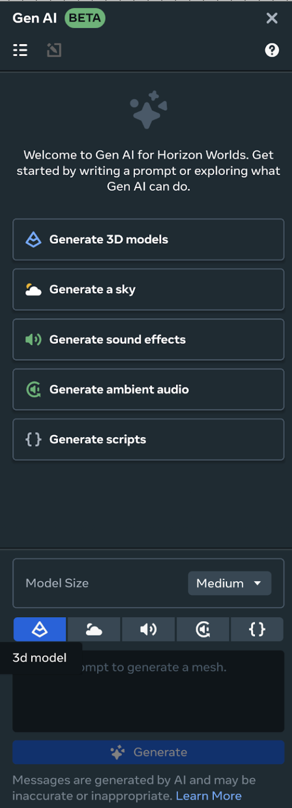
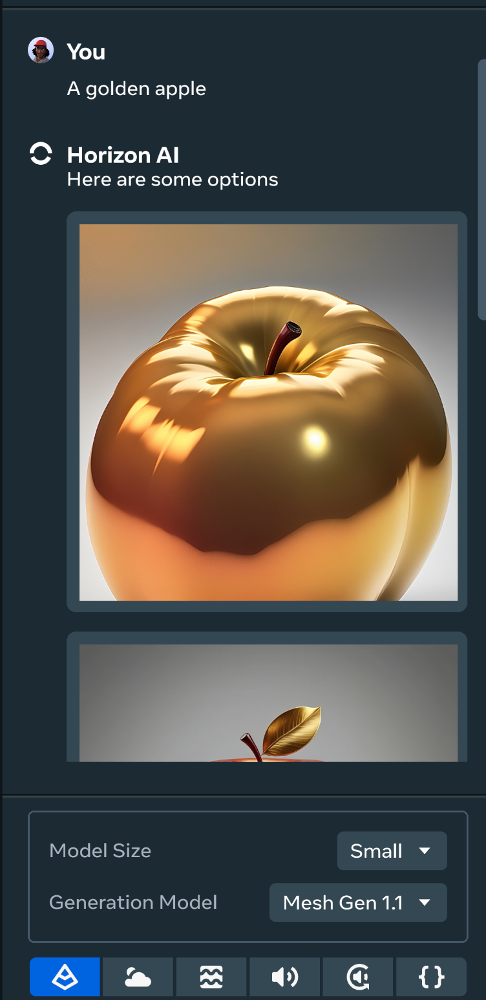
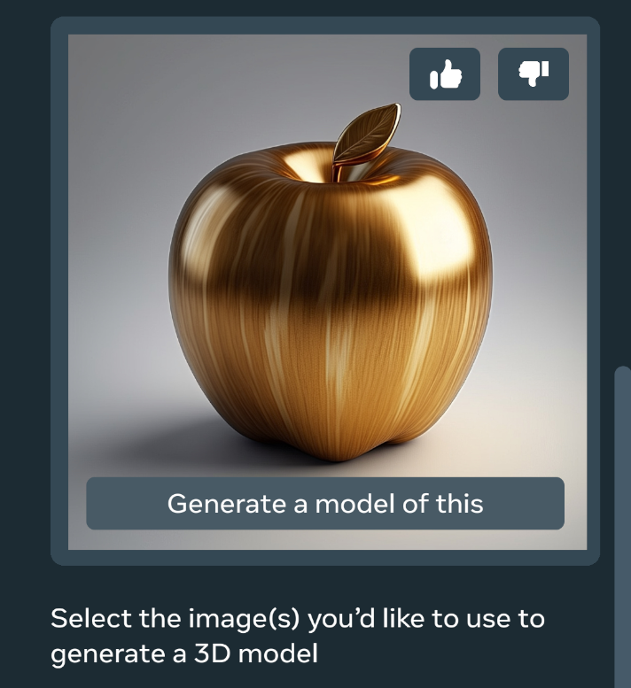

# Generative AI Mesh Generation Tool

The Generative AI Mesh tool allows you to dynamically generate textured meshes that can then be added to your worlds asset library. This tool helps streamline the process of world and environment building by adding generated meshes of varying sizes & complexities. This document will cover how to:

* Generated small, medium, or large meshes using the GenAI mesh tool
* Save the generated asset to your library
* Add the generated asset to your created world

Prerequisites

* [Horizon Desktop editor](../Get%20started%20with%20Desktop%20Editor/Introduction%20to%20the%20desktop%20editor.md) installed on your PC

Gen AI Tool Availability & Rates

 Access to GenAI features is automated and determined based on your location when using the Desktop Editor. If you move from an unsupported location to a supported location or vice versa, there will be a delay in updating your access for GenAI features. Horizon desktop editor’s GenAI tools are currently available to users aged 13+ and the Creator Assistant tool is available to users aged 18+. Access to GenAI features is automated and determined based on your location when using the desktop editor. If you move from an unsupported location to a supported location or vice versa, there will be a delay in updating your access for GenAI Features. The GenAI features are available in the following regions: United States, the United Kingdom (UK), Canada, India, Australia, France, Germany, Spain, Brazil, the Netherlands, Italy, Poland, Argentina, Vietnam, Mexico, New Zealand, Sweden, Belgium, Ireland, Switzerland, Denmark, Finland, Norway, Singapore, Iceland, and Austria. Additionally there are daily rate limits per user on content created using Meta AI. These limits are:

* Typescript - 1000 requests
* Audio SFX/Ambient - 200 requests
* Skybox Generation - 50 requests
* Mesh Generation - 100 requests

## Generate a mesh with GenAI Mesh Generation tool

To access the Mesh Generation tool, open the **GenAI** panel from the top of your Horizon desktop editor.

{width:”400px”}

Then select the **Generate 3D models** option from the available generate options. Next, use the following process to generate a new mesh for your world:

- Use the **Model Size** dropdown to select either **Small**, **Medium**, or **Large**. The selected model size corresponds to the tricount of the generated mesh. The tricount is the number of triangles that make up the mesh. The larger the model size, the more triangles the mesh will have and, generally, the higher quality the mesh will be.
- After selecting your model size, enter a prompt into the prompt field and click **Generate**.
- You will see some images generated for you based on your input prompt. You can select one or more of these images to generate a 3D model from.
  {width:”400px”}
- To generate a 3D model of a generated image, hover your mouse over the image and select **Generate a model of this** on the image.
  {width:”400px”}
- Once your model has finished generating, you can click **Save model** to save the generated 3D model to your asset library. The generated 3D will be added to your **My Assets** folder in your asset library in the **GenAI Assets** subfolder.
- Once saved and available you can drag your generated asset from the library into your world to spawn it.