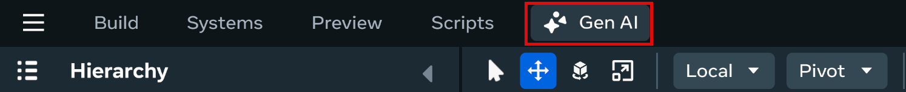
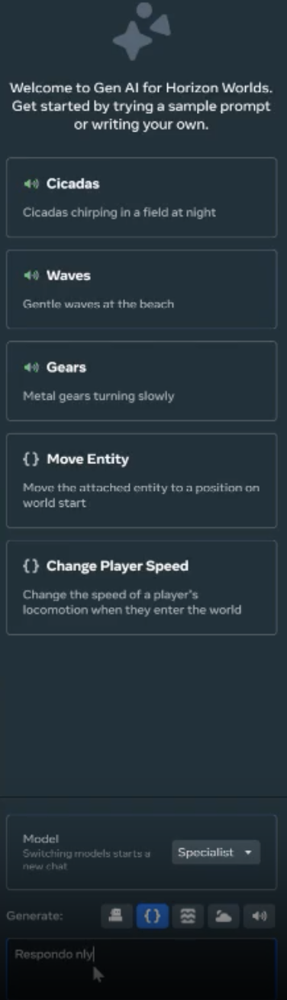
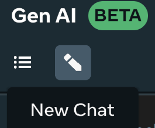
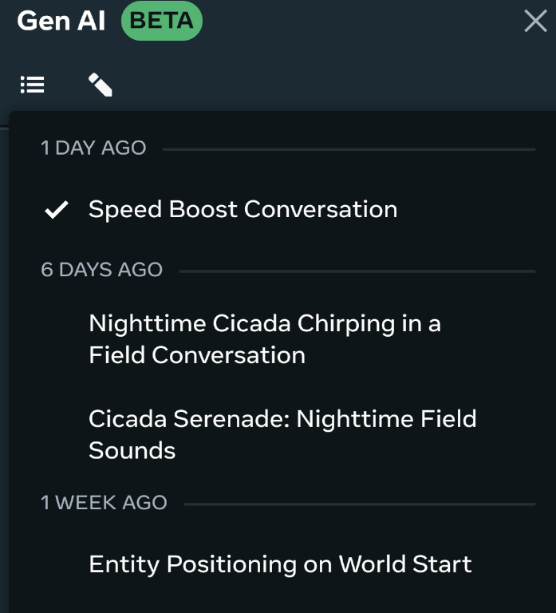

# [Generative AI Overview](#generative-ai-overview)

When using the Meta Horizon Worlds desktop editor, you can leverage a suite of generative AI tools to help create things like assets and scripts for your world.

These generative tools can help accelerate your world-building process by allowing you to tap into either Meta’s Llama or a specialist generative toolset.

Gen AI Tool Availability & Rates

Access to GenAI features is automated and determined based on your location when using the Desktop Editor. If you move from an unsupported location to a supported location or vice versa, there will be a delay in updating your access for GenAI features. Horizon desktop editor’s GenAI tools are currently available to users aged 13+ and the Creator Assistant tool is available to users aged 18+. Access to GenAI features is automated and determined based on your location when using the desktop editor. If you move from an unsupported location to a supported location or vice versa, there will be a delay in updating your access for GenAI Features. The GenAI features are available in the following regions: United States, the United Kingdom (UK), Canada, India, Australia, France, Germany, Spain, Brazil, the Netherlands, Italy, Poland, Argentina, Vietnam, Mexico, New Zealand, Sweden, Belgium, Ireland, Switzerland, Denmark, Finland, Norway, Singapore, Iceland, and Austria. Additionally there are daily rate limits per user on content created using Meta AI. These limits are:

- Typescript - 1000 requests
- Audio SFX/Ambient - 200 requests
- Skybox Generation - 50 requests
- Mesh Generation - 100 requests

## [Open the Generative AI Tool](#open-the-generative-ai-tool)

After creating your world you can use the desktop editor’s generative tools to begin generating assets for your world.

The Gen AI panel features pre-made sample prompts that you can select to create a demonstration of generated content. These pre-made samples can be immediately used in your world building process.

To open and use the Horizon desktop editor’s Generative AI tool, use the following process:

1. Select and open your world then click the Gen AI icon on the top toolbar to open the Gen AI panel. 
2. The AI Creation Tool panel opens on the right side of the screen. 

With the creation panel open, you can generate either typescript or audio for your selected world.

For more detailed information on generating script or audio check the [Generative AI Creation Code Tool](Generative%20AI%20Assistant%20Tool.md) and [Generative AI Creation Audio Tool](Generative%20AI%20Creation%20Audio%20Tool.md) guides.

## [Start new chats and view chat history](#start-new-chats-and-view-chat-history)

Once you’ve generated content using the Gen AI tool you can start a new chat or return to previous conversations.

With the Gen AI panel open select the pencil icon to start a new chat. This can only be selected when you’ve already started generating content.

To view previous conversations select the **Open chat history** button, then select a previous conversation from the list.

You can also delete previous conversations from this list by hovering over an entry, then clicking the trash icon.

## [What’s next?](#whats-next)

To learn more about Meta Horizon Worlds, try the following:

1. [Create your first world](../../Tutorials/Getting%20started/Create%20your%20first%20world%20tutorial%2C%20part%201.md) using our step-by-step tutorial.
2. If you have issues when running the desktop editor, see [Desktop Editor Troubleshooting](../Help%20and%20reference/Desktop%20editor%20troubleshooting.md)
3. Learn about the desktop editor with the [Introduction to the Desktop Editor](../Get%20started%20with%20Desktop%20Editor/Introduction%20to%20the%20desktop%20editor.md).
4. Learn about the other tools available by reading our [Tools Overview](../../Get%20started/Tools%20overview.md).
5. Join the [Meta Horizon Creator Program](https://developers.meta.com/horizon-worlds/programs/) to learn about our program benefits.

