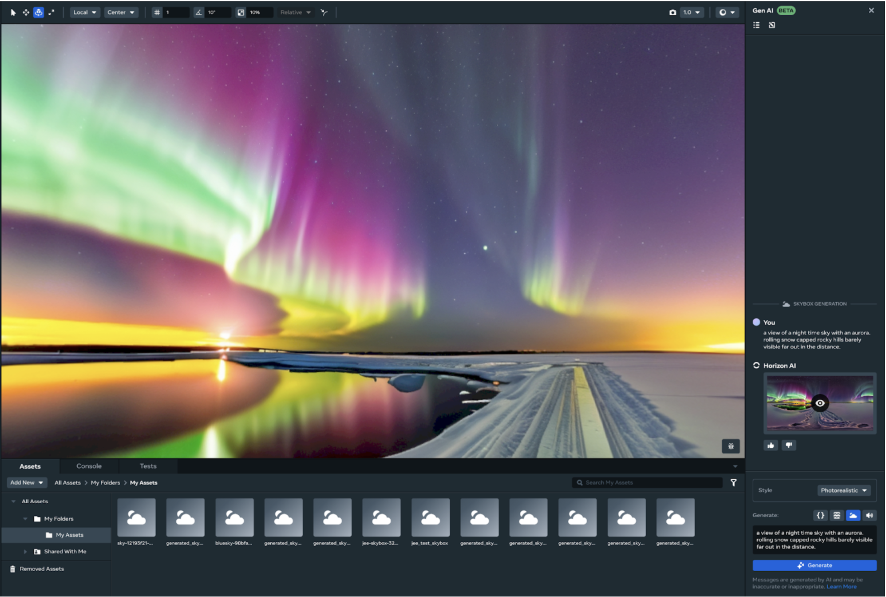
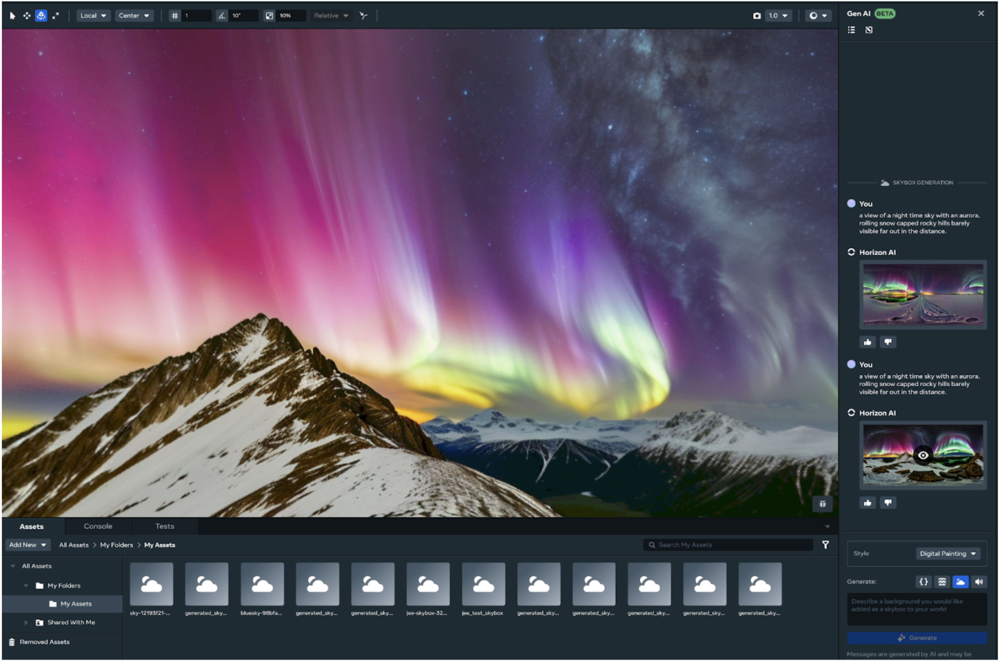
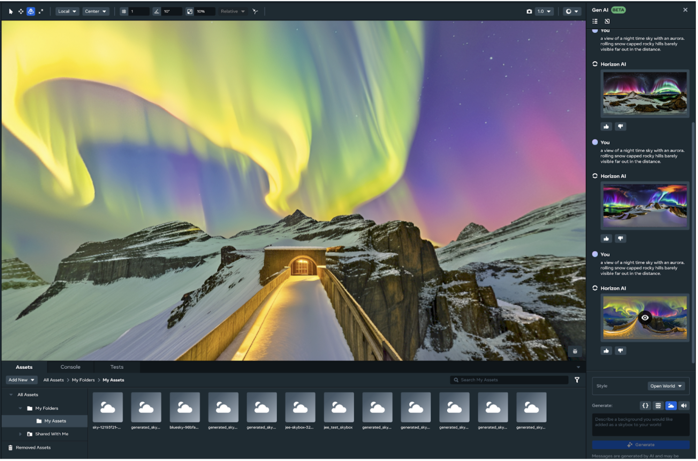
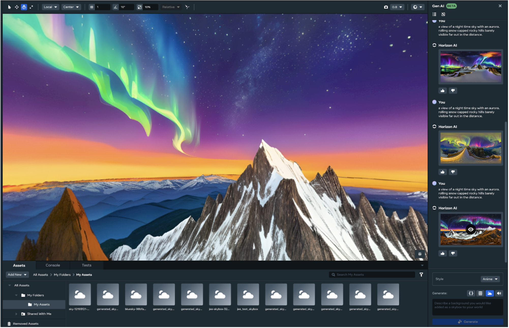
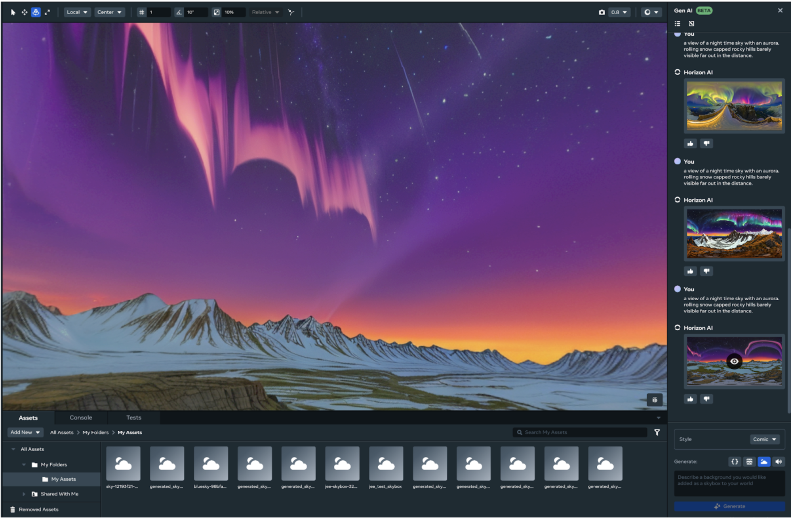

# [Generative AI Skybox Generation Tool](#generative-ai-skybox-generation-tool)

The Generative AI Skybox Generation Tool allows you to dynamically generate skyboxes for your created worlds. This tool helps streamline the process of world and environment building while also allowing you to iterate on the generated assets. This doc will cover how to:

- Generate a skybox in Horizon and its associated styles
- Export the asset(s) to your asset library
- Download the asset(s) to your local machine

## [Prerequisites](#prerequisites)

- [Horizon Desktop Editor](../Get%20started%20with%20Desktop%20Editor/Introduction%20to%20the%20desktop%20editor.md) installed on your PC.
- One or more 3D models imported into your [personal asset library](../Assets/Creating%2C%20importing%2C%20viewing%2C%20and%20spawning%20assets.md#importing-assets) in Desktop Editor.

Gen AI Tool Availability & Rates

Access to GenAI features is automated and determined based on your location when using the Desktop Editor. If you move from an unsupported location to a supported location or vice versa, there will be a delay in updating your access for GenAI features. Horizon desktop editor’s GenAI tools are currently available to users aged 13+ and the Creator Assistant tool is available to users aged 18+. Access to GenAI features is automated and determined based on your location when using the desktop editor. If you move from an unsupported location to a supported location or vice versa, there will be a delay in updating your access for GenAI Features. The GenAI features are available in the following regions: United States, the United Kingdom (UK), Canada, India, Australia, France, Germany, Spain, Brazil, the Netherlands, Italy, Poland, Argentina, Vietnam, Mexico, New Zealand, Sweden, Belgium, Ireland, Switzerland, Denmark, Finland, Norway, Singapore, Iceland, and Austria. Additionally there are daily rate limits per user on content created using Meta AI. These limits are:

- Typescript - 1000 requests
- Audio SFX/Ambient - 200 requests
- Skybox Generation - 50 requests
- Mesh Generation - 100 requests

## [Skybox styles (models)](#skybox-styles-models)

The skybox feature offers different models that can be used to establish a style for your generated skybox. Below are the currently available skybox models generated with the following phrase: “A view of a nighttime sky with an aurora. rolling snow-capped rocky hills barely visible far out in the distance.”

- Skydome - A traditional skybox featuring wide open reflected horizons and realistic rendering 
- Photorealistic - Photographic realism with good visual fidelity 
- Digital Painting - Digitally illustrated concept art
- Open World - Pastel paintings of beautiful worlds 
- Anime - Bright and cheery Japanese styled animation 
- Comic - Cel-shaded illustration style with clean lines and bright colors 

## [Generate Skyboxes for your world](#generate-skyboxes-for-your-world)

To generate a skybox for your world, use the following process:

1. Select the GenAI icon from the toolbar, then select Skybox.
2. Enter a prompt into the prompt field and select a style to base the generated skybox on. The Horizon GenAI tool will then generate several skybox options based on your input prompt and selected style.
3. Once the options are generated, select one of the generated options to create a preview of the skybox. You can use the **Style** drop-down menu to select one of the six available styles for your generated skybox.
4. Once your skybox options are generated, select the option that most fits your created world.

## [Save your generated skybox](#save-your-generated-skybox)

Once a skybox has been generated for your world, you can save it to your asset library.

To save to your asset library, hover over your generated asset and select the **Export to asset library** option.

**Note**: You can also download and save your generated skybox to your local disk using the download icon.

