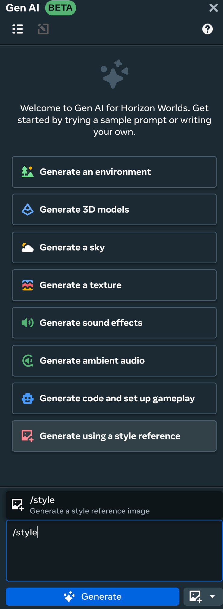
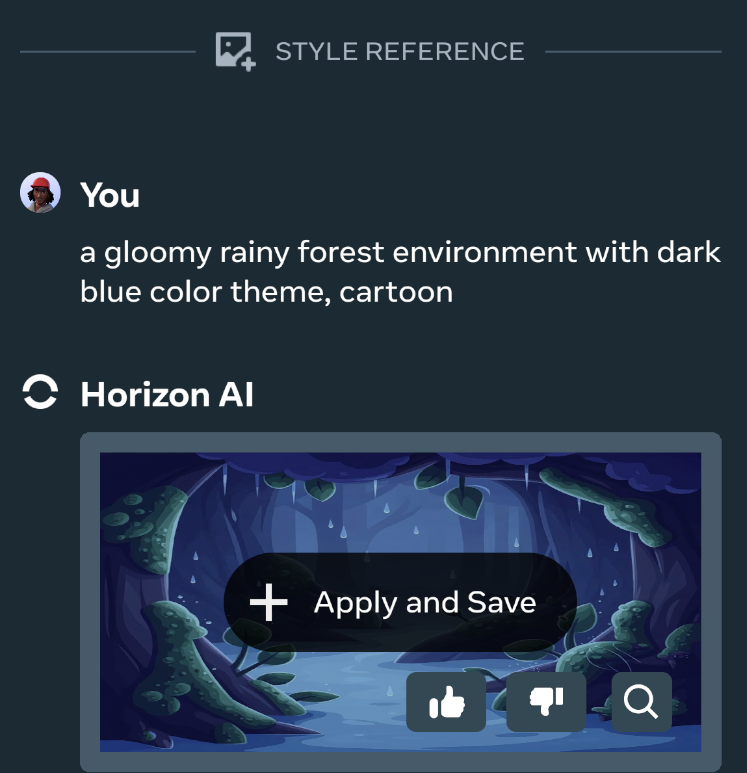
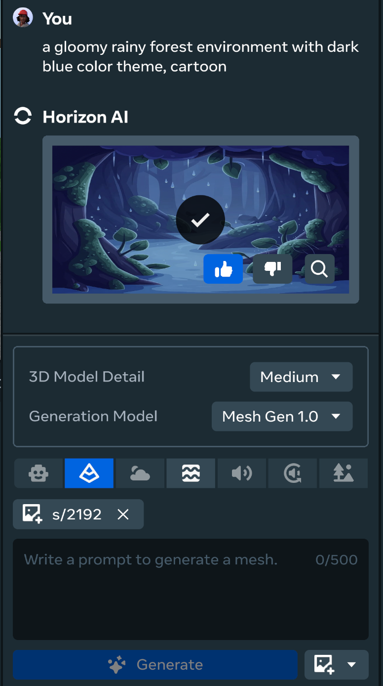
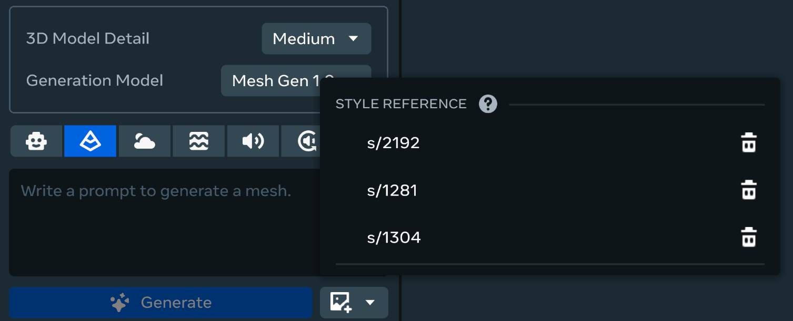

# Generative AI Style Reference

The Horizon Gen AI Style Reference feature allows the creation of a style that informs other content you create using Horizon Gen AI tools. With Style Reference, you can establish a style that helps build a cohesive world look and feel in your created world. Consistency for your generated content can help accelerate the world creation process, and ensure your users have a cohesive experience in your world.

Once a style reference is created you can:

* Apply to additional generated content for your world.
* Save it and reuse the generated style for future content.
* Swap between generated styles to dynamically alter the context window for generated content when world building.

**Note**: When using a style reference for your generated content, you will be rate limited according to your selected generation output. Check the **Gen AI Tool Availability & Rates** for rate limit information.

Gen AI Tool Availability & Rates

 Access to GenAI features is automated and determined based on your location when using the Desktop Editor. If you move from an unsupported location to a supported location or vice versa, there will be a delay in updating your access for GenAI features. Horizon desktop editor’s GenAI tools are currently available to users aged 13+ and the Creator Assistant tool is available to users aged 18+. Access to GenAI features is automated and determined based on your location when using the desktop editor. If you move from an unsupported location to a supported location or vice versa, there will be a delay in updating your access for GenAI Features. The GenAI features are available in the following regions: United States, the United Kingdom (UK), Canada, India, Australia, France, Germany, Spain, Brazil, the Netherlands, Italy, Poland, Argentina, Vietnam, Mexico, New Zealand, Sweden, Belgium, Ireland, Switzerland, Denmark, Finland, Norway, Singapore, Iceland, and Austria. Additionally there are daily rate limits per user on content created using Meta AI. These limits are:

* Typescript - 1000 requests
* Audio SFX/Ambient - 200 requests
* Skybox Generation - 50 requests
* Mesh Generation - 100 requests

## Create a style reference

By creating a style reference you establish a context window for future generated model and texture outputs in your created world.

To create a new style reference, use the following process:

- Select the **Gen AI** option from the top menu bar to open the **Gen AI** panel in the Horizon Editor.
- Select the **Generate using a style reference** or input /style to begin the style reference generation process.
  
- If selecting **Generate using a style reference** you can select a recommended prompt or manually input a prompt into the prompt window.
- After inputting or selecting a prompt from the recommended list, a style will be generated.
- Once you have a style reference it will apply as context for your future generated content. You can swap between your created style references to dynamically swap the context for your generated models and textures.
  
- You created style reference will appear above the prompt window and you can select either the **3D Model** or **Texture** options to generate content.
  

## Using a style reference

Once you have a style reference it will apply as the context for your future generated content. You can swap between your created style references to dynamically swap the context for your generated models and textures.

To generate content using a style reference, using the following process:

- Select a style reference to apply as a context for your generated content. If no style reference in set, you can select the **Open saved style references** button to view your generated style references.
  
- With a style reference applied, select either the **3D Model** option or **Texture** option. Note that other **Gen AI** features will be inaccessible with a style reference enabled.
- If using the **3D Model** option, select the **3D Model Detail** and **Generation Model** for the generation, then input a prompt in the prompt window. If using the **Texture** feature, select a mesh in your world then input a prompt in the prompt window.
- Click **Generate** to generated your texture or model.