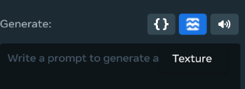
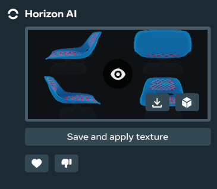
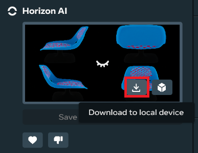
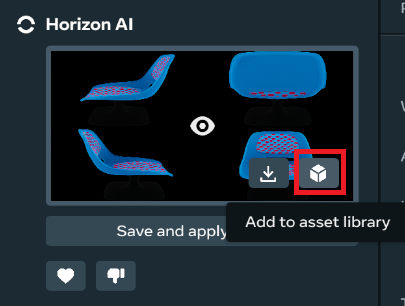
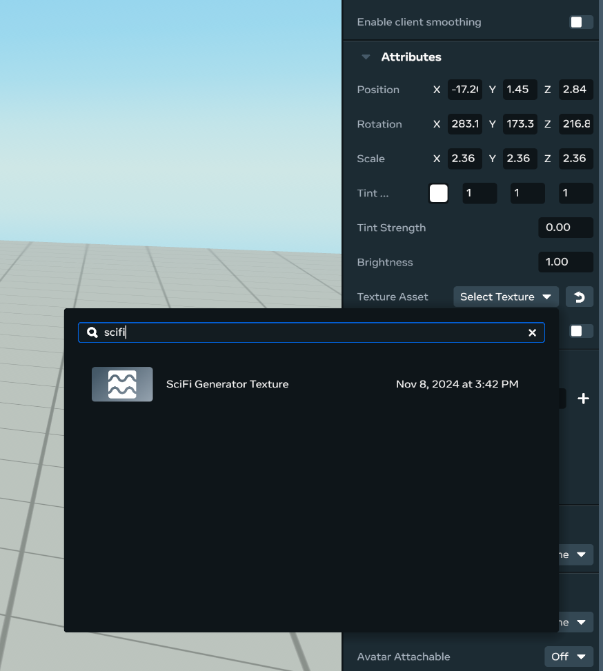

# [Generative AI Texture Generation Tool](#generative-ai-texture-generation-tool)

> [!Important]
>
> Join the [Meta Horizon Creator Program](https://developers.meta.com/horizon-worlds/programs)! As a member, you gain:* Access to monetization opportunities including monthly bonuses, in-world purchases and competition cash prizes.
> * Helpful resources including educational content, technical support and a collaborative creator community.

> [!Important]
>
> To report bugs, go to the main menu and select **Report a problem**. To give us feedback, select **Help us improve** from the main menu.

The Generative AI Texture Generation Tool helps you generate textures for your objects and can improve your flexibility and speed.

After reading this content and better understanding how the Gen AI Texture Generation Tool works, you will be able to:

1. Generate textures for 3D objects.
2. Assign the generated texture to a mesh.
3. Save the texture both onto your local drive and into your asset library.
4. Create textures and work with objects in the wild.

Gen AI Tool Availability & Rates

Access to GenAI features is automated and determined based on your location when using the Desktop Editor. If you move from an unsupported location to a supported location or vice versa, there will be a delay in updating your access for GenAI features. Horizon desktop editor’s GenAI tools are currently available to users aged 13+ and the Creator Assistant tool is available to users aged 18+. Access to GenAI features is automated and determined based on your location when using the desktop editor. If you move from an unsupported location to a supported location or vice versa, there will be a delay in updating your access for GenAI Features. The GenAI features are available in the following regions: United States, the United Kingdom (UK), Canada, India, Australia, France, Germany, Spain, Brazil, the Netherlands, Italy, Poland, Argentina, Vietnam, Mexico, New Zealand, Sweden, Belgium, Ireland, Switzerland, Denmark, Finland, Norway, Singapore, Iceland, and Austria. Additionally there are daily rate limits per user on content created using Meta AI. These limits are:

- Typescript - 1000 requests
- Audio SFX/Ambient - 200 requests
- Skybox Generation - 50 requests
- Mesh Generation - 100 requests

## [Opening the GenAI Texture Generating Tool](#opening-the-genai-texture-generating-tool)

1. Open the Desktop Editor and open a world in **Create** mode.

2. To open the Chat Panel, click on the **GenAI** icon in the top toolbar bar.

   

3. Swap the mode to **Texture**.

   

## [Generating a texture and previewing it](#generating-a-texture-and-previewing-it)

1. Select a mesh from your chosen world.

2. Enter a prompt.

3. Press **Generate**. You will see a thumbnail of the texture after generation is complete.Click on the thumbnail to toggle the texture preview on and off.

4. The generated texture will preview on the mesh but it will not be permanently assigned to the mesh yet. You must press, **Save and apply texture** to assign the texture to the mesh permanently.

   

## [Saving your texture to your computer](#saving-your-texture-to-your-computer)

Press **Download to local device** to save the texture to your computer.

## [Saving your texture to your asset library](#saving-your-texture-to-your-asset-library)

Press **Add to asset library** to save the texture to your asset library without applying it to the mesh.

## [Assigning a saved texture from your library to a mesh](#assigning-a-saved-texture-from-your-library-to-a-mesh)

Open your Asset Library and select the object you want to assign a texture to. In the property panel’s **Texture Asset** dropdown menu, select the texture you want.

## [UV Requirements for Texture Generation](#uv-requirements-for-texture-generation)

In order to succeed, the UVs on your mesh must have:

- A single square texture.
- No overlapping UV islands.

If the UVs on your model pass these requirements, the pipeline will generate a texture using your UVs.

If any of these requirements fail or you don’t have any UVs, the pipeline will Auto-UV your mesh in order to generate a texture for it. In this case, when you apply the generated texture back to your model, things will look unfinished: stretched, squashed, faded, or in some way not successfully generated.

To fix this, you should Auto-UV your model yourself–using Blender or Houdini or another DCC–before sending the model for preprocessing. This is typically a couple of nodes in each DCC. You may have to experiment to get the best results, but a general Auto-UV should ensure that the generated textures remain legible when applied to your mesh.

## [Additional Resources](#additional-resources)

- Blender: <https://docs.blender.org/manual/en/latest/modeling/meshes/editing/uv.html#smart-uv-project>
- Houdini: [Labs Auto UV geometry node](https://www.sidefx.com/docs/houdini/nodes/sop/labs--autouv.html)
- Maya: [Automatic UV mapping](https://help.autodesk.com/view/MAYAUL/2024/ENU/?guid=GUID-CD17C2C5-A442-4960-91DB-A2E5099EBF61)

## [What’s next?](#whats-next)

To learn more about Meta Horizon Worlds, try the following:

1. [Create your first world](../../Tutorials/Getting%20started/Create%20your%20first%20world%20tutorial%2C%20part%201.md) using our step-by-step tutorial.
2. If you have issues when running the desktop editor, see [Desktop Editor Troubleshooting](../Help%20and%20reference/Desktop%20editor%20troubleshooting.md)
3. Learn about the desktop editor with the [Introduction to the Desktop Editor](../Get%20started%20with%20Desktop%20Editor/Introduction%20to%20the%20desktop%20editor.md).
4. Learn about the other tools available by reading our [Tools Overview](../../Get%20started/Tools%20overview.md).
5. Join the [Meta Horizon Creator Program](https://developers.meta.com/horizon-worlds/programs/) to learn about our program benefits.

