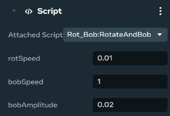

# Adding and editing scripts

## Set up desktop editor to use your IDE

Meta Horizon Worlds Creator docs reference using Visual Studio Code (VS Code), but you can use any IDE you’ve installed on your Windows PC. See [Adding an IDE to Desktop Editor](../../Scripting/Get%20started%20with%20TypeScript/Adding%20an%20IDE%20to%20the%20desktop%20editor.md) for detailed instructions on how to set up desktop editor with your preferred IDE.

For troubleshooting VS Code refer to the documentation on [Troubleshooting VS code for Meta Horizon Worlds library module](../../Scripting/Get%20started%20with%20TypeScript/If%20VS%20Code%20can’t%20find%20a%20V2%20module.md),

## Getting started with TypeScript scripting

Refer to [TypeScript Getting Started](../../Scripting/Get%20started%20with%20TypeScript/Using%20TypeScript%20in%20Meta%20Horizon%20Worlds.md) docs for more information on how to start using TypeScript with Meta Horizon Worlds.

## Adding an existing script to an entity

These instructions walk you through assigning a script reference after you have created the script.

- Select an object in the Hierarchy menu or in the scene pane.
- In the **Properties** panel, scroll to the **Script** section.
- Select a script from the **Attached Script** dropdown menu.
- The script is applied to the object, and the properties defined in the script now appear in the **Script** section of the **Properties** panel.
  

## Copying scripts

Script copying is an available feature to save you time. You can copy a script from an object, and paste it directly onto another. You can reference an object from a script by dragging it onto a script that is already attached to an object.

#### To copy a script

- Open the **Properties panel** for an object that already has a script attached.
- Scroll down to the **Script** section, and click the menu dropdown.
- From the menu that appears, select **Copy Script**. The script is copied into memory.

#### To paste a copied script

- Open the **Properties Panel** for another object.
- Navigate to the **Script** section, then click the menu dropdown.
- From the menu that appears, select **Paste all script properties**. A copy of the script is attached to the object.

