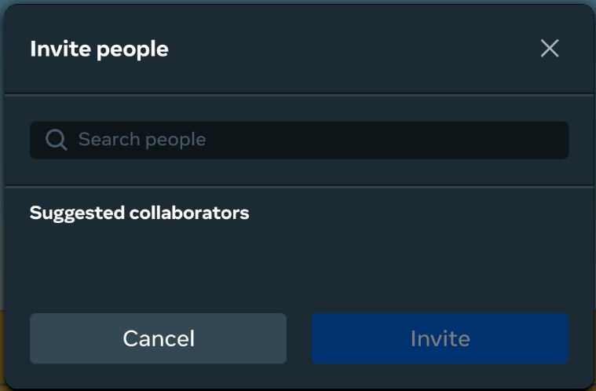
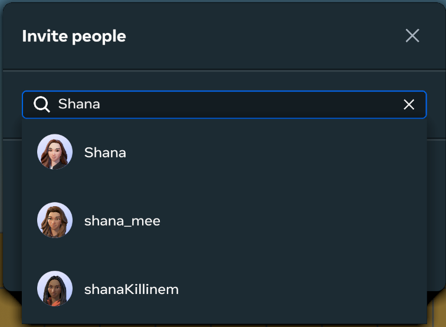
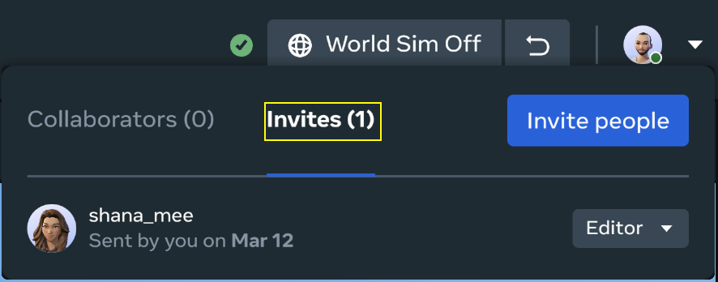
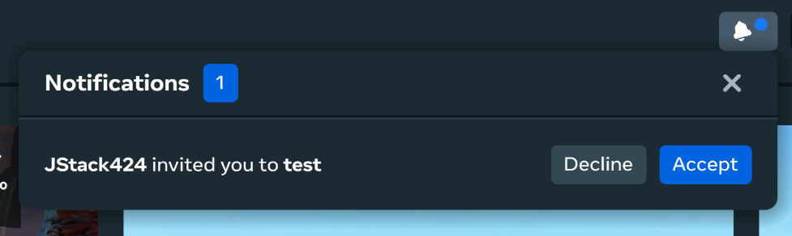
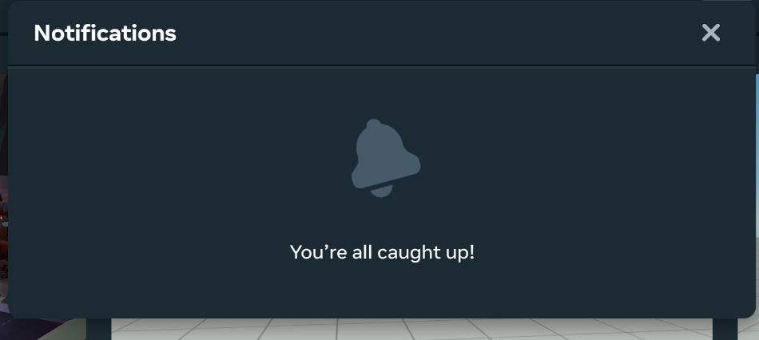

# Collaborator Management

These features enable you to manage world collaborators in the Desktop Editor. This includes viewing, inviting, and removing collaborators, as well as editing a collaborator’s role, and accepting or rejecting an invitation to collaborate.

**Note**: When multiple collaborators are present in a world, **Auto-stop simulation on Preview exit** setting is bypassed so a collaborator exiting Preview mode will not disrupt the work-flow of other collaborators.

## Viewing Collaborators

- Open or create a new world.
- Your avatar is located in the upper right of the main toolbar. Any collaborators that are active in your world will appear here.

  
- Click on the chevron button beside your avatar to open the menu for Collaborators. You and your fellow collaborators and invites (if any) will appear here.

  

## Inviting Collaborators

- Click the **Invite people** button to invite others to collaborate on your world. You will see a list of suggested collaborators here.

  
- You can select any of the suggested collaborators or search for any collaborators to add.

  
- Select the roles you’d like your collaborators to have.

  
- Click the **Invite** button to send the invitations. You will receive a confirmation notice at the bottom of the screen.

  
- To see any open invites, you can open the **Invites** tab from the **Collaborators** menu.

  

## Removing & Changing Roles

- To change an invitee’s role, collaborator’s role, revoke access, or cancel an invite, open the Collaborators menu, click the Invites tab, and open the dropdown menu then select the appropriate option.

  

## Accepting or Rejecting an Invitation

If you have been invited to collaborate on a world, you will receive a notification in the home screen of the desktop editor. To accept or decline an invitation, open the notification menu in the upper right corner and select the appropriate action.

