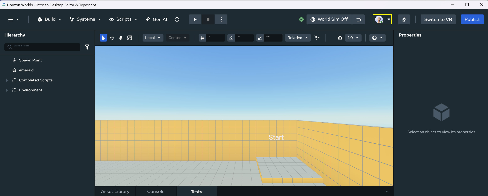
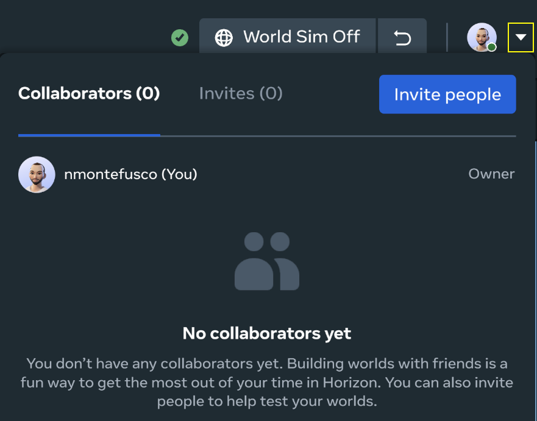
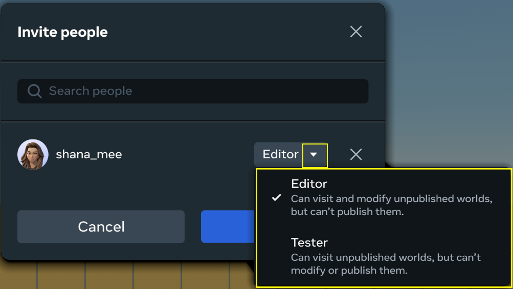
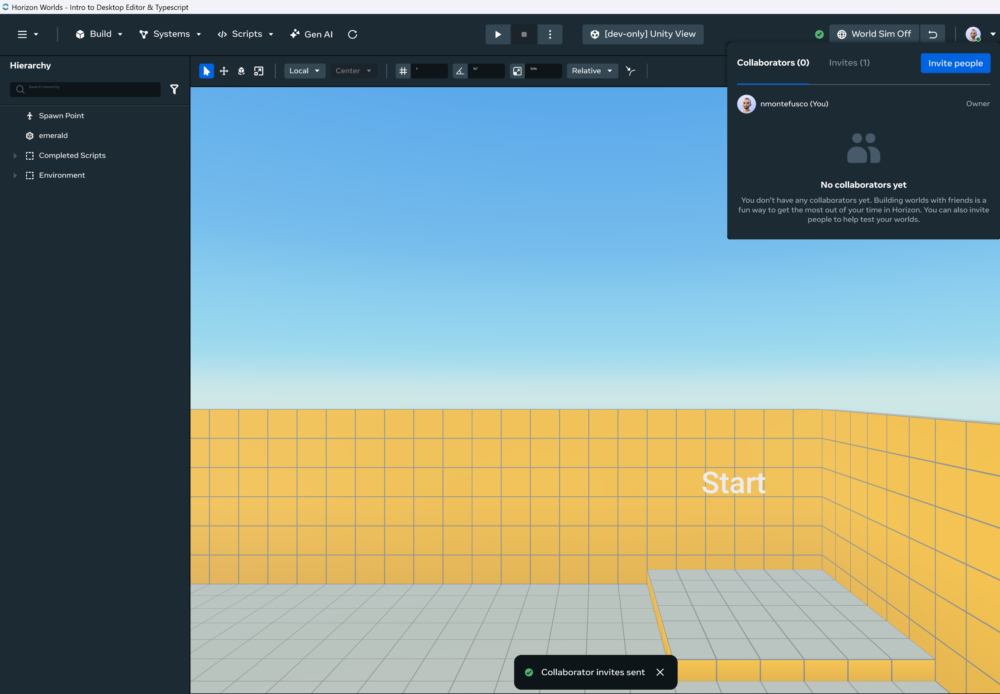
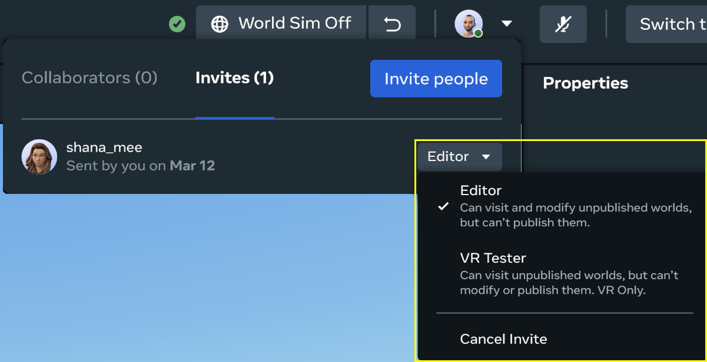

# [Collaborator Management](#collaborator-management)

These features enable you to manage world collaborators in the Desktop Editor. This includes viewing, inviting, and removing collaborators, as well as editing a collaborator’s role, and accepting or rejecting an invitation to collaborate.

**Note**: When multiple collaborators are present in a world, **Auto-stop simulation on Preview exit** setting is bypassed so a collaborator exiting Preview mode will not disrupt the work-flow of other collaborators.

## [Viewing Collaborators](#viewing-collaborators)

1. Open or create a new world.

2. Your avatar is located in the upper right of the main toolbar. Any collaborators that are active in your world will appear here.

   

3. Click on the chevron button beside your avatar to open the menu for Collaborators. You and your fellow collaborators and invites (if any) will appear here.

   

## [Inviting Collaborators](#inviting-collaborators)

1. Click the **Invite people** button to invite others to collaborate on your world. You will see a list of suggested collaborators here.

   

2. You can select any of the suggested collaborators or search for any collaborators to add.

   

3. Select the roles you’d like your collaborators to have.

   

4. Click the **Invite** button to send the invitations. You will receive a confirmation notice at the bottom of the screen.

   

5. To see any open invites, you can open the **Invites** tab from the **Collaborators** menu.

   

## [Removing & Changing Roles](#removing--changing-roles)

1. To change an invitee’s role, collaborator’s role, revoke access, or cancel an invite, open the Collaborators menu, click the Invites tab, and open the dropdown menu then select the appropriate option.

   

## [Accepting or Rejecting an Invitation](#accepting-or-rejecting-an-invitation)

If you have been invited to collaborate on a world, you will receive a notification in the home screen of the desktop editor. To accept or decline an invitation, open the notification menu in the upper right corner and select the appropriate action.

