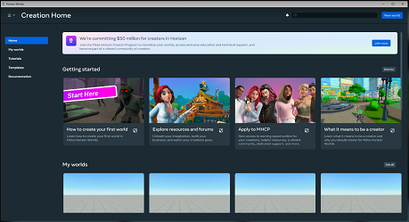
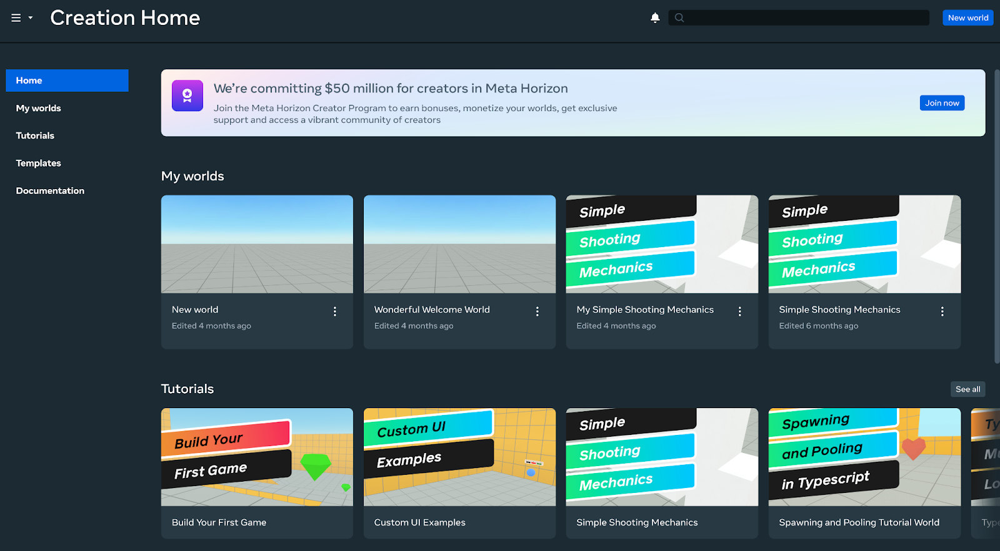
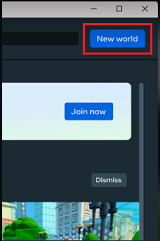
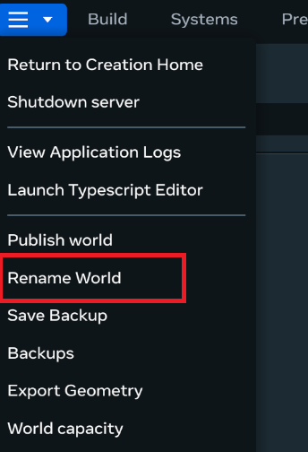

# [Create a New World](#create-a-new-world)

Opening the Meta Horizon Worlds desktop editor takes you to the editor’s **Creation Home**.

From this page, you can open an existing world that you’ve created, or start creating a new one.

**To create a new world**

1. Open the Worlds desktop editor.

   

2. On the **Creation Home** page, click **New World**.

   

3. When the desktop editor opens, click **Rename World** from the main menu.

   

4. Provide a name for your new world

   

   **Note**: If you do not provide a name for your new world, it will still exist and be saved as normal. However, the next time you open it, it will be called “New World” with the count of how many worlds you’ve created without names appended to it (for instance, “New World 4.” If you do this several times, you may end up with multiple worlds called by similar names, potentially causing confusion. You can always rename it to something else at a later time.

5. Click **Save**.

### [Your next step](#your-next-step)

- [The Desktop Editor user interface](User%20interface/User%20Interface.md)

