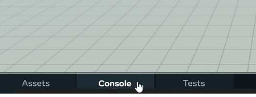
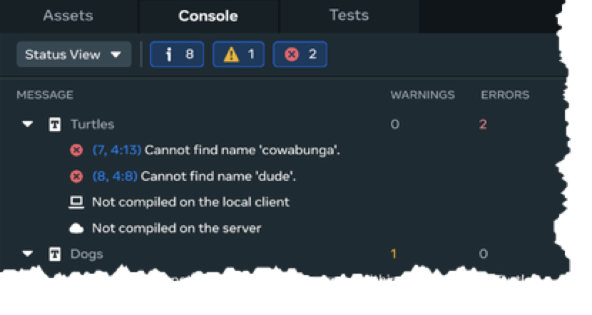
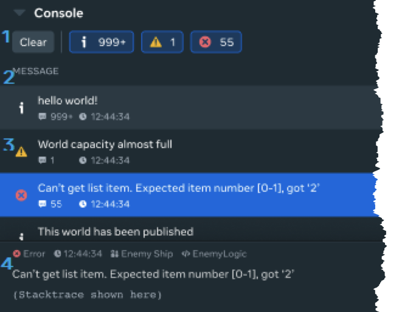
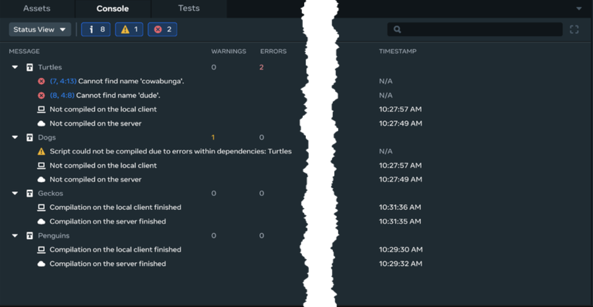
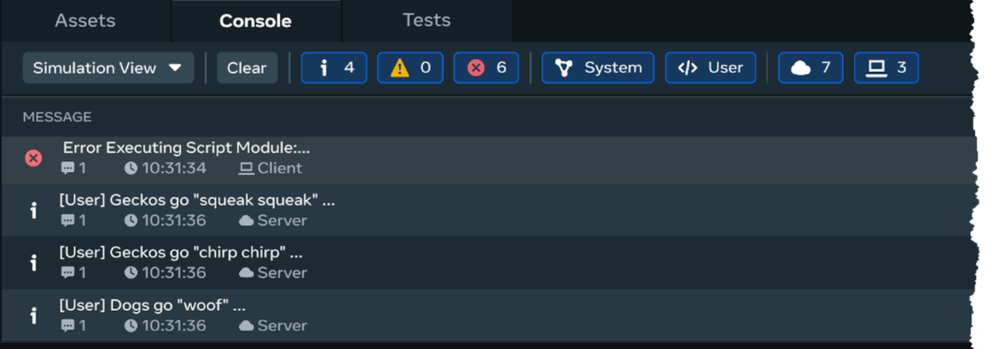
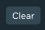
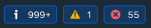

# [Editor Console](#editor-console)

The Editor Console is a pane that appears at the bottom of the Desktop Editor screen. It displays a running list of status messages generated by the editor, and by the Meta Horizon Worlds runtime. These messages contain information intended to help you find and fix problems with your world.

The console displays the following three kinds of messages:

| **Type of Status Message** | **Description**                                                                                                                                         |
| -------------------------- | ------------------------------------------------------------------------------------------------------------------------------------------------------- |
| Compilation Status         | Messages generated as your world builds.                                                                                                                |
| System Warning             | Error messages generated by the Meta Horizon Worlds runtime as it runs your world.                                                                      |
| Debugging                  | These messages are the result of calls that you make in your code. They come from CodeBlocks, DebugMessage blocks, and script calls to `console.log()`. |

This article describes the parts of the Console UI, and it explains how to access and use the console.

## [How to access the console](#how-to-access-the-console)

By default, the console pane doesn’t appear on the editor screen. Instead, it displays in a tab (collapsed by default) located beneath the **Scene** pane.

To open the console, click the **Console** tab. The tab expands and displays the contents of one of its two sub-views: **Status View** and **Simulation View**.

## [Console interface](#console-interface)

The following image highlights the main components of the Editor Console.

1. **Toolbar**: Contains controls that let you clear and filter message logs.
2. **Header**: Arranges the message details in a structured format to make the information easy to find, and easy to read. In this format, log messages display along with associated metadata, and the name of the script and or world object that generated the message.
3. **Console Message List**: Displays each log message. Click on a log message to display its contents (text and metadata) in the **Console Message Inspector**.
4. **Console Message Inspector**: Displays full text and metadata for a selected log message. Clicking on the currently selected log message closes the inspector.

## [Status View](#status-view)

The Status View displays compilation information about each one of your scripts for each connected client, and for the server. Details include the current status of each one of your scripts. Script status is either `Not Compiled`, `Compiling`, or `Finished Compiling`. These details are displayed along with timestamps of the latest update for each script. Compilation errors and warnings are also shown.

Build log messages on this tab aren’t displayed in chronological order. Instead they’re organized by script. The list displays details from just the most recent script compilation. Status View also shows the compilation time on each connected client, along with any compilation errors.

## [Simulation View](#simulation-view)

The Simulation View displays `console.log()` messages from your code, as well as system errors and warnings, in chronological order.

## [Console toolbar](#console-toolbar)

The console toolbar contains the following controls.

| **Control**                                                                                    | **Description**                                                                                                                                           |
| ---------------------------------------------------------------------------------------------- | --------------------------------------------------------------------------------------------------------------------------------------------------------- |
|  | Deletes all of the log messages in the console. Does not depend on world status. You cannot undo this action.                                             |
|  | Display and hide log messages by log level. The log levels are: `Information`, `Warnings`, and `Errors`. Enable a message log level by clicking its icon. |
|  | Search for log messages (or apply a filter). You can input a string (case sensitive) or a regular expression.                                             |

You can combine filters with log levels to increase your search granularity.

## [Console message list](#console-message-list)

Every console message includes the following details.

| **Type of Information** | **Description**                                                                                      |
| ----------------------- | ---------------------------------------------------------------------------------------------------- |
| Log level               | Log messages are ranked by severity. The severity levels are: `Information`, `Warning`, and `Error`. |
| Log message             | The text contained in the first line of the log message.                                             |
| Log count               | The number of times that a particular log message generated consecutively.                           |
| Log time                | The log message’s timestamp.                                                                         |
| Object                  | The object (entity) that spawned the message.                                                        |
| Source                  | The script that spawned the message.                                                                 |

## [Console message inspector](#console-message-inspector)

The Message Inspector is a window that displays details for a particular log message when you select a particular log message. The details displayed include:

- The log’s message in its entirety, in a scrollable view.
- The log message’s metadata.

**Tip** : You can dismiss the Message Inspector by selecting the log message again.

