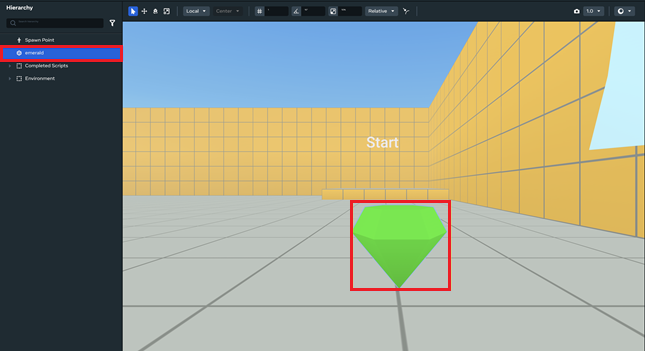
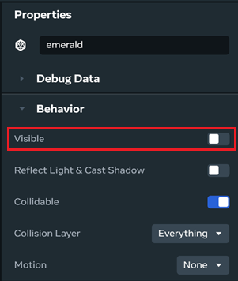

# [Modifying editable entity properties](#modifying-editable-entity-properties)

Many of the properties of objects in your world can be modified after you’ve added them. To edit the property of an object, click the object to select it. This lets you see its available properties using the **Properties** panel.

**To modify the properties of an object**

1. Select an object in the **Hierarchy** panel or in the **Scene** panel of the desktop editor.

   

2. Navigate to the object’s **Properties** panel, search for the **Attributes** category, then change the value of the **Tint Color** to *(1, 0, 0)* and the **Tint Strength** to *1.00*. Your object will change from the color Green to Red.

   

3. In the **Properties** panel, navigate to the **Behavior** category. You can toggle the visibility of the object on or off by clicking **Visible**.

   

4. You can also select a vector label, such as **Position**, and then copy and past the value of that vector into another vector input label in the panel.

