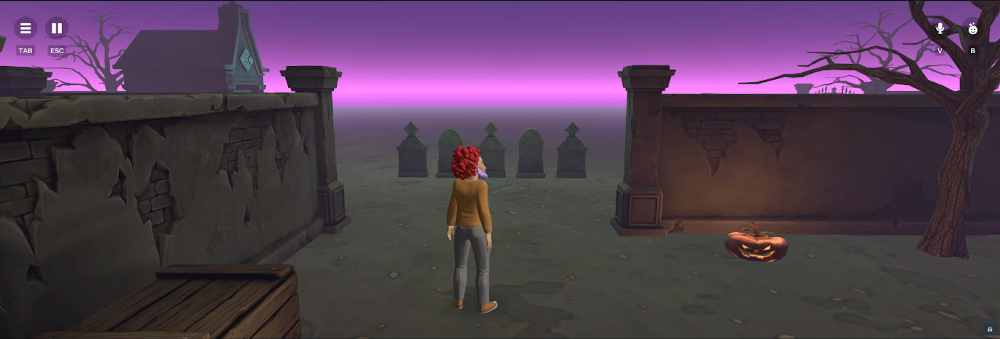
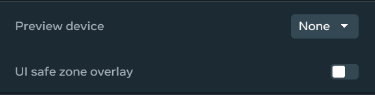
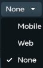
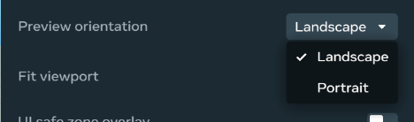
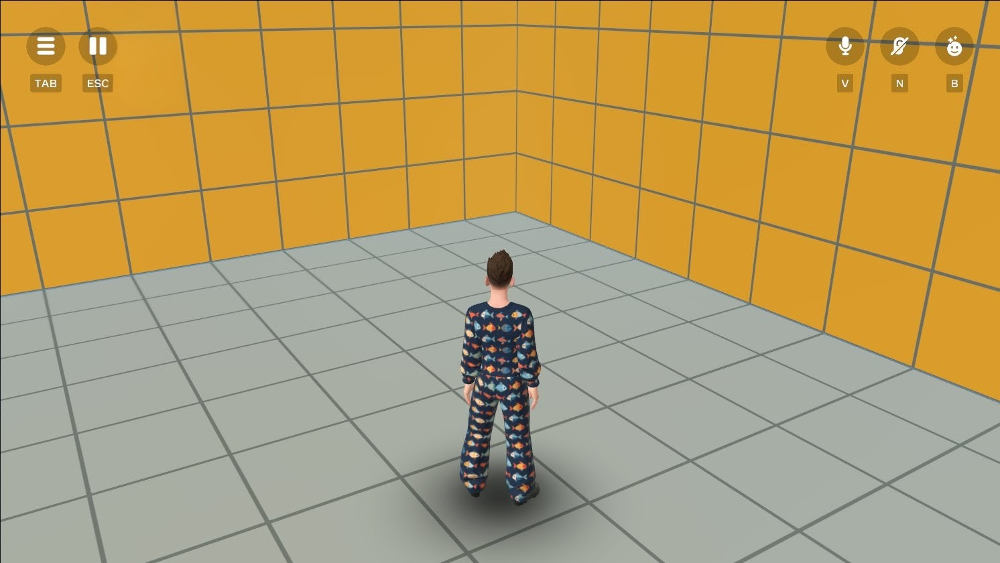
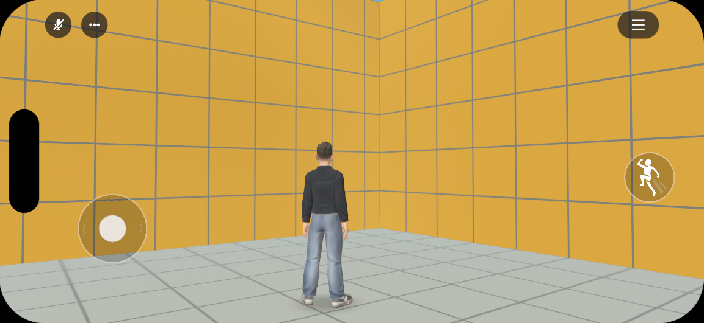
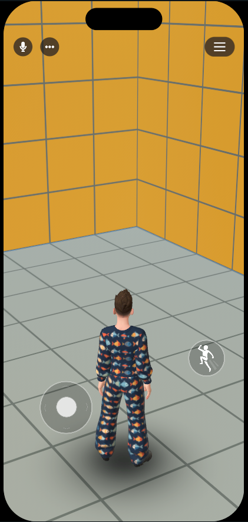
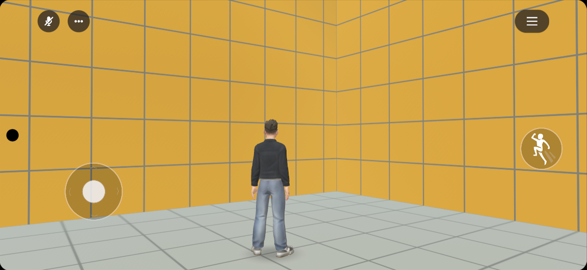
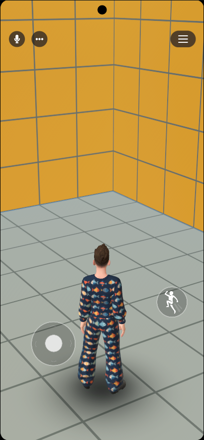

# [Preview mode](#preview-mode)

You can click the play button to enter preview mode.

When you enter preview mode, you will start at your world’s spawn point. If an avatar is present, you can move it around a bit using the arrow keys to get a feel for how your users will experience your world. You can also change the direction the avatar faces using your mouse.

**Note**: The avatar displayed in the playtest will probably be your own personal avatar. In the actual game, the avatar of the user will be used.

## [Configuring your preview](#configuring-your-preview)

You can also configure aspects of the preview mode using the preview mode **Settings** button.

### [Auto-stop and Auto-start](#auto-stop-and-auto-start)

You can configure when world simulation automatically starts and ends. This allows you to begin editing your world right away after switching out of preview mode.

You can:

- Enable or disable simulation auto-start upon entry into preview mode.
- Enable or disable simulation auto-stop upon exit out of preview mode.

By configuring these options, it enables you to:

- Enter and exit preview mode with your world auto-simulating. This saves you from having to start simulation before entering preview mode, and having to stop simulation after leaving preview mode.
- Enter preview mode without simulation. This enables you to survey your world without requiring it to run for yourself, or for your in-world collaborators.
- Exit preview mode with simulation still running. This lets you:
  - Debug in the desktop editor.
  - Move entities.
  - Change world values.
  - Jump back into preview mode for immediate testing.

These auto-start and auto-stop settings persist across different worlds and sessions.

### [Setting the preview device](#setting-the-preview-device)

By default, when you preview your world, you’ll see it in the desktop editor. However, you can choose a different device for the preview if you choose. For example, you can choose to preview for Mobile, which adjusts the viewport and other characteristics of the previewing. Options are available the **Preview Configuration** panel:

You have the following preview device configuration options:

- **Preview device**: Select the type of device for which you are previewing. Select the desired device from the drop-down list.

  

  **Note**: You must publish your world at least once before you can preview on web or mobile.

- **Device model**: This is only visible with the **Preview device** option set to **mobile**. This allows you to simulate the look of an Android or iOS phone during preview mode which features common screen blocking elements such as rounded corners and a camera hole-punch or island.

  

- **Preview orientation**: Select the device orientation you wish to use when previewing your world. You can choose between landscape or portrait.

  

- **UI safe zone overlay**: When enabled, an overlay is displayed in the preview to indicate safe zones on the screen, which appear across all publishing platforms.

- **Preview actions**: There are three options for previewing your world for web or mobile.

  

  These options are:

  | Icon                                                                                                                   | Option                  | Description                                                                                                            |
  | ---------------------------------------------------------------------------------------------------------------------- | ----------------------- | ---------------------------------------------------------------------------------------------------------------------- |
  |  | **Send Link to Mobile** | Sends a link to the Meta Horizon app on your mobile devices, allowing you to preview your world on your mobile device. |
  |      | **Open in Browser**     | Opens a preview build of the Horizon World in your default browser, providing an instant preview experience.           |
  |        | **Copy Web Link**       | Copies a web link to the preview build to your clipboard, making it easy to share with others or access later.         |

### [Device Previews](#device-previews)

| Device                     | Preview (landscape)                                                                                                                    | Preview (portrait)                                                                                                                    |
| -------------------------- | -------------------------------------------------------------------------------------------------------------------------------------- | ------------------------------------------------------------------------------------------------------------------------------------- |
| Web Preview                |      | Currently not yet supported                                                                                                           |
| Mobile Preview (iPhone 15) |   |   |
| Mobile Preview (Samsung)   |  |  |

## [Other Preview options](#other-preview-options)

In addition using the standard preview mode option, the desktop editor also provides a **Preview from here** options. This provides you a specific location from where you can preview your world rather than from your world’s spawn point. It is an extension of the preview mode button on the top bar.

**To use Preview from here**

1. In your **Scene** panel, right-click and select **Preview from here**.

   

2. You will enter into preview mode based on your current location. If your location is a non-traversable, non-collidable location such as the sky, then you’ll enter preview mode from your world’s spawn point.

   

