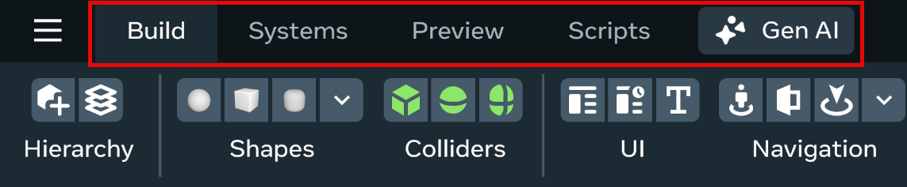
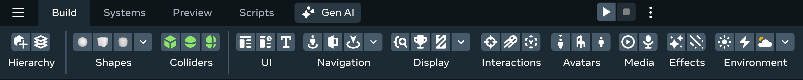
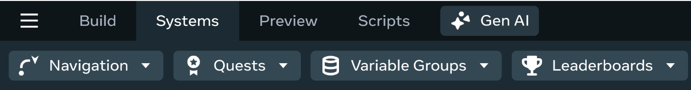
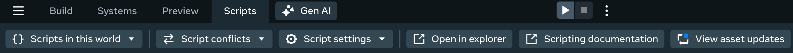
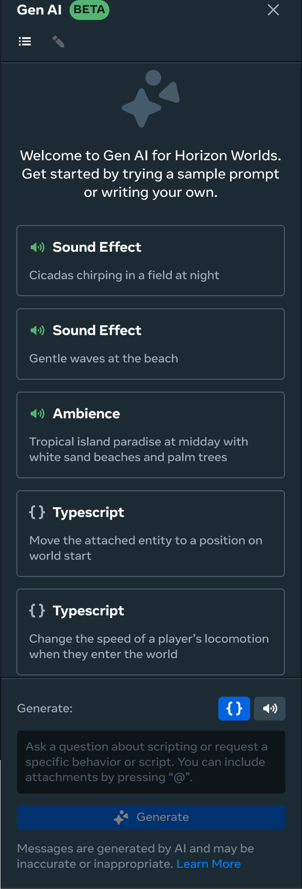
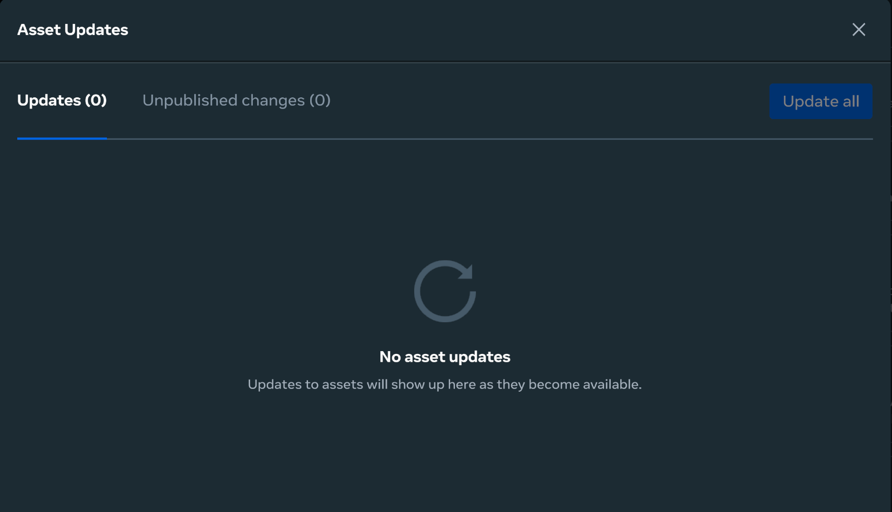

# [Creator Tools](#creator-tools)

The Desktop Editor’s Creator tools provide a set of commonly used tools for building scenes and asset use. Each option provides a menu of different types of tools that you can use for creating your worlds.

This toolbar contains the following creator tool options:

- [Build tools](Creator%20Tools.md#build-tools)
- [Systems tools](Creator%20Tools.md#systems-tools)
- [The Public Asset Library](Creator%20Tools.md#the-public-asset-library)
- [The Scripts panel](Creator%20Tools.md#the-scripts-panel)
- [The Generative AI Creation Tool](Creator%20Tools.md#the-generative-ai-creation-tool)

## [Build toolbar](#build-toolbar)

Use **Build** tools to create objects to add to your scene.

This menu includes a variety of tools such as:

- **Shapes** for creating geometric objects like cubes, shperes, cones, or cylinders.
- **Colliders** for creating objects like such as box colliders, sphere colliders, or capsule colliders.
- **UI** for creating NoesisUI, CustomUI, or Text objects.
- **Navigation** for creating spawn points, doors, snap destinations, and navigation volumes.
- **Display** for adding a debug console, a world leaderboard, mirror, welcome board, or world shop.
- **Interactions** for adding a raycast, projectile launcher, or trigger zone.
- **Avatars** for adding an NPC, avatar pose, or avatar playback.
- **Media** for setting up a scheduled video player or a sound recorder.
- **Effects** for setting up Particle FX or TrailFX.
- **Environment** to add a static light, dynamic light, or environment light to your world.

## [Systems tools menu](#systems-tools-menu)

Use systems tools to create systems-related objects like quests and leaderboards or add a navigation volume to your world.

More information about the systems tool options can be found at [Quests, leaderboards, and variable groups](../../Quests%2C%20leaderboards%2C%20and%20variable%20groups/Quests%2C%20leaderboards%2C%20and%20variable%20groups.md).

## [The Public Asset Library](#the-public-asset-library)

The **Public Asset Library** is a collection of free stock assets that you can include when creating your worlds.

Public Asset Library stock assets include the following categories:

- Featured
- Shapes
- Interactive
- Toys
- Environment
- Structures
- Interiors
- Lights
- Food
- Animals
- Vehicles
- Wearables
- Audio
- Weapons
- VFX
- Educational

For more information, see [Public Asset Library](../../Assets/Public%20Assets.md).

## [The Preview panel](#the-preview-panel)

[The Preview panel](https://developers.meta.com/horizon-worlds/images/creator-tools-preview-panel.png)

You can use the **Preview** option to preview your world, choose a device to preview your world on, configure your preview settings, send your preview to either the browser or **Meta Horizon** app, or **Switch to VR**.

## [The Scripts panel](#the-scripts-panel)

You can use the **Scripts** panel to create new scripts, view the scripts currently used in your world, or to open each of your scripts for editing and debugging in your IDE.

For more information, see [Adding and Editing Scripts](../Adding%20and%20editing%20scripts.md).

## [The Generative AI Creation tool](#the-generative-ai-creation-tool)

The **Generative AI Creation Tool** is a useful asset generation assistant. You can use it to:

- Generate audio sound effects.
- Generate TypeScript code snippets for small tasks in your world.

For both sound effects and Typescript code snippets and sound effects, you can write a prompt to generated your own scripts or have the tool create some for you.

For more information, see [Generative AI Creation Code Tool](../../Generative%20AI%20tools/Generative%20AI%20Assistant%20Tool.md).

## [The View available asset updates tool](#the-view-available-asset-updates-tool)

If you add objects to your world that you spawned from an [asset template](../../Assets/Asset%20Templates.md), you can update those objects whenever the asset template’s creator revises the original.

### [See also](#see-also)

The **Creator** toolbar is part of the suite of tools in the Desktop Editor UI. You can find out more about the UI at:

- [The Desktop Editor user interface](User%20Interface.md)

You can also try out the editor by working through these beginner tutorials:

- [Create Your First World](../../../Tutorials/Getting%20started/Create%20your%20first%20world%20tutorial%2C%20part%201.md)
- [Batting Cage Tutorial](../../../Tutorials/Adding%20and%20manipulating%20objects%20tutorial.md)

