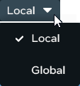
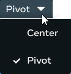
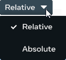

# [Object tools](#object-tools)

The object tools in the Desktop Editor provide a set of commonly used tools for building scenes and asset use. Each option provides a menu of different types of tools that you can use for creating your worlds.

For more in-depth information about the object tools, see [Using the Object tools](../../Objects/Using%20the%20Object%20Tools.md)

This suite of tools contains the following object tool tyou can use:

- [Select](Object%20tools.md#select)
- [Move](Object%20tools.md#move)
- [Rotate](Object%20tools.md#rotate)
- [Scale](Object%20tools.md#scale)
- [Local and Global Coordinate Systems](Object%20tools.md#local-and-global-scripts)
- [Pivot](Object%20tools.md#pivot)
- [Snapping tools](Object%20tools.md#snapping-tools)

## [Select](#select)

Use the **Select** tool to select an object on the scene. This enables you to easily manipulate the object or view its properties. You can also select multiple objects by either using the **Select** tool and holding the **Ctrl** key down while you select the objects in the scene, or by holding down the **Ctrl** or **Shift** key and selecting the objects in the **Hiearchy** panel.

## [Move](#move)

Select an object and then use the **Move** tool to reposition it anywhere in your scene.

## [Rotate](#rotate)

Use the **Rotate** tool to rotate an object about its center or pivot point. You can rotate it in any direction using the tool.

## [Scale](#scale)

Use the **Scale** tool resize an object in your scene. It can be scaled in a single direction (such as making it longer or wider), or in all directions (making it bigger or smaller).

## [Local and Global Coordinates](#local-and-global-coordinates)

This option toggles between **Local** and **Global** axes for the **Rotate** and **Move** tools. If this is set to **Local** (the default), any movement or rotation along (or about) an axis will be relative to the current orientation of the object. If it’s set to **Global**, it will move or rotate relative to the world’s X, Y, and Z axes.

## [Pivot](#pivot)

By default, objects are positioned based on their center point. You can use the **Pivot** tool to position objects instead based on their pivot point, which is usually located at the bottom of the object.

## [Snapping tools](#snapping-tools)

You can use the **Snapping** tools to precisely translate, rotate, and scale objects in your scene by forcing the object to *snap* to a whole value, into a new position, orientation, or scale.

The following snapping tools are availabe in the Desktop Editor UI:

- [Translation Grid Snap](Object%20tools.md#translation-grid-snap)
- [Rotation Angle Snap](Object%20tools.md#rotation-angle-snap)
- [Scale Snap](Object%20tools.md#scale-snap)
- [Relative or Absolute Snap](Object%20tools.md#relative-or-absolute-snap)
- [Snap to Surfaces](Object%20tools.md#snap-to-surfaces)

### [Translation Grid Snap](#translation-grid-snap)

**Translation Grid Snap** provides you a way to move objects along a given axis by specific increments called *Grid Snap Units*. They then snap into position along a whole coordinate value. Snapping objects into position helps you place object precisesly in your scene.

The Translation Grid Snap supports both local and global coordinate systems.

### [Rotation Angle Snap](#rotation-angle-snap)

Use the **Rotation Angle Snap** tool to rotate an object about its center point in specific increments.

### [Scale Snap](#scale-snap)

Use the **Scale Snap** toggle when you want to change an object’s size, and you want to scale it incrementally using a scaling factor.

### [Relative or Absolute Snap](#relative-or-absolute-snap)

Snapping objects to values helps you align them precisely. By default, the Desktop Editor uses Relative snapping, but you can change it to use Absolute snapping.

| Snap Type | Description                                                                                                                                                                  |
| --------- | ---------------------------------------------------------------------------------------------------------------------------------------------------------------------------- |
| Relative  | Aligns objects based on their current position relative to other objects. This is useful to maintain consistent spacing or alignment between multiple objects in your scene. |
| Absolute  | Aligns objects to a fixed grid or axis, regardless of their current position. This is useful to place objects at exact coordinates, or to align them to a specific grid.     |

### [Snap to Surfaces](#snap-to-surfaces)

Use the **Snap to surfaces** to snap the pivot point of one object to the collider (surface) of another object in the scene.

### [See also](#see-also)

The **Object tool** suite is part of the collection of tools in the Desktop Editor UI. You can find out more about the UI at:

- [The Desktop Editor user interface](User%20Interface.md)

You can also try out the editor by working through the the introductory tutorials:

- [Create Your First World Tutorial](https://developers.meta.com/horizon-worlds/learn/documentation/get-started/create-your-first-world-intro)

