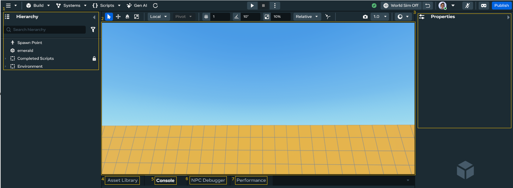
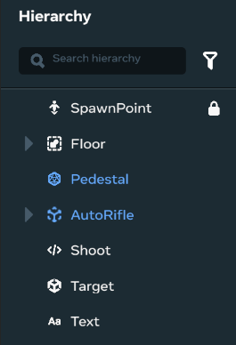
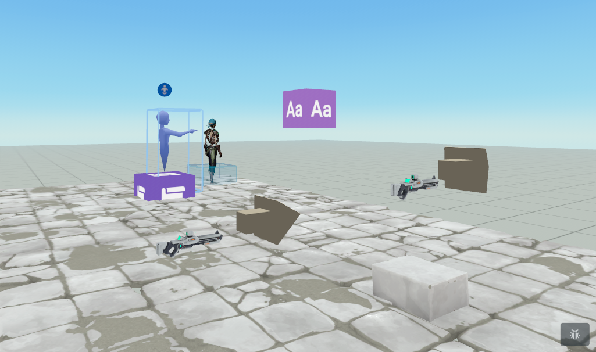
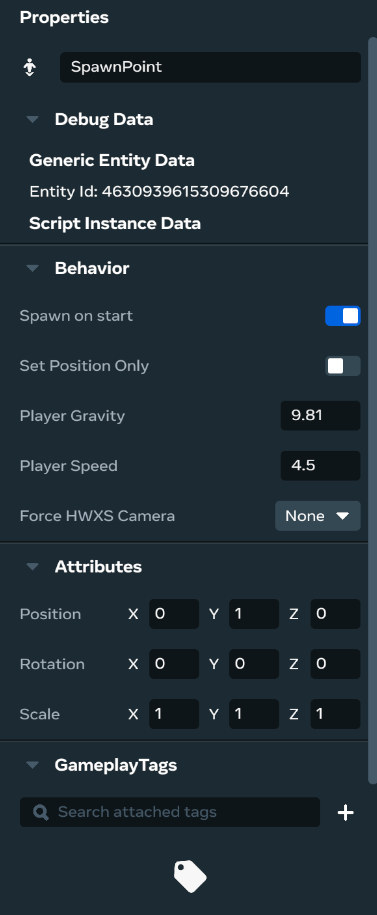
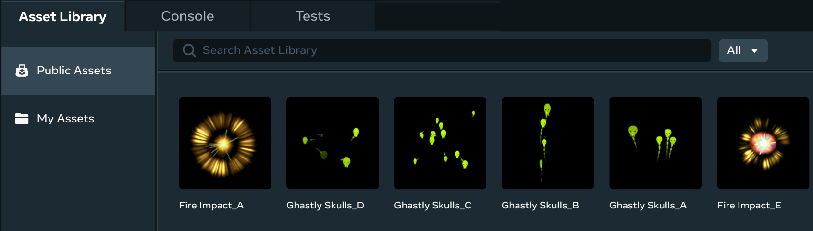
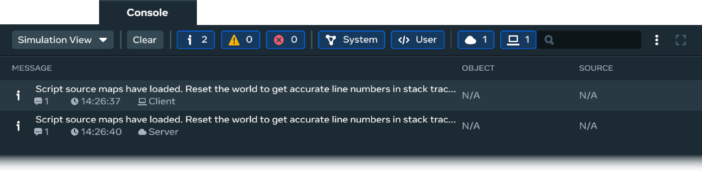
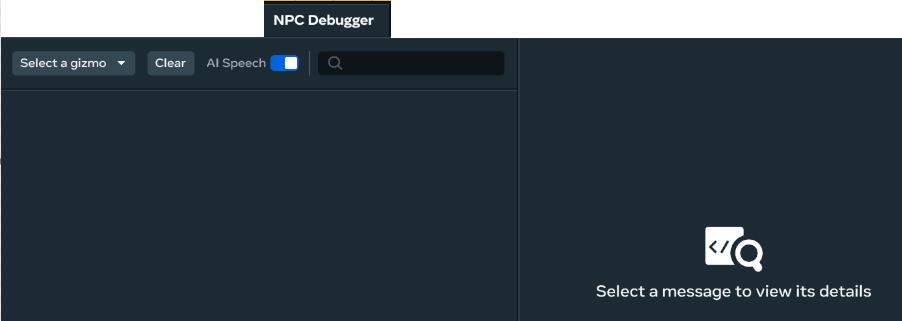

# [Panels and Tabs in the desktop editor](#panels-and-tabs-in-the-desktop-editor)

The desktop editor contains a variety of different panels and tabs to give you a wide variety of functionality, from the **Scene** panel to the **Assets** tab. Each option provides a different type of tool that you can use for creating your worlds.

The editor contains the following panels and tabs available for creative and building functionality:

- [Hierarchy panel](Panels%20and%20Tabs%20in%20the%20desktop%20editor.md#hierarchy-pane)
- [Scene panel](Panels%20and%20Tabs%20in%20the%20desktop%20editor.md#scene-pane)
- [Properties panel](Panels%20and%20Tabs%20in%20the%20desktop%20editor.md#properties-pane)
- [Assets Library](Panels%20and%20Tabs%20in%20the%20desktop%20editor.md#assets-library)
- [Console tab](Panels%20and%20Tabs%20in%20the%20desktop%20editor.md#console-tab)
- [Tests tab](Panels%20and%20Tabs%20in%20the%20desktop%20editor.md#tests-tab)

## [Hierarchy panel](#hierarchy-panel)

The **Hierarchy** panel displays the list of objects in the current scene, such as 3D models and script components. When you add objects to your scene, entries for them also appear in your **Hierarchy**. You can use this panel to sort and group the objects for selecting or filtering.

For more information, see the [Hiearchy Panel Overview](../../Hierarchy%20window/Hierarchy%20panel%20overview.md).

## [Scene panel](#scene-panel)

The **Scene** panel is the window located in the middle of the desktop editor screen. It displays the scene you’re currently working on. When you add objects to a scene, they will appear in the world.

## [Properties panel](#properties-panel)

When you select an object from the **Hierarchy**, or from the scene, its properties display in the **Properties** panel. From here, you can make specific changes to the details of that object.

## [Assets library](#assets-library)

The **Assets Library** contains your public and private assets library. It shows all of the asset folders for your world, in which you store any assets you create or import.

For more information, see [Introduction to the desktop editor Asset Library](../../Assets/Introduction%20to%20the%20Desktop%20Editor%20Asset%20Library.md).

## [Console tab](#console-tab)

The **Console** tab opens a panel that displays a running list of status messages generated by the editor and the Meta Horizon Worlds runtime. These messages contain information intended to help you find and fix problems with your world.

For more information, see the [Desktop editor Console](../Editor%20Console.md) page.

## [NPC Debugger tab](#npc-debugger-tab)

The **NPC Debugger** tab helps you test your NPC’s behavior and speech and its reaction to players in real-time.

For more information, see the [NPC Debugger](../../NPCs/NPC%20Conversation/Debugging%20AI%20Speech%20NPCs.md) page.

## [Performance tab](#performance-tab)

The **Performance** tab allows you to render the results of a World Content Trace, containing frame-by-frame details on your world’s performance and understand how the assets in your world might contribute to it.

For more information, see the [Performance](../../../Performance/Performance%20tools/World%20Content%20Traces.md) page.

### [Additional Resources](#additional-resources)

The UI panels and tabs are part of the suite of tools in the desktop editor. See the [The desktop editor user interface](User%20Interface.md) for more information.

You can become familiar with the editor by working through the beginner tutorials below:

- [Create Your First World](../../../Tutorials/Getting%20started/Create%20your%20first%20world%20tutorial%2C%20part%201.md)
- [Batting Cage Tutorial](../../../Tutorials/Adding%20and%20manipulating%20objects%20tutorial.md)

