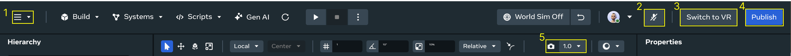
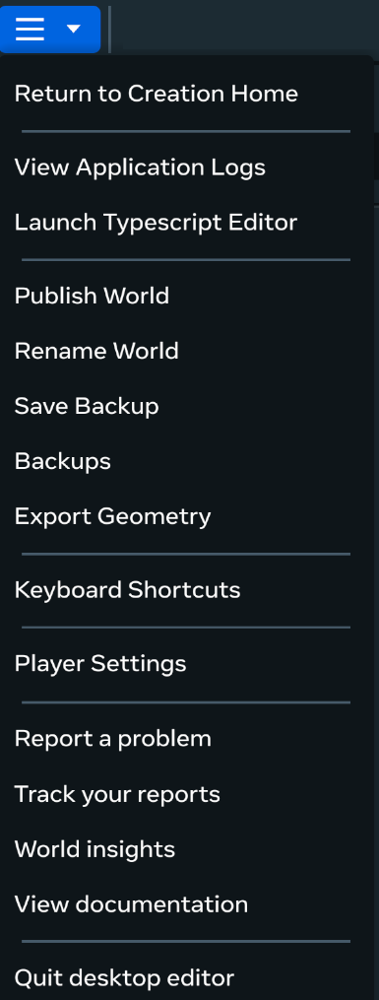
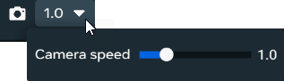
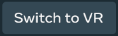

# [Primary Tools in the User Interface](#primary-tools-in-the-user-interface)

A variety of primary tools can be found on the Meta Horizon Worlds Desktop Editor screen. Each serves a different purpose designed to help you in creating your worlds.

This set of tools contains the following options:

1. [The Main menu](Primary%20Tools%20in%20the%20User%20Interface.md#the-main-menu)
2. [Microphone](Primary%20Tools%20in%20the%20User%20Interface.md#microphone)
3. [Development mode](Primary%20Tools%20in%20the%20User%20Interface.md#development-mode)
4. [Publish button](Primary%20Tools%20in%20the%20User%20Interface.md#publish-button)
5. [Camera speed controls](Primary%20Tools%20in%20the%20User%20Interface.md#camera-speed-controls)
6. [World simulation toggle](Primary%20Tools%20in%20the%20User%20Interface.md#world-simulation-toggle)

## [The Main menu](#the-main-menu)

The main menu provides a quick way to access many of the Desktop Editor’s most popular features.

## [Camera speed controls](#camera-speed-controls)

The Camera speed controls enable you to adjust the camera speed within your world and adjust the location of the camera.

Camera speed is the rate at which the camera moves when you’re navigating through your world. With this, you can customize the navigation experience to suit your needs. For example, you might find a faster camera speed useful for quickly exploring large areas, or a slower camera speed more suitable for precise movements.

You can ajust the location of the camera by right-clicking the camera icon and using the arrow keys or WASD keys to move the camera around.

## [Microphone](#microphone)

The Microphone control provides you with an on and off switch for your PC’s microphone, enabling you to more effectively collaborate with another developer while working in the Desktop Editor.

## [Development mode](#development-mode)

The Desktop Editor provides you with a large palette of tools to work with, occasionally it can be helpful to use your Meta Quest headset for development, either for building your worlds or seeing how it displays in VR. The Development mode button **Switch to VR** takes your development process from your desktop to your headset.

## [Publish button](#publish-button)

The final step in releasing your world to players is to publish it. To release your world click the **Publish** button.

For more information, see [Publish Your World](../../../VR%20tools/Publish%20your%20world%20using%20VR%20tools.md).

## [World simulation toggle](#world-simulation-toggle)

The world simulation toggle allows you to turn off and on your world simulation; the toggle is set to **World Sim Off** by default.

Clicking the toggle will change the option to **World Sim On**, and will start your world simulation. This includes launching preStart() and start() methods of your scripts, which pre-populates the object pool.

Clicking the toggle again will turn world simulation off and revert the toggle back to **World Sim Off**.

### [Additional resources](#additional-resources)

The selection of primary tools is part of the suite of tools in the Desktop Editor UI. For more details about the User interface, see

- [The Desktop Editor user interface](User%20Interface.md)

You can explore the editor by working through the following beginner tutorials below:

- [Create Your First World](../../../Tutorials/Getting%20started/Create%20your%20first%20world%20tutorial%2C%20part%201.md)
- [Batting Cage Tutorial](../../../Tutorials/Adding%20and%20manipulating%20objects%20tutorial.md)

