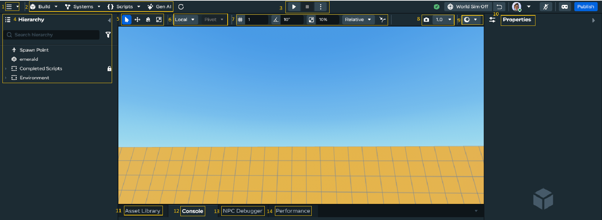

# [User Interface](#user-interface)

The Desktop Editor contains a variety of controls that enable you to create objects to add to your scene. These tools provide you the control to position, scale, and program an object’s behaviour with scripts.

1. [Main menu](Primary%20Tools%20in%20the%20User%20Interface.md#the-main-menu) provides quick access to the Desktop Editor’s most popular features.
2. [Creator tools](Creator%20Tools.md) provide a set of commonly used tools for building scenes and using assets. Each button provides a menu of different tool types you can use for creating your world.
3. [Build and Preview controls](Build%20and%20Preview%20Modes.md) are Desktop Editor’s main operational modes. These modes enable you to experience your rendered world, with Object scripts executing their functionallity, to ensure that your world is working as you intended.
4. [Hierarchy panel](Panels%20and%20Tabs%20in%20the%20desktop%20editor.md#hierarchy-pane) displays the list of objects in the current scene, such as 3D models and script components. When you add objects to your scene they will appear in your Hierarchy panel.
5. [Object tools](Object%20tools.md) enable you to manipulate objects within your scene. These tools provide you the control to select, move, rotate, and scale objects. Additionally, it enables control to position objects based on their pivot point, or make the objects in your scene snap to a specific coordinate value.
6. [Local, Global, and Transform pivot](../../Objects/Using%20the%20Object%20Tools.md#global--local-coordinate-space) toggles the coordinate space that object manipulators are based on.
7. [Snapping tools](../../Objects/Grid%20and%20Surface%20Snapping.md) snap objects to specific increments in your world with grid, angle, and scale snapping. These features make it possible to be more precise and uniform when placing objects.
8. [Camera speed](Primary%20Tools%20in%20the%20User%20Interface.md#camera-speed-controls) enables you to adjust the camera speed within your world.
9. [View mode](../View%20modes%20for%20debugging.md) can help you debug your world by providing different modes to view it. These modes include a wireframe view, a bounding box view, and a lightmap UV view.
10. [Properties panel](Panels%20and%20Tabs%20in%20the%20desktop%20editor.md#properties-pane) displays an object’s properties. When you click an Object from the Hierarchy panel, or directly from the Scene pane, its properties display in the Properties panel. You can make specific changes to the variables of that object.
11. [Asset Library](Panels%20and%20Tabs%20in%20the%20desktop%20editor.md#assets-library) contains your public and private assets library. It shows all of the asset folders for your world, in which you store any assets you create or import.
12. [Console tab](Panels%20and%20Tabs%20in%20the%20desktop%20editor.md#console-tab) displays a running list of status messages generated by the editor and the Meta Horizon Worlds runtime. These messages contain information intended to help you find and fix problems with your world.
13. [NPC Debugger](../../NPCs/NPC%20Conversation/Debugging%20AI%20Speech%20NPCs.md) helps you test your NPC’s behavior and speech and its reaction to players in real-time.
14. [Performance](../../../Performance/Performance%20tools/World%20Content%20Traces.md) allows you to render the results of a World Content Trace, containing frame-by-frame details on your world’s performance and understand how the assets in your world might contribute to it.

### [Getting Started Tutorials](#getting-started-tutorials)

You can try out the Desktop Editor by working through these beginner tutorials.

- [Create Your First World](../../../Tutorials/Getting%20started/Create%20your%20first%20world%20tutorial%2C%20part%201.md)
- [Batting Cage Tutorial](../../../Tutorials/Adding%20and%20manipulating%20objects%20tutorial.md)

