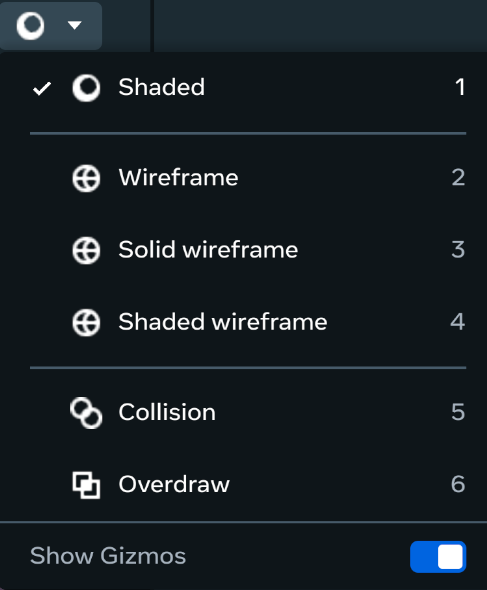
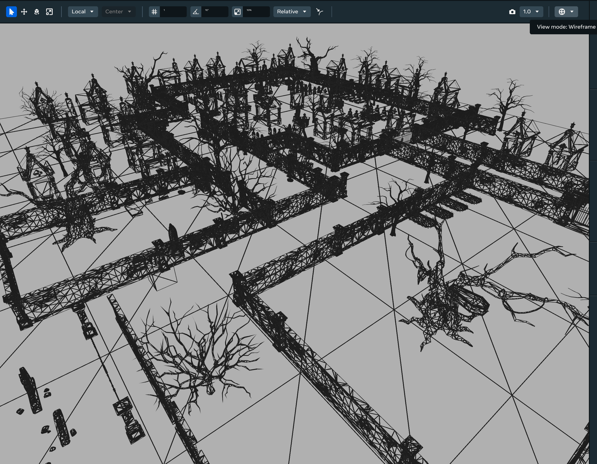
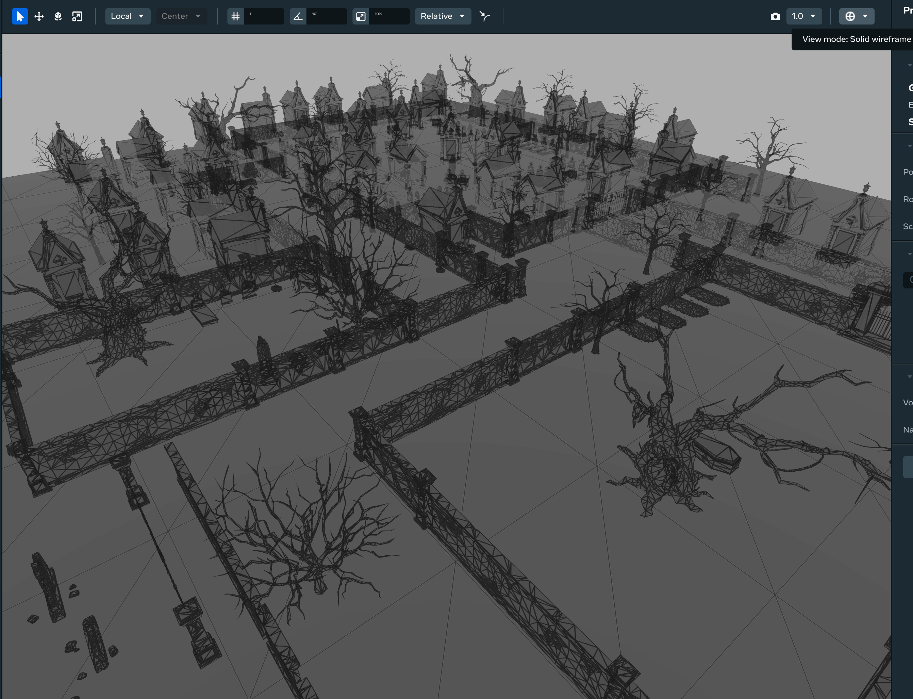
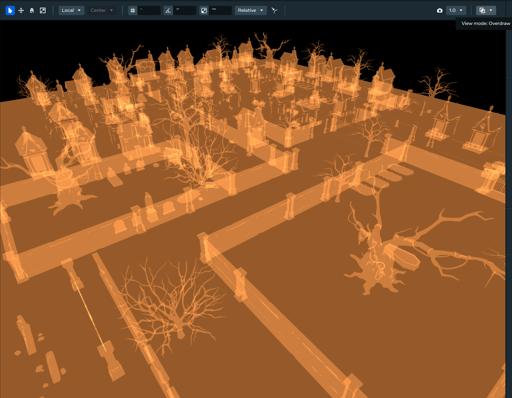

# View modes for debugging

Debugging view modes in desktop editor can help you debug your world. Its features include:

* Wireframe viewing options that give you visibility into the geometric complexity of your meshes.
* A collision view mode that helps you understand how players will be able to interact with objects in your world.
* An overdraw view mode that helps you see where the same pixels are being drawn more than once.

## Opening in desktop editor

To open the view modes menu, select the view icon on the right side of the toolbar.

Hovering your cursor over each option reveals a description of the view mode. See [Available view modes](https://developers.meta.com/horizon-worlds/learn/documentation/view-modes-for-debugging#available-view-modes) for further details. After selecting an option, the view mode will be displayed inside the dropdown button. Hovering over this dropdown button will also show you the active view mode.

### Opening in VR

In VR, first [Enable the Utilities Menu](../../Performance/Performance%20tools/Enable%20the%20Utilities%20menu.md), then open your wearable and select the desired view mode.

## Available view modes

| View mode | Description |
| --- | --- |
| **Shaded** | - Texture only.   - This is the default view that shows meshes with their textures available. |
| **Wireframe** | - Wireframe only.   - Use this to view your world’s geometric complexity. It allows you to see through meshes for debugging unintended overlaps between objects. |
| **Solid wireframe** | - Wireframe over a solid material.   - This option places a solid material underneath the wireframe, it’s useful for displaying objects that are apart and distinguishing which objects are closer to the camera. |
| **Shaded wireframe** | - Wireframe over the object’s texture.   - Use this view to understand how textures are affected by their underlying mesh geometry and debug texture issues that may be caused by the meshes underneath them.   - **Note:** There is a known bug in the desktop editor where jumping to Preview mode while Shaded Wireframe mode is active causes the player to pass through geometry. |
| **Collision** | - Shows object colliders.   - Use this view to see which objects have colliders. You can also use this to optimize the performance of a world to disable collisions on objects that players can’t reach, reducing the overall complexity. |
| **Overdraw** | - Shows pixel overdraw.   - Use this view to see where the same pixels are being drawn more than once in a scene so you can better optimize your world.   - See the [Overdraw view mode](View%20modes%20for%20debugging.md#overdraw-view-mode) section for more information. |

## Keyboard shortcuts

These numeric keys provide shortcuts to the different view modes:

* 1: Shaded
* 2: Wireframe
* 3: Solid wireframe
* 4: Shaded wireframe
* 5: Collision
* 6: Overdraw

## Wireframe view mode

Wireframe view mode helps you see the geometric complexity of your 3D models. You can use this view mode to assess which 3D models should be simplified to make your world more performant if you’re running into performance issues.

### Use wireframe view mode to optimize your world

Wireframe view mode comes in three variants:

* Wireframe.
* Solid wireframe.
* Shaded wireframe.

For reference, the screenshot below displays a scene in the default **Shaded view** mode:

*Shaded (default) view mode.*

**Wireframe view** mode allows you to see through 3D models to get a high level view of your world’s geometric complexity and identify unintended overlaps between models in your world.

*Wireframe view mode.*

**Solid wireframe view** mode places a solid material underneath the wireframe. Use this view mode to help you tell objects apart more clearly and distinguish which objects are closer to the camera while in wireframe view.

*Solid wireframe view mode.*

**Shaded wireframe view** mode shows the object’s texture underneath the wireframe. Use this view mode to help you understand how textures are affected by their underlying 3D models and debug texture issues that may be caused by the meshes underneath them.

*Shaded wireframe view mode.*

## Collision view mode

**Collision view** mode helps you identify which objects in your world have colliders. Use this view mode to optimize your world’s performance by disabling colliders on objects that players can’t reach or resizing colliders only to where they are necessary.

### Use collision view mode to optimize your world

In collision view mode, colliders are visualized using a semi-transparent colored material.

*Collision view mode.*

## Overdraw view mode

**Overdraw view** mode helps you see where the same pixels are being drawn more than once in a scene so you can better optimize your world. Turning on overdraw view mode shows where meshes overlap so you can change, remove, or reposition geometries to make your world more performant.

### Use overdraw view mode to optimize your world

In overdraw view mode, you can see where geometries overlap the most in your world by looking for the areas that are most opaque. Each occurrence of overdraw is a place where unnecessary pixels are being drawn. You can optimize your world by modifying your meshes and optimizing your layout to minimize overdraw.

*Overdraw view mode.*