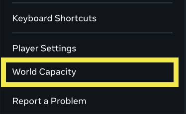
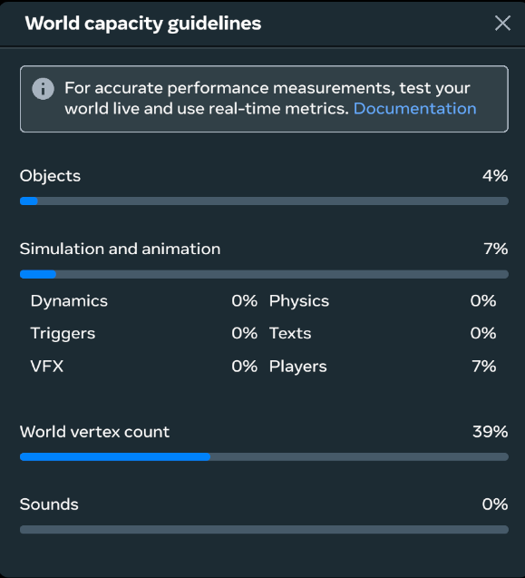
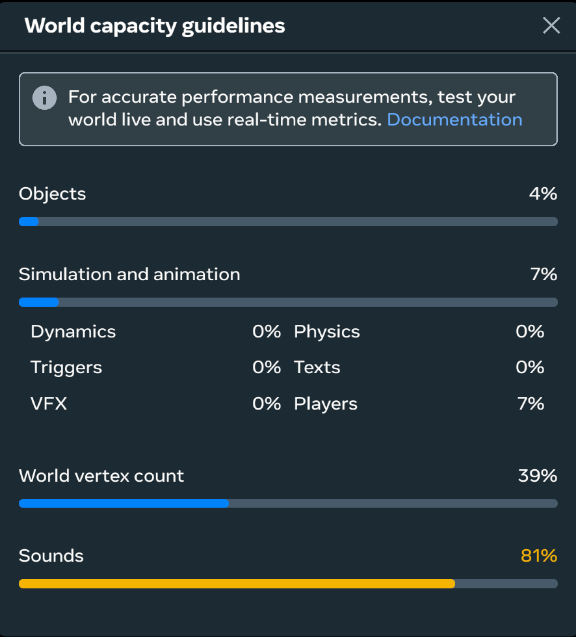
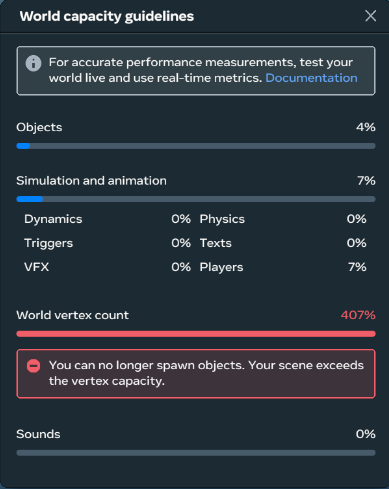

# [World Capacity dialog](#world-capacity-dialog)

## [Viewing the World capacity guidelines dialog](#viewing-the-world-capacity-guidelines-dialog)

The World capacity guidelines dialog shows you how close your world is to meeting or exceeding the capacity limits of a World. To access the World Capacity dialog, open the **Main Menu** and select **World Capacity**.

The World capacity guidelines dialog shows you the used capacity, as a percentage, of four major categories: Objects, Simulation and animation, World vertex count, and Sounds. If you at more than 75% of the capacity limit for any of these categories, you will see a yellow bar for the category. If you are at more than 100% of the capacity limit for any of these categories, you will see a red bar and an error message.

> [!Note]
>
> The World vertex count category is incorrectly named in the dialog as world tricount. This will be fixed soon.

\
*World capacity dialog*

\
*World capacity dialog with Sounds at yellow*

\
*World capacity with vertex count at 407% and error message*

## [Understanding capacity limits](#understanding-capacity-limits)

The capacity limits shown in this dialog are a quick snapshot of the current capacity of your world. There are other factors related to world capacity that are not shown in this dialog. To understand world capacity in more detail, see [Performance limits for a world](../../Performance/Performance%20limits%20for%20a%20World.md).

### [Objects](#objects)

The objects category is the number of objects in your world that contain a mesh. The hard limit for these objects is 3000.

### [Simulation and animation](#simulation-and-animation)

The simulation and animation category is a shared bucket of objects related to simulation and animation. These objects are counted based on estimated simulation time, with a total limit of 4.2ms. They include:

- **Dynamics** - Each dynamics (moving) object counts as 0.0121ms.
- **Triggers** - Each trigger object counts as 0.002ms.
- **VFX** - Each VFX object has its own estimated simulation time, from 0.0059ms to 0.1ms.
- **Physics** - Each physics object counts as 0.008ms.
- **Texts** - Each text object counts as 0.0035ms.
- **Players** - The estimated simulation time for the [maximum allowed players](../Settings/Player%20Settings%20Modification.md) in the world, ranging from 0.0ms for 1-4 players up to 2.8ms for 20-32 players.

### [World vertex count](#world-vertex-count)

The world vertex count is the number of vertices currently rendered in your world. This includes all the vertices in your world, even the ones that may be culled by being out of view. You can have at most 125,000 vertices in a world.

You can reduce vertices by using simpler meshes. See the section for “Highly detailed meshes” in [GPU best practices](../../Performance/Performance%20best%20practices/GPU%20best%20practices.md#highly-detailed-meshes).

### [Sounds](#sounds)

The sounds category counts the memory used by sounds in your world. The hard limit for this category is 15,000 kilobytes.

