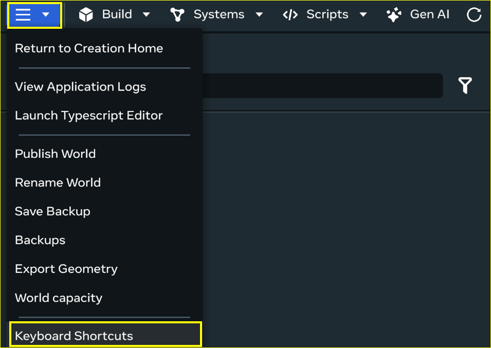

# Desktop Editor Creation Tools Keyboard Shortcuts

## Overview

You can access Keyboard Shortcuts from the desktop editor by clicking on the three-dot menu and selecting **Keyboard shortcuts**.

## Build mode

| **Action** | **Shortcut** |
| --- | --- |
| Move camera forward | **Arrow up**, or **Right-click + W** |
| Move camera backward | **Arrow down**, or **Right-click + S** |
| Move camera left | **Arrow left**, or **Right-click + A** |
| Move camera right | **Arrow right**, or **Right-click + D** |
| Move camera up | **Right-click + E** |
| Move camera down | **Right-click + Q** |
| Set camera movement speed | **Right-click + mouse wheel** |
| Increase camera movement speed | **Hold Left-shift** |
| Orbit camera | **Left-click and drag + Alt** |
| Pan camera | **Middle mouse click and drag** |
| Rotate camera | **Right-click and drag** |
| Zoom camera in and out | **Mouse wheel scroll** |
| Toggle Global/Local transform | **X** |
| Select an entity | **Left-click** |
| Focus camera on selected entity | **F** |
| Undo (for applicable actions) | **Ctrl+Z** |
| Redo (for applicable actions) | **Ctrl+Y** |
| Delete selected entity | **Delete** or **Backspace** |
| Duplicate selected entity | **Ctrl+D** |
| Group or ungroup the selection | **Ctrl+G** |
| Copy the selected content to the clipboard | **Ctrl+C** |

## Preview mode

| **Action** | **Shortcut** |
| --- | --- |
| Enter Preview Mode | **F5** |
| Exit Preview Mode | **Shift+F5** |
| Unfocus/Exit Preview mode | **Esc** |
| Move player forward | **W** |
| Move player backward | **S** |
| Move player left | **A** |
| Move player right | **D** |
| Jump | **Spacebar** |
| Grab an object | **E** |
| Release an object | **X** |

## VR mode

| **Action** | **Shortcut** |
| --- | --- |
| Exit VR mode | **Esc** |