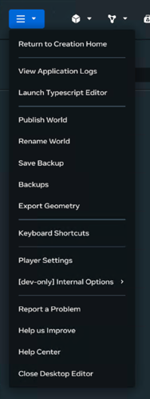

# [Desktop editor troubleshooting](#desktop-editor-troubleshooting)

The following sections provide troubleshooting tips for a variety of common situations involving the Meta Horizon Worlds desktop editor.

## [How to report a bug or give feedback](#how-to-report-a-bug-or-give-feedback)

You can report bugs or submit suggestions through the desktop editor by selecting the **Report a problem** menu option.

For more information about reporting a bug, filing a suggestion, or editing a submitted report check the [Feedback tool documentation](../../Get%20started/Feedback%20tool.md).

## [I can’t open or run desktop editor.](#i-cant-open-or-run-desktop-editor)

Ensure that you have all prerequisites satisfied for using the desktop editor. For the list of prerequisites, see [Installing the desktop editor](../../Get%20started/Install%20the%20desktop%20editor.md)

## [Where can I view logs for the desktop editor?](#where-can-i-view-logs-for-the-desktop-editor)

To view the logs, navigate to `%UserProfile%\AppData\LocalLow\Meta\Horizon Worlds\Player.log`. You can also click **View Application Logs** on the main menu in the editor.

