# Manual Level of Detail Overview

“Level of detail” describes the principle of having lower-detail versions of models in memory for an object and switching to those lower-detail models when the object is small or far away.

The manual level of detail (LOD) feature in Meta Horizon Worlds lets you use this principle to save GPU costs during rendering. With LOD you can create assets that contain multiple model files with different levels of detail and configure which model to render based on relative screen size. This allows you to create more complex worlds in Meta Horizon Worlds.

**Note:** LOD only works in visit mode in worlds with Custom Model Import (tri-mesh) and cached global illumination (GI). In all other situations, LOD won’t be enabled, even if the assets are set up for LOD.

## How LOD improves performance

The current version of LOD is focused on improving GPU performance in worlds.

With LOD, you avoid overshading sub-pixel triangles by switching to a lower-detail version of the model. The tradeoff is that storing multiple models increases memory usage and size on disk. These increases are moderate and configurable based on the size of the additional models stored and how much they’re decimated.

## Prerequisites

**Note:** The current LOD feature only works with Desktop Editor.

* A Windows PC with [Meta Horizon Worlds desktop editor configured](../Get%20started%20with%20Desktop%20Editor/Introduction%20to%20the%20desktop%20editor.md).
* [Simplygon](https://www.simplygon.com/) software installed.
  + This is required to import LOD assets and publish a world with LOD assets.
* A Custom Model Import world running in edit mode in Desktop Editor to import LOD assets into.

### How to install Simplygon

**Warning:** LOD asset import and GI lighting data generation require Simplygon. If Simplygon is not installed correctly, LOD import will fail and if a world has LOD objects, GI lighting data publishing will fail.

- [Download](https://www.simplygon.com/Downloads) the installation file and run the installer.
- Refer to the [Simplygon installation guide](https://documentation.simplygon.com/SimplygonSDK_10.0.1400.0/installation/default.html#download-installer) for installation details.
- You’ll be prompted to install a license key.

  * For 1P and 2P Studios, please reach out to [Alex Elsayad](mailto:alexelsayad@meta.com), [Deborah Guzman Barrios](mailto:debguzman@meta.com), or [Travis Hoffstetter](mailto:thoffstetter@meta.com) to get a Meta license key.
  * 1P and 2P studios/creators can use Meta’s license key to use Simplygon under the following terms:

  ***NOTICE OF LICENSE RESTRICTION***

  ***The license key for Simplygon provided is strictly limited to use for the Horizon World project only. Any use of the license key for purposes other than the Horizon World project is expressly prohibited and constitutes a material breach of this agreement.***

  ***The user acknowledges and agrees that the license key may not be used for any other projects, products, or services, and may not be shared, transferred, or sublicensed to any third party without the prior written consent of Simplygon.***

  ***By using the license key, the user confirms its acceptance of these terms and conditions, and acknowledges that any unauthorized use of the license key may result in legal action, including but not limited to, injunctions and damages.***
- After installing Simplygon, close all instances of Horizon, Unity, Hubbub or NuDevTools, and relaunch them as needed. If you see an asset ingestion error after closing and relaunching, try restarting your PC. See [Troubleshooting](Manual%20Level%20of%20Detail%20Overview.md#troubleshooting) for more information.

## Create and use LOD assets

### Demo video

Here is a demo video on how to use LOD.

### Sample assets

You can download sample assets to test LOD import from the links at the bottom of the page or from the links in the following table.

| Asset Name | LOD assets | Recommended relative screen size setting | Vertex | Texture assets | Notes |
| --- | --- | --- | --- | --- | --- |
| DamagedHelmet | [DamagedHelmet\_LOD0](https://scontent-dfw5-1.oculuscdn.com/v/t64.5771-25/38974452_1110977567398498_3267634047256809730_n.fbx?_nc_cat=105&ccb=1-7&_nc_sid=e280be&_nc_ohc=q6gaG1CHOcsQ7kNvwF3pm1p&_nc_oc=Adk_lJoVoTeNA-MynCLlf_ma9pt9nla2xblq9HEvNMyVvjN6P7a2IgCuItBJI4wQI-pSZpHE6jCxm9aLb4pO4S33&_nc_zt=3&_nc_ht=scontent-dfw5-1.oculuscdn.com&oh=00_Afr5D3luY9S7w2XT1uqjYwcvq9qqen-gywNCcRfQIO95PA&oe=698436C9)  [DamagedHelmet\_LOD1](https://scontent-dfw5-3.oculuscdn.com/v/t64.5771-25/75241698_1084209123102490_8721696503486453490_n.fbx?_nc_cat=109&ccb=1-7&_nc_sid=e280be&_nc_ohc=N_Nkl6HxSewQ7kNvwESE15_&_nc_oc=Adn5OY3ceSzyj3UzBarzSH5prIUDejgLYtqwcR5g-F-odR41LEQN9elsyBnF_chjU76bOxbvhA92w7iTo2Pti9k-&_nc_zt=3&_nc_ht=scontent-dfw5-3.oculuscdn.com&oh=00_AfrDSEVScxZY6BTUxYIK2z4eQDmak0E8QVVitgStw68_kA&oe=69843B88)  [DamagedHelmet\_LOD2](https://scontent-dfw6-1.oculuscdn.com/v/t64.5771-25/39036644_543824368397921_749567675276430240_n.fbx?_nc_cat=101&ccb=1-7&_nc_sid=e280be&_nc_ohc=9A-TUQTnJw0Q7kNvwF5-P8O&_nc_oc=AdmOqT7xWKolR-vRpiZ_U6DDO1Bys-Ym0uhKCW3N8MskDWF2KV5UX2za2lWwE8h1wxfOjgvsy0eIteifolpQJ32H&_nc_zt=3&_nc_ht=scontent-dfw6-1.oculuscdn.com&oh=00_AfoFfoGnu_7XRXk8nyGUska7FpRNi0q864QYx2fK-mqxGQ&oe=69841402) | .3    .1    .01 | 13341    5763    2208 | [DamagedHelmet\_BR.png](https://scontent-dfw5-3.oculuscdn.com/v/t64.5771-25/39031396_1211383596830479_1106960686933552311_n.png?_nc_cat=108&ccb=1-7&_nc_sid=e280be&_nc_ohc=7Sp9nvi5HbwQ7kNvwEV3OmK&_nc_oc=Adl475JeHdTeHDJucLzqL_F8c-W7qjpW_9S9-Hv86Isf01TLBXdKmnYS2uj3cGN6q5VGtaVLmQ_2TSQupYsJ83Ws&_nc_zt=3&_nc_ht=scontent-dfw5-3.oculuscdn.com&oh=00_AfpOT763MQ-P4L-krelMqGkD3sS4ePXzd5TFRKbtvoDXug&oe=698420BF)  [DamagedHelmet\_MEO.png](https://scontent-dfw5-2.oculuscdn.com/v/t64.5771-25/39035471_460649110467753_1686906741871334990_n.png?_nc_cat=104&ccb=1-7&_nc_sid=e280be&_nc_ohc=bqIefB6e9ZcQ7kNvwHAw2H1&_nc_oc=Adlgo39WvFYo1KWbVL4mkT0X1LM650esPfsRXK7ycyOI9xUUQHEYDQgSu9JaeQ0lwYgq-FuXE09gIO0awuBIixPS&_nc_zt=3&_nc_ht=scontent-dfw5-2.oculuscdn.com&oh=00_Afotgv6C-E9Ajnd2RsosJWwJjfS6LkQq-4c29dPRc1IqyQ&oe=6984141A) |  |
| Suzanne | [Suzanne\_LOD0](https://scontent-dfw5-2.oculuscdn.com/v/t64.5771-25/86620687_424732963772558_3603515224534172233_n.fbx?_nc_cat=104&ccb=1-7&_nc_sid=e280be&_nc_ohc=6mdAvLNOq58Q7kNvwHtQJIe&_nc_oc=AdmubcfUgsvc0sRbZs9YDWcqUmkqD6t2UimVoHQ66c7gLzlXSREWFPYgML918uKmI-ovHyAvSemHgS6PANQ33AI-&_nc_zt=3&_nc_ht=scontent-dfw5-2.oculuscdn.com&oh=00_AfoghEuHeKeAZZK3Lwz-hkELfomprQ2nkAXoiz-nP1L4Yg&oe=698442A2)  [Suzanne\_LOD1](https://scontent-dfw5-1.oculuscdn.com/v/t64.5771-25/38974679_1774312949997424_3774288506792177577_n.fbx?_nc_cat=107&ccb=1-7&_nc_sid=e280be&_nc_ohc=qWUX1leouf0Q7kNvwGtYzFR&_nc_oc=AdkTHQsiwuMyXxnDllWF9q8zhBtq0mR1Cykys0qWKVy6FraUSyPr_C0so-mqyNm4q3EBPLa9XXhTzCnvc_OTMTMr&_nc_zt=3&_nc_ht=scontent-dfw5-1.oculuscdn.com&oh=00_AfrrFBXGddS40dlawikp4HckUNmaiaJ_pAR74d21qqhycg&oe=69842E34)  [Suzanne\_LOD2](https://scontent-dfw5-3.oculuscdn.com/v/t64.5771-25/75404233_507077025666832_7688880730582757364_n.fbx?_nc_cat=108&ccb=1-7&_nc_sid=e280be&_nc_ohc=uoWIl4a9X3cQ7kNvwFa4Yji&_nc_oc=AdlxGQZWpsSaznk7CM89KE00V8HVsWW0AnN9RPG_mHXw02R6RC4CwE22Y71M1R4RjbjEWT5KCu7ARwQHoueXHMmt&_nc_zt=3&_nc_ht=scontent-dfw5-3.oculuscdn.com&oh=00_AfrE3q2aANG6TA1yML_TWTKNnfQbqtmAQceeh8q_GW2O8A&oe=69843637) | .3   .1    .01 | 7958    2573    909 | [Suzanne\_BR.png](https://scontent-dfw6-1.oculuscdn.com/v/t64.5771-25/75210401_522547524089238_3818379784629030093_n.png?_nc_cat=103&ccb=1-7&_nc_sid=e280be&_nc_ohc=65P_i-BJXFoQ7kNvwEYObO_&_nc_oc=AdnFKeXsEmSCpP408tOR8R9mYQqRAEz9VSt1kwmczRDFRPj5gqlO8QKJU2b0XCKtiZR-QRHJbXO8g2Y5OBxYx4Vj&_nc_zt=3&_nc_ht=scontent-dfw6-1.oculuscdn.com&oh=00_AfqmqyFo22pwZYaOpJF4A36LkclupEAtCtSLb3504XNE1A&oe=6984274F)  [Suzanne\_MESA.png](https://scontent-dfw5-1.oculuscdn.com/v/t64.5771-25/75334063_485564684498051_5902144713115885952_n.png?_nc_cat=111&ccb=1-7&_nc_sid=e280be&_nc_ohc=bOoXqPimV9sQ7kNvwH_9TAq&_nc_oc=AdmWUVitxR77j2tIAw2ddpsNkV7XSzx9kZHTI-cEa9DIaI4fqF9PahQoNcjkX-O7qH96juO_oCz29qV9palR4EiP&_nc_zt=3&_nc_ht=scontent-dfw5-1.oculuscdn.com&oh=00_AfqPQlu7-ch_WsCFpBobPKFK8suwxezF32UEuAw2ulNzQQ&oe=698444BA) | Ignore import warnings. |
| StoneFloor | [StoneFloor\_LOD0](https://scontent-dfw5-1.oculuscdn.com/v/t64.5771-25/38974803_3611041129041311_2668313382660000807_n.fbx?_nc_cat=107&ccb=1-7&_nc_sid=e280be&_nc_ohc=4yx2TdApGfIQ7kNvwHc_BIM&_nc_oc=Adk9f3yfugBQo3-bay2Oj3va3HOmaKwef6IVvtTVK83nq9rIXOZOFBvDOrt0c610jE5d6D6FCqwYUhsspcv7PBxR&_nc_zt=3&_nc_ht=scontent-dfw5-1.oculuscdn.com&oh=00_Afo-VUKF-7ZdbDlDfoGDpVAqaSCem-i1ANAu9EGy9i4o8Q&oe=6984487E)  [StoneFloor\_LOD1](https://scontent-dfw5-2.oculuscdn.com/v/t64.5771-25/57575351_583790344173233_5836712915629891216_n.fbx?_nc_cat=102&ccb=1-7&_nc_sid=e280be&_nc_ohc=5epGCVhQ57UQ7kNvwH1TWA2&_nc_oc=AdkvY5s_fLvQol5rgFlxj-lapKXlcOj4QcwgCv00igFIA3bhXNnPDvTAzCj0W9ZsNxYMkATNF6e3n_KzydaXdycH&_nc_zt=3&_nc_ht=scontent-dfw5-2.oculuscdn.com&oh=00_Afo1ojV9lgc85uPLd_U6tnDR_khwOzE6Qko-XEl0M3U7fw&oe=69841B12) | .3   .01 | 1502  266 | [StoneFloor\_BR.png](https://scontent-dfw5-1.oculuscdn.com/v/t64.5771-25/38982708_1041123087752366_8769918822486248358_n.png?_nc_cat=107&ccb=1-7&_nc_sid=e280be&_nc_ohc=lhSAmvyJzG8Q7kNvwGOyNHu&_nc_oc=AdlEcaNwIBrzbSLmhxKgYhM3Bl1Cddu03Q6bqlgwtuL5AzLJQI0U85fEvzDNy48JQb7up_D6QNqO9SAqLcgdqj4T&_nc_zt=3&_nc_ht=scontent-dfw5-1.oculuscdn.com&oh=00_Afq080o1VHvyNucoULJKe7DOelT5SOsaQghzGvTOLRmu1w&oe=69842DF8) |  |
| ColumnSetA | [ColumnSetA\_LOD0](https://scontent-dfw5-3.oculuscdn.com/v/t64.5771-25/75207235_572656031963575_8134019312426795705_n.fbx?_nc_cat=108&ccb=1-7&_nc_sid=e280be&_nc_ohc=4cIgdwtxREcQ7kNvwEtm805&_nc_oc=AdnbOxyVXcrl6w7l-gofzDxMtb99YOeNPiNz4xalz-H_oSNl1gVT2YgRh1xK-MoQTmckVSpzWfvt1Bey15s2Dmts&_nc_zt=3&_nc_ht=scontent-dfw5-3.oculuscdn.com&oh=00_Afr-yoHbsly_I-qb9XLSk2w0-9dG4be09hLsxxS5y9hSqw&oe=698437B8)  [ColumnSetA\_LOD1](https://scontent-dfw6-1.oculuscdn.com/v/t64.5771-25/75422379_1117471496715133_9153812592022689103_n.fbx?_nc_cat=101&ccb=1-7&_nc_sid=e280be&_nc_ohc=6FnivNGRpQgQ7kNvwH5yBXL&_nc_oc=AdnINIG8ZQfIzXPs0PelfKiHQPkiYEzC-cNwp5TXw5wKco3rAhZNk3j4pvD6bJTHfiRy8NLAACcUW2hhlU1n33yg&_nc_zt=3&_nc_ht=scontent-dfw6-1.oculuscdn.com&oh=00_Afp39ho6bnO06xyNA-kaRPhsXWPsHO-ogocuHyJqTewfYw&oe=698418F3)  [ColumnSetA\_LOD2](https://scontent-dfw6-1.oculuscdn.com/v/t64.5771-25/38974723_1229165174971481_2089172905872648967_n.fbx?_nc_cat=103&ccb=1-7&_nc_sid=e280be&_nc_ohc=8Yp-icLwTY4Q7kNvwENujW_&_nc_oc=AdnXMt2ChNZVGQTwmotie2M-GisZSH27Y-cvRbrTbCljApwvHyqXRK8iPhoi-6Bqn6ekn-ptlloWl4uSMdssuoeB&_nc_zt=3&_nc_ht=scontent-dfw6-1.oculuscdn.com&oh=00_Afp-W68J3kvyiJ_CgR-NZuCzlSuV3CUwqaEOQpyWYGXVOQ&oe=6984339C) | .5  .3  .1 | 7657  4733  2515 | [ColumnSetA\_BR.png](https://scontent-dfw5-2.oculuscdn.com/v/t64.5771-25/38982480_1328835308493384_834914125048304768_n.png?_nc_cat=102&ccb=1-7&_nc_sid=e280be&_nc_ohc=Axc311cD2KkQ7kNvwEqMfs3&_nc_oc=Adle6kA0jVwLS8K05YCCjNsQJ6679KsUtKOXXF_d3OoVwMnILniuxggGCmSveoaZhYyXoS8lhIHoh6n0D-317ek5&_nc_zt=3&_nc_ht=scontent-dfw5-2.oculuscdn.com&oh=00_AfrCZI-I6RnGwa30D7SCw6gfnpDEyAiMUsPU7Uh02emIsQ&oe=6984310D) | Use this asset to clearly view LOD switching. Use the recommended values on the “Recommended relative screen size setting” column. This asset has visual issues on purpose to facilitate the LOD switch viewing. |

## Ingest LOD Assets

### Create a folder

First, create a folder to store your ingested assets.

- Click the **Assets** pane at the bottom of the editor.
  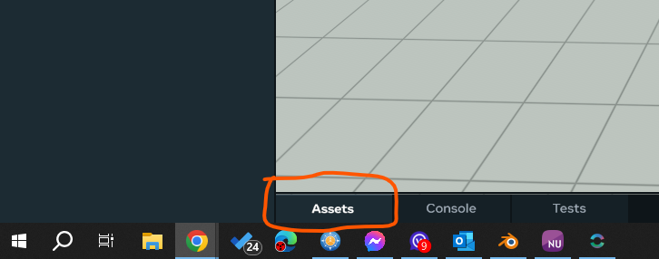
- Click **Add New > Folder** and give the folder a name.
  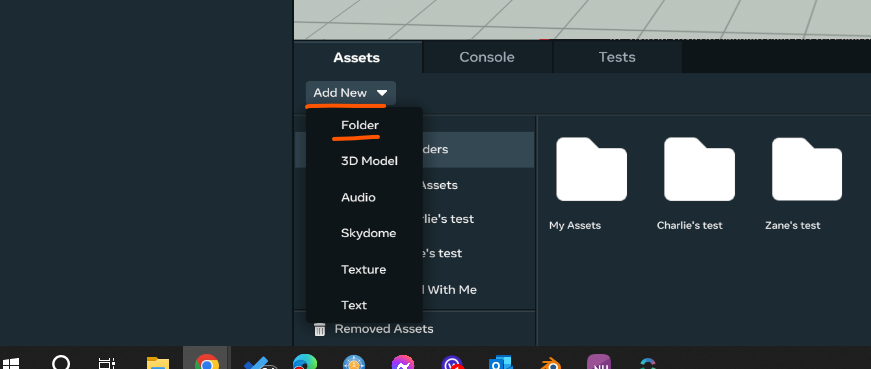

### Add your LOD 0 assets

> **Note:** The FBX file meshes for different LODs should reference the same textures.

Start by ingesting your most detailed model, called LOD 0, and textures.

- Click **Add New > 3D Model**.
  
- The mesh ingestion window will appear.
  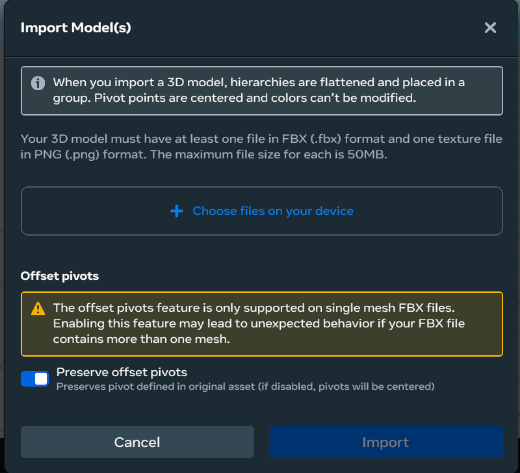
- Click **Choose files on your device**, navigate to the folder with your assets, and select your LOD 0 model FBX file as well as your textures. Click **Open**.
  * To select multiple files, hold Ctrl while clicking the files.
  * If you’re using the test sample assets, select DamagedHelmet\_BR.png, DamagedHelmet\_MEO.png, and DamagedHelmet\_LOD0.fbx.
    
- The ingestion window should now show the files you selected.
  

At this point, you should have all the files you need to import a fully functional asset with only one level of detail. To add additional levels of detail, you must append more LOD assets to this 3D model.

When you import LOD meshes, they are appended to the MeshAsset containing the LOD 0 meshes. This means they will share the same materials used by the LOD 0 mesh asset.

### Append LOD assets

- To append more LOD assets, expand the LOD 0 FBX file by clicking the expander arrow.
  
- Click **Add LOD(s)**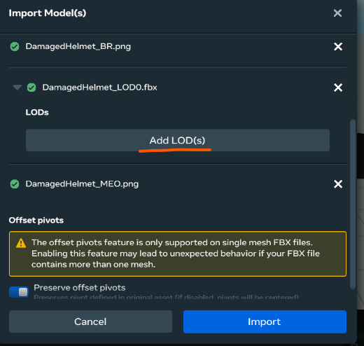
- In the file selection window, multi-select your additional LOD FBX model files then click **Open**.
  * If you’re using the sample files, select DamagedHelmet\_LOD1.fbx and DamagedHelmet\_LOD2.fbx. 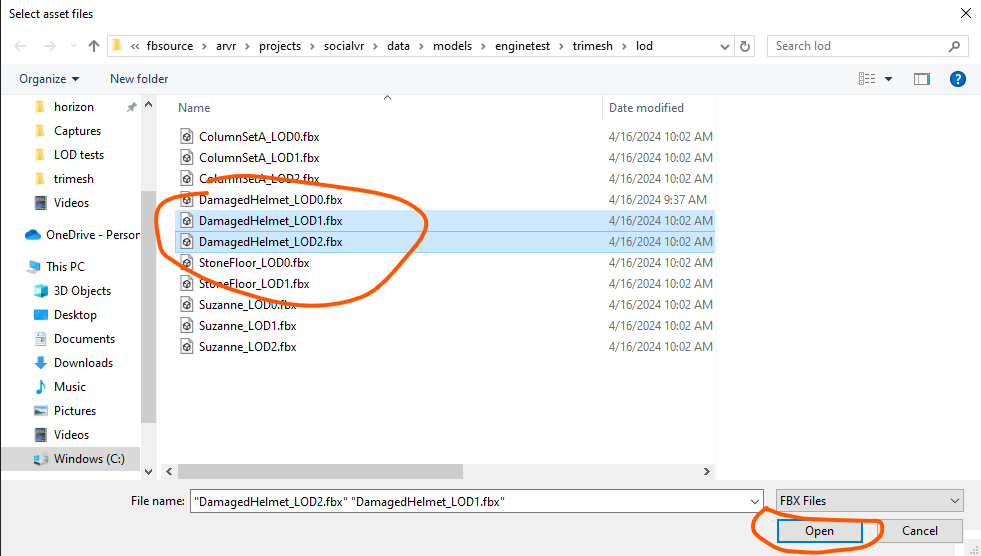
- The ingestion window should now also show the new LOD files.
  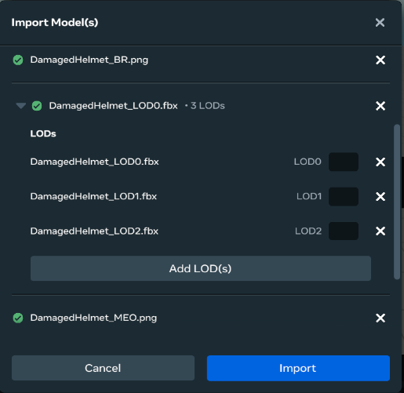
- Now, set the desired relative screen size for each LOD level. The relative screen size determines the threshold for each LOD level as a percentage of the full screen. When the object on the screen is smaller than this threshold percentage, the engine switches to the LOD mesh of the next LOD level.See the following example values for a more intuitive explanation:
  * **LOD 0: .3** - LOD 0 will be used when the object is larger than 30% of the full screen.
  * **LOD 1: .1** - LOD 1 will be used when the object is between 30% and 10% of the full screen.
  * **LOD 2: .01** - LOD 2 will be used when the object is between 10% and 1% of the full screen. - The object will be culled when smaller than 1% of the full screen.
- Click **Import**.
  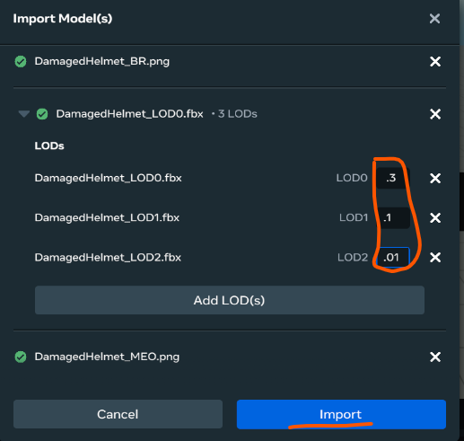
- Wait for the importing process to be finished. You may see a clock icon on the top right of the asset icon.
  
- When the import finishes, a “Success” banner will appear.
  

> **Note:** When importing FBX files containing multiple meshes, the system will try to match LOD meshes to the LOD 0 mesh by node name matching.

> **Note:** It’s possible to import different types of meshes to an LOD if you also add the dependent textures. This can be useful for testing LOD switching.

### Add an LOD asset to your world

To use an LOD asset, drag the asset to the world window.

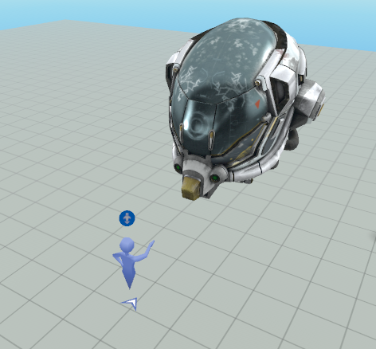

If the object is too far from the view point, it may have a green color. This is because the additional LOD level GI is being computed in the background and isn’t ready yet. You can move the object around in the world before the GI data is computed.

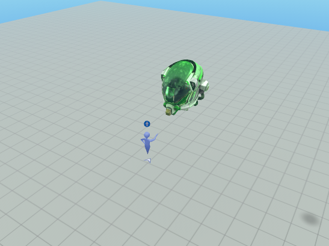

You can verify that LOD is working by moving around in the world to make the object take up different amounts of space on your screen and watching as different LOD models populate.

It can be hard to notice this happening if the relative screen size values are small. If you move far away from the object, eventually it will be culled.

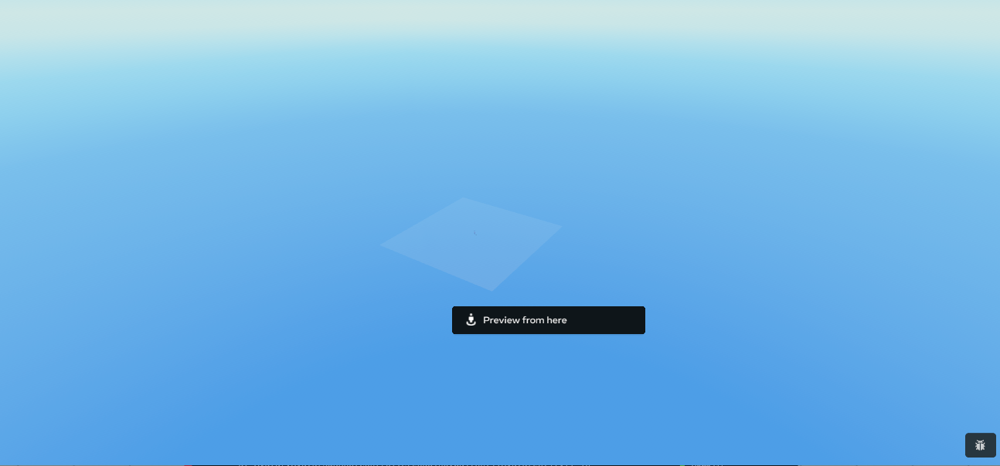

You can also see LOD behavior in Desktop Editor’s preview mode.

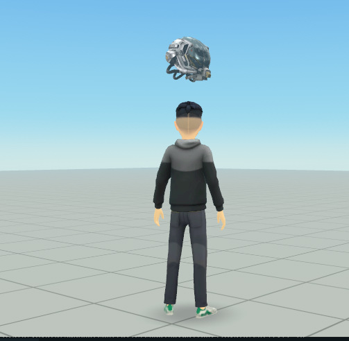

### Publish the world

To publish a world with LOD assets, you must publish the world from the PC with Simplygon installed. The web or VR flow can’t generate GI data for the LOD assets, and LOD objects will be disabled if you publish your world from web or VR..

When publishing a world with LOD assets and objects, the publishing process may take longer, between 30 seconds to a few minutes.

Then wait for the publish process to finish. Depending on how many objects and LOD assets are in the world, this process could take anywhere from 30 sec to a few minutes.

## Current limitations

* The LOD asset has to be re-ingested to change LOD parameters.
* There’s no LOD property TUI, so after placing assets in a scene, there’s no direct way to tell whether the asset contains LOD meshes.
* If an FBX file has multiple nodes (thus multiple meshes), all of the nodes will use the same relative screen size value.

## Troubleshooting

**If you can’t ingest LOD models, but ingesting a single FBX file works:**

This seems to be related to the Simplygon installation. After installing Simplygon, close all instances of NDT, Unity, Hubbub, etc. and try restarting your PC.