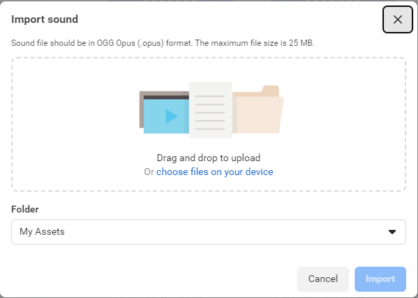
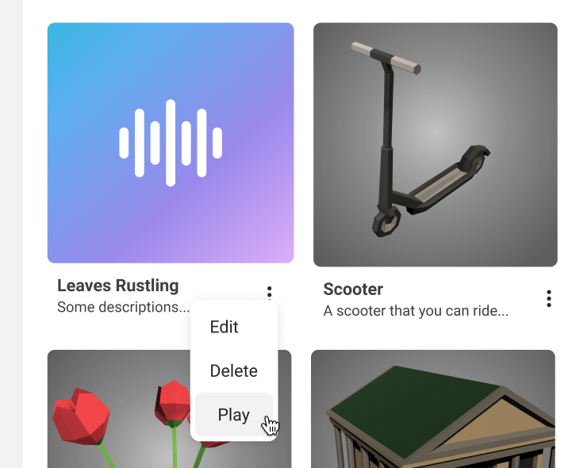
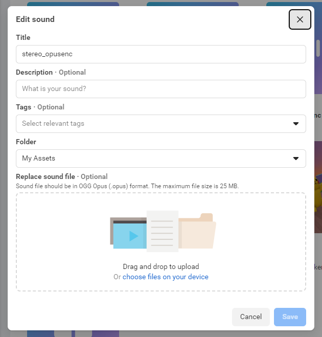
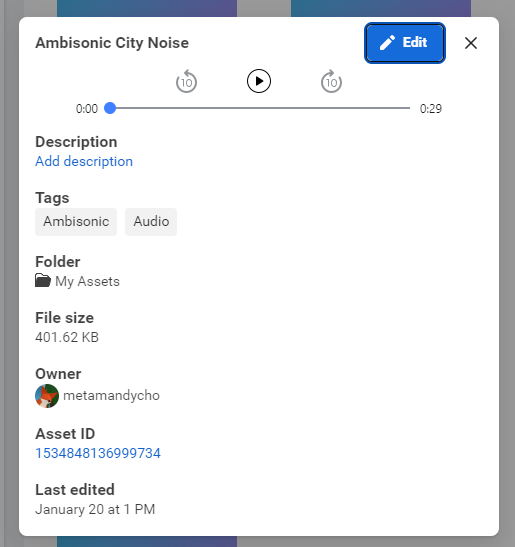

# [Meta Horizon Worlds Audio Ingestion](#meta-horizon-worlds-audio-ingestion)

Meta Horizon Worlds supports the following formats:

- MP3 (.mp3)
- WAV (.wav)
- FLAC (.flac)
- Ogg Opus (.opus)

Supported sample rates are 16kHz, 22.5kHz, 24kHz, 44.1kHz and 48kHz.

Audio assets can be uploaded to your Asset library using a web interface or using the desktop editor.

| Audio type | File type                                       | Loudness and Duration                                                  | Usage                                                  | Notes                                                                                                        |
| ---------- | ----------------------------------------------- | ---------------------------------------------------------------------- | ------------------------------------------------------ | ------------------------------------------------------------------------------------------------------------ |
| Mono       | Channels: 1                                     | -18 LUFS Maximum Peak Value: <= -1.0dBTP                               | Sounds effects tied to a location in the world.        | Avoid including reverb or spatialization pre-baked into asset files unless for expression/flavor             |
| Ambisonic  | First-Order Ambisonic (FOA) Channels: 4 Looping | -40 to -30 LUFS Duration: \~30 seconds                                 | Ambience or general four-channel first-order ambisonic | Ambisonic content should not contain too much broadband noise, which may conflict with spatialized emitters. |
| Stereo     | Channels: 2 Looping                             | -14 to -12 LUFS Maximum Peak Value: <= -1.5dB Duration: 90–120 seconds | Headset-locked content, no spatialization, e.g. Music. | Avoid including lyrics in your music.                                                                        |

## [Known limitations](#known-limitations)

- Audio uploads under 50MB.
  - Mono, Stereo, and First Order Ambisonic files are supported
  - All spatial SFX should be imported as mono assets to minimize memory usage.
  - First Order Ambisonic files must be Ambix format to ensure correct orientation.
- Audio assets that are larger than 2.5 MB are streamed from disk.
  - Only one audio asset larger than 2.5 MB should be playing at any time.
- Stereo assets that are uploaded and summed to mono costs memory and CPU.
  - Downmixing assets consumes CPU.

## [Upload Audio](#upload-audio)

### [Desktop Editor](#desktop-editor)

1. Open a world in the desktop editor.
2. Click the Asset Library tab.
3. From the Asset Library tab, click **Add New**. Select **Audio**.
4. Navigate your local environment to select the .MP3, .WAV, .FLAC or Ogg Opus file to upload.
5. Select the folder in your Asset Library tab where you wish to upload the asset. To share the asset with other team members, it must be uploaded or moved to a shared folder.
6. Click **Upload**.
7. Repeat the above steps for other audio files.

### [Meta Horizon Worlds Creations](#meta-horizon-worlds-creations)

<video controls><source src="(BROKEN_REF)" type="video/mp4"></video>

1. Navigate to the [Meta Horizon Worlds Creations site](https://horizon.meta.com/creator/).
2. In the left nav bar, select **My Assets > View All**.
3. At the top right, select + **Import > Sound**. 
4. Follow the instructions: 
5. When your audio file has been uploaded, select the context menu on the asset tile to edit, delete, or play the audio asset: 

## [Edit Assets](#edit-assets)

**Note**: Following steps reference editing assets through the Horizon Words Creations interface.

1. To view an asset’s details, click on the asset you uploaded to your folder. The following video demonstrates this process: 
2. To edit the asset, click the context menu on the asset tile, or click **Edit** in the Details view.
3. Modify the name, description, tags, folder, and associated audio file for the asset: 

**Note**: You can replace the audio assets only for assets that you own.

After the audio details are added, they are displayed:

## [Use audio](#use-audio)

Your new audio asset can be accessed from your Asset Library. From the Desktop Editor, you can drag the asset into your world and place it and modify its properties as needed.

### [Runtime limits](#runtime-limits)

- A maximum of **1024 virtual audio sources** can be available at any one time.
- A maximum of **64 audible sounds** can be played at any time.
  - If there are more than 64 audio sources, the quietest sounds are muted to limit the number to 64.
  - If enabled, player-to-player voice-over (VOIP) counts as 1 audible sound source.

### [Memory usage](#memory-usage)

As soon as an audio asset is instantiated in the world, its referenced audio data is loaded into runtime memory. This applies to spawned audio or audio entities in the world at startup.

### [Preview playback](#preview-playback)

To preview the audio, select it. In the Properties panel, click **Play**.

You can also preview in your headset. See the following video for a demonstration of this process:

<video controls><source src="(BROKEN_REF)" type="video/mp4"></video>

### [Audio properties](#audio-properties)

When you add a sound into your world, it is encapsulated in an Audio gizmo. Select the gizmo, and the following properties are displayed in the Properties panel:

| Property            | Description                                                                                                                                                                                                                                                       |
| ------------------- | ----------------------------------------------------------------------------------------------------------------------------------------------------------------------------------------------------------------------------------------------------------------- |
| Preview             | Use the **Play** and **Stop** buttons to preview how the sound asset is presented in the world. Make adjustments to the playback properties of the asset and then retest playing.                                                                                 |
| Play on Start       | When enabled, the sound asset is played when the world starts. If Play on Start is disabled, you must manage the playback of this ambient asset through TypeScript.                                                                                               |
| Loop                | When enabled, the sound asset is played repeatedly.                                                                                                                                                                                                               |
| Volume              | Set the volume of asset playback on a scale from `0` to `1`.                                                                                                                                                                                                      |
| Volume randomness   | Sets the randomness of volume around the current Volume setting as the midpoint of the range. Range is `0.00` to `1.00`. Example: Setting to `1.00` means that actual volume in Volume +/- `6db`, which is an internal limit on randomness.                       |
| Pitch               | You can pitch the general playback of the sound up (positive values) and down (negative values). The pitch is on a scale of `-24` and `24` semitones, which is manipulated by changing the speed. 12 semitones -> 1 Octave → 2x speed                             |
| Pitch randomness    | Sets the total range in semitones. Example: Setting this value to `4.00` means that the pitch value is selected at random in the range from (Pitch - `2` semitones) to (Pitch + `2` semitones).                                                                   |
| Global              | When enabled, the asset is played back without any falloff due to distance.                                                                                                                                                                                       |
| Minimum Distance    | When Global is disabled, set the minimum distance that a player must be from the sound asset in order to trigger playback. Minimize the minimum and maximum distance values, where possible.                                                                      |
| Maximum Distance    | When Global is disabled, set the maximum distance that a player must be from the sound asset in order to trigger playback. Minimize the minimum and maximum distance values, where possible. Minimum and maximum distance are three-dimensional vector distances. |
| Low-pass cutoff     | Frequency in hertz that defines the low-pass cutoff, which accentuates sounds below this frequency and attenuates sounds above it. Default is `20000` hertz.                                                                                                      |
| Send Audio Complete | When enabled, an event is sent to all subscribers to indicate when the sound playback is complete. For ambient music, do not enable this option.                                                                                                                  |

