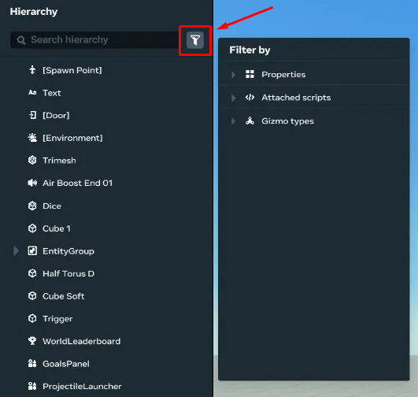
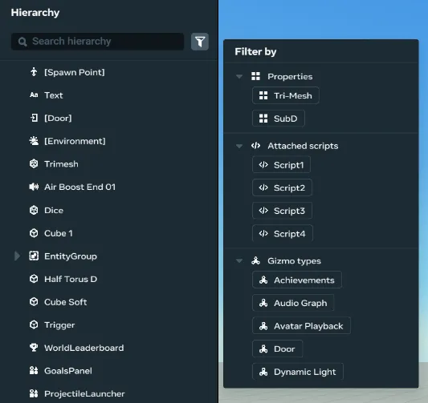
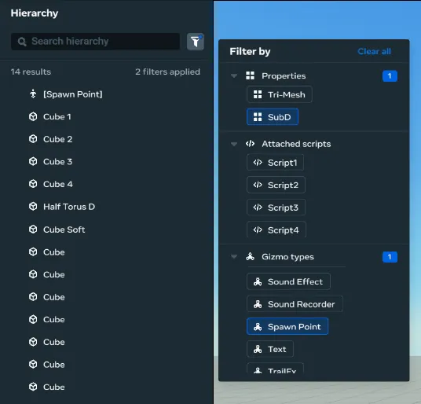
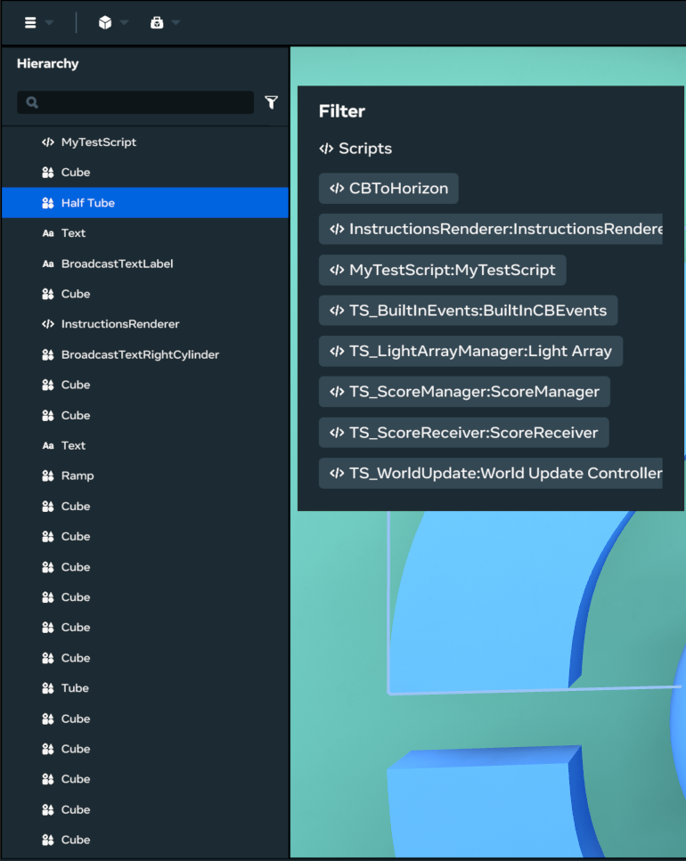
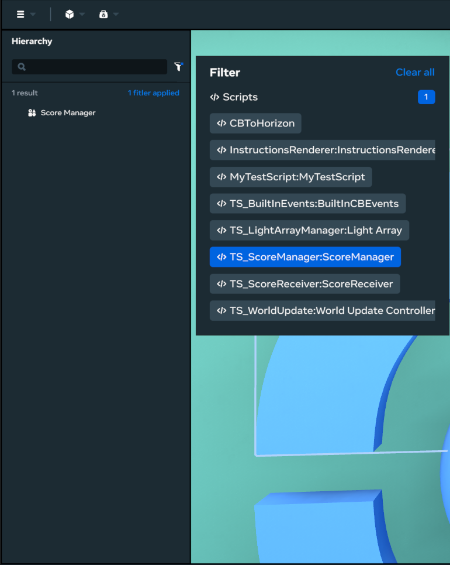
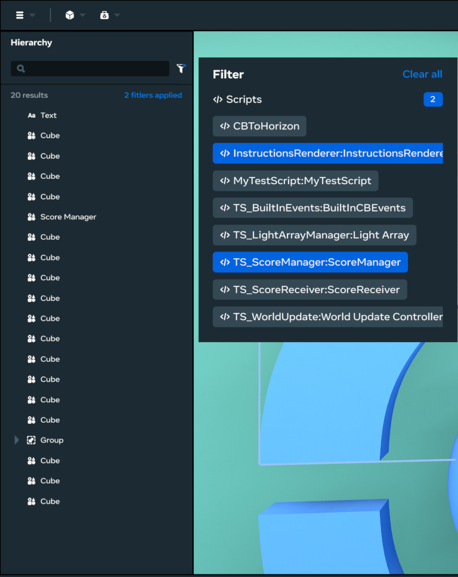

# Filtering and Searching in the Hierarchy Window

You can filter for:

- Assets and gizmos in your virtual world, including:
  - Properties: Tri-Mesh, SubD (helpful when needing to find and remove SubD assets)
  - Gizmo types
- Objects attached to specific scripts

## Using the filter

The following steps show how to use the filter:

- Click on the filter button next to the Hierarchy Search Bar to open the filter:
  
- The filter provides the following filter categories:
  

  * **Properties:** The Properties section allows filtering by the properties of assets, and supports filtering to show only “Tri-Mesh” assets and only “SubD” assets. All Tri-Mesh assets are labeled “Tri-Mesh” so you can verify them.
  * **Attached Scripts:** The Attached Scripts section allows filtering to show only the objects that have the specific selected script attached.
  * **Gizmo types:** Similar to above, the Gizmo Types section allows filtering to gizmos that match the gizmo type selected.
  * **NOTE that filtering uses OR Logic** : Filtering uses “OR” logic across all categories. For example, if you filter by “Script 1” and “Tri-Mesh,” it will display all objects that are “Tri-Mesh” OR have “Script 1” attached OR have *both* “Tri-Mesh” and “Script 1” attached.
    

## Using filters to search for object attached to scripts

- Select the Filter button  next to the Hierarchy Search Bar. A list  of scripts available within the world appears.
  
- Selecting one of the script names will update the Hierarchy to show objects attached to the selected script.
  
- If multiple scripts are selected within this filter, all objects attached with one of the selected scripts will be shown.
  

## Searching for scripts

- Within the Desktop Editor, view the Hierarchy on the left-hand side of the application.
- Type in the name of the script you’d like to search for - the editor will automatically filter for relevant Scripts matching the keyword provided.
- When selected in the Hierarchy, press the **F key** to automatically move the camera towards the Script Gizmo in-world.

